<h1 align="center">vdm-protobuf</h1>

<p align="center">
  <strong>COVESA's Vehicle Data Model, as AIP-shaped protobuf — and as
  FlatBuffers and Cap'n Proto.</strong><br>
  Generated from the GraphQL specification, linted by two linters with no rule
  disabled, and compiled by three toolchains.
</p>

<p align="center">
  <a href="LICENSE"></a>
  
  
  
</p>

## Contents

- [What this is](#what-this-is)
- [How the model is filed](#how-the-model-is-filed)
- [The resource tree](#the-resource-tree)
- [What each shape can do](#what-each-shape-can-do)
- [How a resource lives and dies](#how-a-resource-lives-and-dies)
- [What a vehicle will let you write](#what-a-vehicle-will-let-you-write)
- [Where units live](#where-units-live)
- [The one cross-domain resource](#the-one-cross-domain-resource)
- [The failure the ledger prevents](#the-failure-the-ledger-prevents)
- [Inside the generator](#inside-the-generator)
- [The gates](#the-gates)
- [Getting started](#getting-started)

## What this is

[COVESA's Vehicle Data Model](https://github.com/COVESA/vdm) is authored in
GraphQL SDL, following the [S2DM](https://covesa.github.io/s2dm/) approach.
That is a good way to write a domain model and not a way to move bytes: there
is no wire format, no service surface, and no path to the languages a vehicle
platform is actually built in.

This repository compiles it into one.

| | |
|---|---|
| Protos | 277 |
| Messages / enums | 407 / 98 |
| Resources / services / RPCs | 46 / 46 / 204 |
| FlatBuffers / Cap'n Proto | 228 / 274 |
| Languages | 12 |
| Annotated signals | 713 |

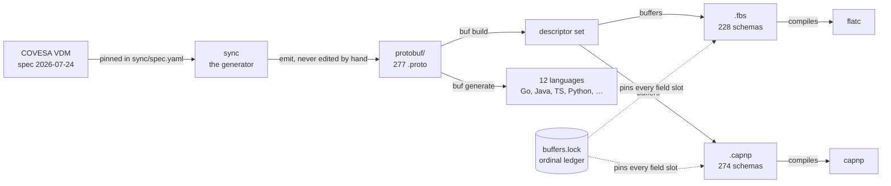

> **The protobuf is the pivot.** Languages and wire formats both derive from
> it, so a change to the specification reaches all of them or none. The dashed
> edges are the ledger: it constrains what the two schema targets may assign,
> and CI fails when a rebuild would disagree with it.

Everything under `protobuf/` is generated by `sync` and carries a
`DO NOT EDIT` banner naming the specification revision it came from — dated
`2026-07-24`, the way MCP versions its spec, so any single file answers "which
model is this?" on its own. A fix belongs in the generator; see
[`CLAUDE.md`](CLAUDE.md).

## How the model is filed

Two specifications, seven functional domains. VSS describes the vehicle
itself; VDM describes what a connected vehicle interacts with.

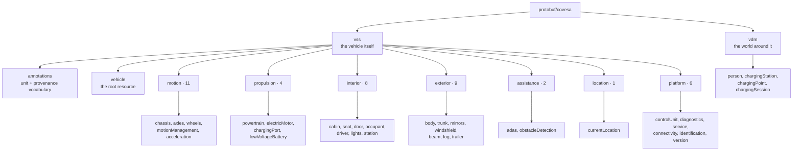

> **47 packages, one per resource plus the vocabulary.** The path is the
> package name: `protobuf/covesa/vss/interior/seat/v1` is
> `protobuf.covesa.vss.interior.seat.v1`, so buf's directory-match rule holds
> with no lookup table.

The domain layer is the one hand-maintained classification in the generator.
The source model states the tree but never says what any part of it is *for*,
so the grouping is asserted rather than derived — a branch the table does not
name lands in `platform` and is reported, never silently filed.

```
protobuf/covesa/vss/annotations/v1/        the unit and provenance vocabulary
protobuf/covesa/vss/interior/seat/v1/      Seat, addressable per instance
protobuf/covesa/vss/motion/chassis/v1/     Chassis, a singleton per vehicle
protobuf/covesa/vdm/charging_session/v1/   the cross-domain resource
sync/cmd/sync/                             regenerates the schema
sync/cmd/docs/                             regenerates this reference
sync/internal/                             the generator, one package per stage
sync/spec.yaml                             the pinned specification revision
buf/<language>.yaml                        one template per language
```

## The resource tree

Every resource has a name, and the name says where it sits. Two shapes appear,
and the source model decides which.

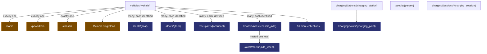

> **18 singletons (amber), 28 collections (indigo).** A branch a vehicle holds
> one of is a singleton — its name ends in a literal and nothing can create a
> second. A branch whose members carry an `@instanceTag` is a collection: that
> tag is the specification stating the members have identity.

A seat is reachable on its own, which it was not when the instance-tagged
branches were still embedded messages:

```http
PATCH /v1/vehicles/{vehicle}/seats/{seat}
{ "position": 420 }
```

<details>
<summary><strong>Why a seat is not under the cabin</strong></summary>

AIP-123 requires a resource name to alternate collection and identifier. A
singleton's name ends in a literal, so hanging a child beneath one would put
two literals in a row. A seat is therefore `vehicles/{v}/seats/{seat}`, not
`…/cabin/seats/{seat}` — and nothing is lost, because a cabin has exactly one
occurrence and a segment with one possible value identifies nothing. The full
VSS path survives in the branch annotation's `fqn`.

</details>

## What each shape can do

Both get full CRUD. They differ by exactly four methods, and the difference is
not a compromise.

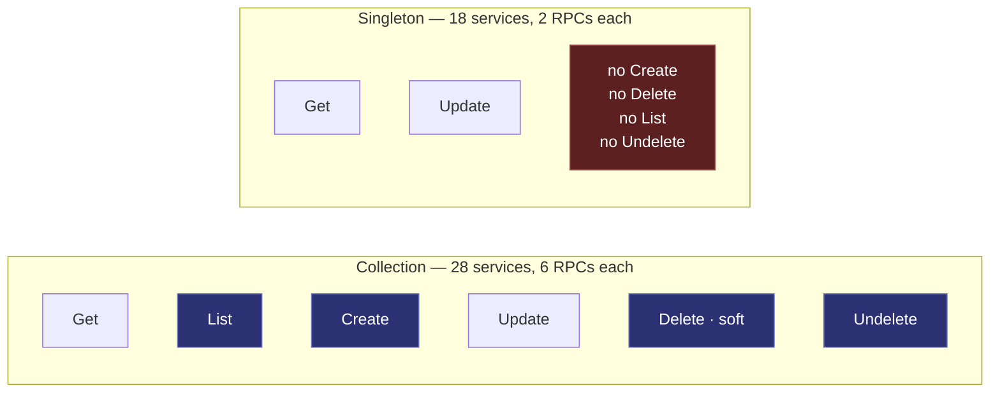

> **The four highlighted methods are the whole difference.** A singleton exists
> because its vehicle does: nothing can make a second cabin or remove the only
> one, so AIP-156 does not define those methods for it. Two RPCs is the
> complete set, not a shortfall.

## How a resource lives and dies

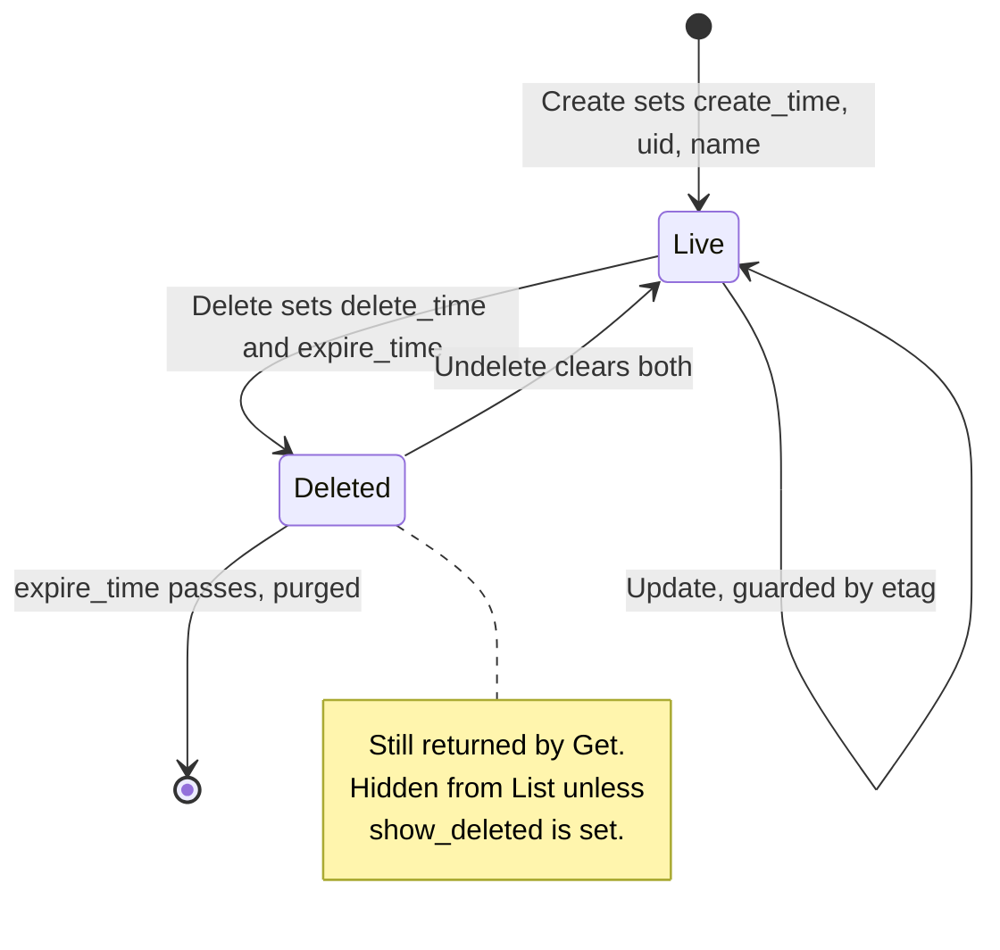

> **A deleted resource is still readable.** That is what makes `Undelete`
> meaningful — and why `List` needs `show_deleted` rather than simply
> returning everything.

## What a vehicle will let you write

VSS labels every signal with how it comes to exist. That label decides
writability — it is not an API style choice.

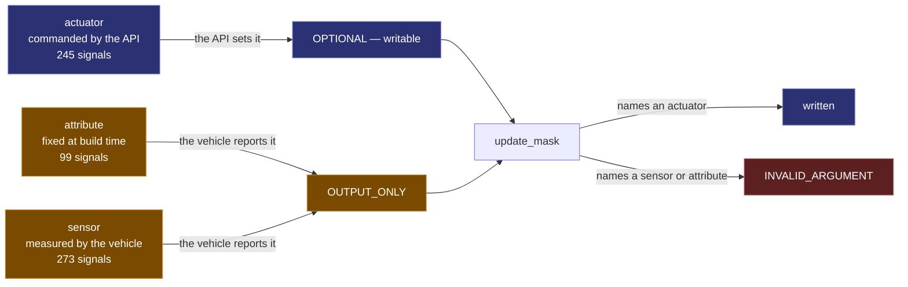

> **Rejected, not ignored.** An `update_mask` naming a sensor fails the request
> rather than quietly dropping the field, so a caller that believes it set the
> vehicle's speed finds out immediately.

## Where units live

A `double` does not say kilometres per hour. The source model states it as a
GraphQL field argument, and protobuf has no such thing.

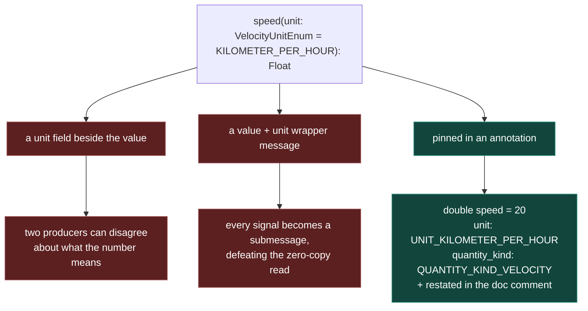

> **Fixed, not negotiated.** The unit is machine-readable for generators and
> repeated in the comment for humans, because an option is invisible in
> generated documentation. 713 signals carry one.

```proto
// Vehicle speed.
//
// Unit: km/h. VSS: Vehicle.Speed (sensor).
double speed = 20 [
  (google.api.field_behavior) = OUTPUT_ONLY,
  (protobuf.covesa.vss.annotations.v1.signal) = {
    element: ELEMENT_SENSOR
    fqn: "Vehicle.Speed"
    unit: UNIT_KILOMETER_PER_HOUR
    quantity_kind: QUANTITY_KIND_VELOCITY
  }
];
```

## The one cross-domain resource

A charging session is where a vehicle, a person and roadside infrastructure
meet — three owners, three packages.

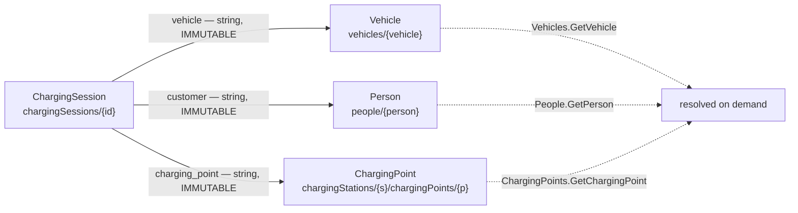

> **Names, not embedded copies.** AIP-215 forbids a field naming a message in
> another proto package — and naming is the better model anyway: a session is a
> historical fact, and embedding a Vehicle would freeze every signal it held at
> write time.

## The failure the ledger prevents

A field's slot is a wire format, and protobuf's numbering does not match the
targets'. Proto numbers are 1-based and sparse; Cap'n Proto ordinals and
FlatBuffers ids are 0-based and contiguous.

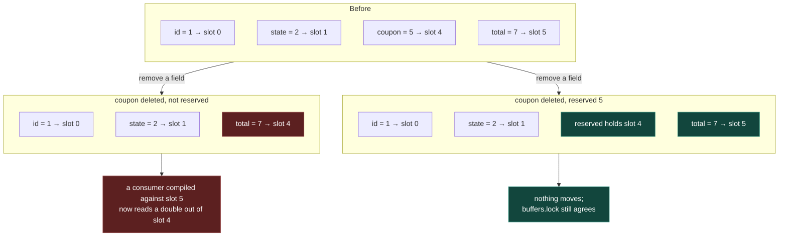

> **Nothing else reports this.** Not protoc, not flatc, not capnp, not the
> consumer — it simply reads the wrong field. The ledger records every
> assignment, and CI fails if a rebuild would move one. This schema reserves
> `8 to 15` in every resource for exactly that reason.

## Inside the generator

Nothing under `protobuf/` is written by hand. A fix belongs in one of the
generator's named tables, not in an emitted file.

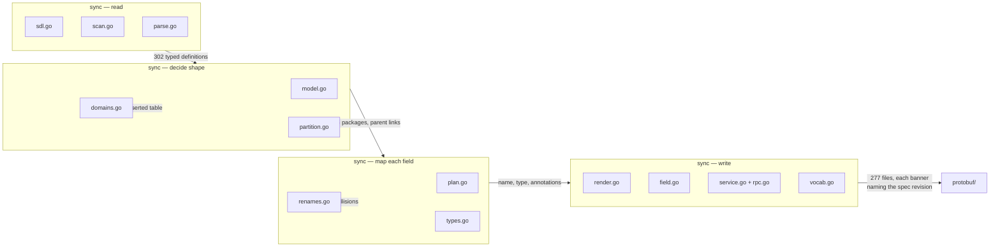

> **It refuses rather than guesses.** An unknown SDL construct is an error, not
> a skipped field; a source field colliding with a resource's own AIP fields
> names itself and stops the build. A parser that quietly accepts an unfamiliar
> shape produces a schema wrong in a way no linter catches.

| Change | Where it goes |
|---|---|
| a field name a linter rejects | `FieldRenames` in `sync/internal/catalog` |
| a message name a linter rejects | `TypeRenames`, same package |
| a plural English gets wrong | `irregularPlurals` in `sync/internal/naming` |
| which functional area a branch belongs to | `domains` in `sync/internal/model` |
| an enum better modelled as a scalar | `ScalarEnums` in `sync/internal/catalog` |
| a value type shared across packages | `sharedValueTypes` in `sync/internal/model` |
| which specification revision to read | `sync/spec.yaml`, then `just sync` |

## The gates

Five workflows, one per concern, so a failure names what broke rather than
burying it in a matrix. No lint rule is disabled anywhere in the repository,
and the two linters are given non-overlapping jobs because where they overlap
they contradict.

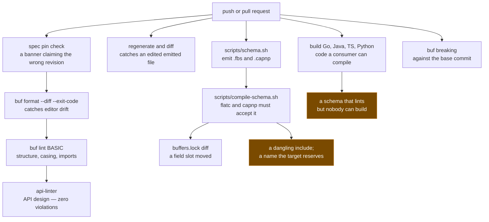

> **The amber outcomes are real failures caught here** — a `PostalAddress`
> field that vanished from the emitted FlatBuffers without a diagnostic, and a
> `CountryCode` enum Cap'n Proto could not represent at all. Both are written
> up in [`docs/decisions.md`](docs/decisions.md).

| Workflow | What it owns |
|---|---|
| `lint` | spec pin, formatting, both linters, licence headers, line cap |
| `sync` | `protobuf/` is exactly what the pinned spec produces |
| `schema` | `.fbs` and `.capnp` emitted, compiled, and slot-stable |
| `generate` | four languages generated and built |
| `breaking` | wire compatibility against the base commit |

## Getting started

```sh
just              # list every recipe
just sync         # regenerate protobuf/ from the pinned spec revision
just docs         # regenerate the Markdown reference beside the protos
just test         # build, vet and test the generator
just spec         # check the pin against the vdm checkout
just lint         # buf format, buf lint, buf build, api-linter
just schema       # emit .fbs and .capnp, then compile both
just lang go      # generate one language
just ci           # everything CI runs
```

Requires [buf](https://buf.build/docs), Go, and
[api-linter](https://github.com/googleapis/api-linter). The schema recipes
additionally need `flatc`, `capnp` and
[buffers](https://github.com/the-protobuf-project/buffers).

## Documentation

- [`CLAUDE.md`](CLAUDE.md) — the working rules, all of them hard
- [`docs/conventions.md`](docs/conventions.md) — what goes inside a file, and the full rename catalogue
- [`docs/decisions.md`](docs/decisions.md) — what was deliberately not done
- [`docs/generator.md`](docs/generator.md) — how `sync/` is laid out, and why
- [`docs/spec.md`](docs/spec.md) — which specification revision, and how to bump it
- [`docs/references.md`](docs/references.md) — a link-checked index

## License

Apache-2.0. The Vehicle Data Model and Vehicle Signal Specification are
COVESA's; see [COVESA/vdm](https://github.com/COVESA/vdm) for their terms.
