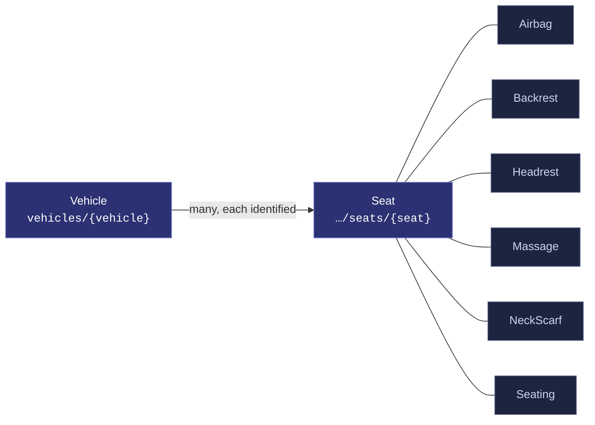
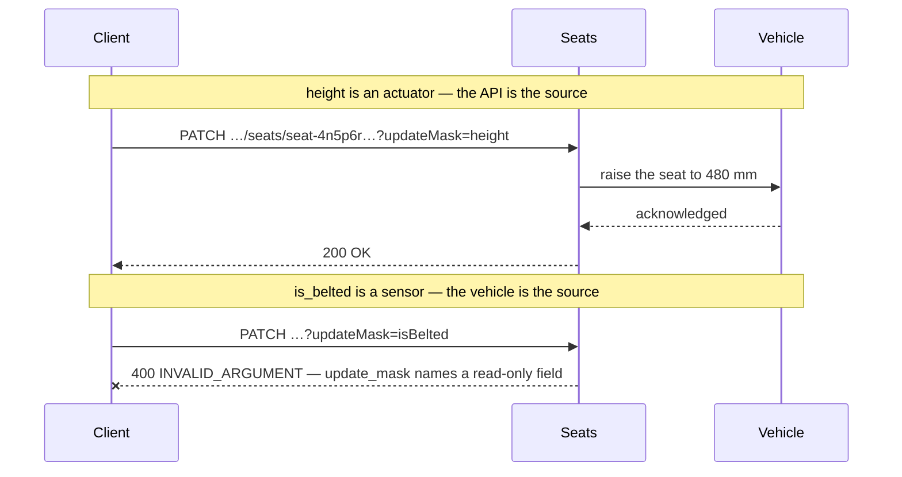
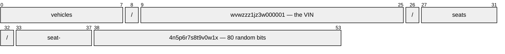
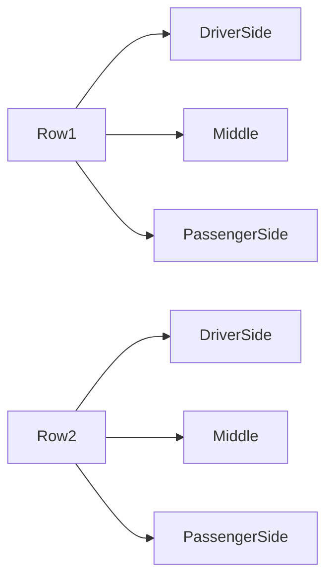
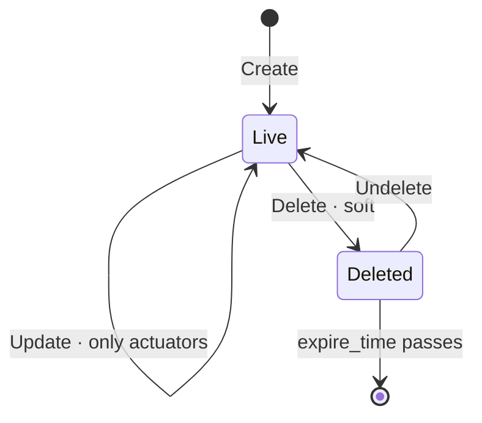

# Seat

[](https://github.com/COVESA/vdm)
[](https://covesa.github.io/vehicle_signal_specification/)
[](https://aip.dev/121)
[](https://aip.dev/131)
[](#signals)
[](v1/)

All in-cabin seats. Each is separately addressable, because VSS marks the
branch with an `@instanceTag` — the specification stating that its members
have identity: a seat is Row1 / DriverSide, not seat number four.

```
vehicles/{vehicle}/seats/{seat}
```

## Where it sits



The seat hangs off the **vehicle**, not the cabin. AIP-123 requires a resource
name to alternate collection and identifier, and `cabin` is a singleton whose
name ends in a literal — two literals in a row is not a legal name. Nothing is
lost: a cabin has one occurrence, so the segment would identify nothing, and
the full VSS path survives in the branch annotation.

The six blue-grey boxes are **embedded messages**, not resources. They have no
name of their own and travel with the seat.

## Example

A seat as this API returns it:

```json
{
  "name": "vehicles/wvwzzz1jz3w000001/seats/seat-4n5p6r7s8t9v0w1x",
  "uid": "b3f1c2de-4a5b-4c6d-8e9f-0a1b2c3d4e5f",
  "instanceTag": { "dimension1": "DIMENSION1_ROW1", "dimension2": "DIMENSION2_DRIVER_SIDE" },
  "height": 420,
  "heatingCooling": -40,
  "isBelted": true,
  "occupancyStatus": "OCCUPANCY_STATE_OCCUPIED"
}
```

The same seat in the **VSS shape**, for a peer that speaks the specification
rather than this schema — `codec.ToVSS` produces it from
[`codec/manifest.json`](../../../../../codec/manifest.json):

```json
{
  "Vehicle.Cabin.Seat.Height": 420,
  "Vehicle.Cabin.Seat.HeatingCooling": -40,
  "Vehicle.Cabin.Seat.IsBelted": true,
  "Vehicle.Cabin.Seat.OccupancyStatus": "OCCUPIED",
  "Vehicle.Cabin.Seat.InstanceTag": {
    "dimension1": "Row1",
    "dimension2": "DriverSide"
  }
}
```

Note what changed: signals are keyed by **fully qualified VSS name**, enum
constants drop to the spelling VSS writes (`DIMENSION1_ROW1` → `"Row1"`), and
the AIP fields — `name`, `uid` — fall away, because VSS declares no signal for
them. `codec.FromVSS` reverses all three.

Raising the seat, and the one thing that will fail:



```http
PATCH /v1/vehicles/wvwzzz1jz3w000001/seats/seat-4n5p6r7s8t9v0w1x?updateMask=height
{ "height": 480 }
```

The rejection is the schema working, not an inconvenience: VSS marks
`is_belted` a sensor, so the vehicle is the only thing that can set it. A mask
naming it fails rather than being silently dropped, so a caller that believed
it had unbelted a passenger finds out immediately.

## Resource names

Every seat is addressed by a name that alternates collection and identifier,
per [AIP-122](https://aip.dev/122):



Collection, identifier, collection, identifier — 54 characters,
alternating, which is what [AIP-123](https://aip.dev/123) requires. The
vehicle's identifier is its **VIN**: already unique, already external and
meaningful, which is the case AIP-122 prefers over a generated id. A seat
has no such natural key, so it gets one.

Rather than splitting that string by hand, use
[`resourcename`](https://github.com/the-protobuf-project/resourcename), which
implements AIP-122 templates in Go, Python, Rust, TypeScript, Swift and C:

```go
import "github.com/the-protobuf-project/resourcename"

t := resourcename.ResourceTemplate("vehicles/{vehicle}/seats/{seat}")

t.Parse("vehicles/wvwzzz1jz3w000001/seats/seat-4n5p6r7s8t9v0w1x")
// map[vehicle:wvwzzz1jz3w000001 seat:seat-4n5p6r7s8t9v0w1x]

t.Generate(map[string]string{"vehicle": "wvwzzz1jz3w000001", "seat": "seat-7t8v9w0x1y2z3a4b"})
// "vehicles/wvwzzz1jz3w000001/seats/seat-7t8v9w0x1y2z3a4b"
```

```python
import resourcename

t = resourcename.ResourceTemplate("vehicles/{vehicle}/seats/{seat}")
t.parse("vehicles/wvwzzz1jz3w000001/seats/seat-4n5p6r7s8t9v0w1x")
# {'vehicle': 'wvwzzz1jz3w000001', 'seat': 'seat-4n5p6r7s8t9v0w1x'}
```

The template above is the `pattern` this resource declares in its
`google.api.resource` annotation, so the two cannot drift.

### Three identifiers, and what each is for

| | Example | Assigned by | Purpose |
| --- | --- | --- | --- |
| **id** in `name` | `seat-4n5p6r7s…` | server, at creation | addresses the seat in a URL |
| `uid` | `b3f1c2de-4a5b-…` | server, UUID4 | stable handle, survives a rename |
| `instance_tag` | Row1 · DriverSide | the vehicle | says *which* seat it physically is |

The id is **80 random bits**, prefixed: `seat-` then 16 Crockford base32
characters. Three properties, and the prefix is not decoration:

- **It leaks nothing.** This is the randomness half of a ULID with the
  timestamp half deliberately removed. A ULID's leading characters *are* a
  millisecond timestamp, so an id would publish when the record was created —
  and a fleet's provisioning schedule is not something a resource name should
  disclose to anyone who can read a URL.
- **No coordination.** Two systems can mint ids for the same vehicle without a
  sequence or a round trip. 80 bits gives one chance in 10⁵ of a collision
  across five billion ids, and these need only be unique within one vehicle's
  seats.
- **Legal as a resource id.** [AIP-122](https://aip.dev/122) asks for
  `^[a-z]([a-z0-9-]{0,61}[a-z0-9])?$` — lowercase, opening with a letter.
  Crockford base32 is case-insensitive by specification, so lowercasing costs
  nothing, and the `seat-` prefix supplies the leading letter.

**What was given up.** A full ULID sorts chronologically as a plain string, so
paging in creation order needs no index. Dropping the timestamp drops that:
order by `create_time`, which is on every resource, and treat the id as
opaque.

**The cost, stated plainly.** An opaque id means you cannot address the
driver's seat by guessing its name. `row1DriverSide` read better — but it also
failed AIP-122 (capitals), and it encodes a fact that belongs in
`instance_tag`, where a consumer can filter on it:

```http
GET /v1/vehicles/wvwzzz1jz3w000001/seats
    ?filter=instance_tag.dimension1=ROW1 AND instance_tag.dimension2=DRIVER_SIDE
```

One `List` finds the seat; its `name` is then stable for every later call.

## Signals

31 fields: 7 AIP identity and lifecycle, 24 VSS signals. Field numbers 8–15
are reserved for identity fields a later revision may add, so adding one never
renumbers a signal.

### Writable — actuators

The vehicle accepts these in an `update_mask`.

**`height`** · `int32` · millimetres · `Vehicle.Cabin.Seat.Height`
Seat position on the vehicle z-axis, relative within the available movable
range. `0` is the lowermost position supported.

**`heating_cooling`** · `int32` · percent · `Vehicle.Cabin.Seat.HeatingCooling`
`-100` maximum cooling, `0` deactivated, `100` maximum heating.

**`is_backward_switch_engaged`** · `bool` · `…Seat.IsBackwardSwitchEngaged`
Seat backward switch engaged.

### Read-only — sensors and attributes

The vehicle reports these. An `update_mask` naming one is **rejected**, not
silently ignored.

**`is_belted`** · `bool` · sensor · `Vehicle.Cabin.Seat.IsBelted`
Is the belt engaged.

**`occupancy_status`** · [`OccupancyState`](#occupancystate) · sensor
Whether the seat is occupied.

<details>
<summary>Identity and lifecycle — 7 fields every resource carries</summary>

| Field | Type | Notes |
| --- | --- | --- |
| `name` | `string` | `vehicles/{vehicle}/seats/{seat}`, server-assigned |
| `uid` | `string` | server-assigned UUID4 |
| `etag` | `string` | pass back on update to make the write conditional |
| `create_time` `update_time` | `Timestamp` | when it was stored here |
| `delete_time` `expire_time` | `Timestamp` | soft delete; recoverable until `expire_time` |

</details>

## Which seat



`instance_tag` carries the two axes. VSS expands a branch across each axis in
turn, so the pair together names one seat — `Row1` × `DriverSide`.

## Methods

A collection, so the full set: **`Get`** · **`List`** · **`Create`** ·
**`Update`** · **`Delete`** · **`Undelete`**.



```http
GET    /v1/{name=vehicles/*/seats/*}
PATCH  /v1/{seat.name=vehicles/*/seats/*}
POST   /v1/{parent=vehicles/*}/seats
```

A deleted seat is still returned by `Get` and hidden from `List` unless
`show_deleted` is set — which is what makes `Undelete` meaningful.

## Enums

#### `OccupancyState`

Whether a seat is occupied. `Vehicle.Cabin.Seat.OccupancyStatus`

`UNSPECIFIED` · `UNKNOWN` · `OCCUPIED` · `EMPTY`
<sub>emitted as `OCCUPANCY_STATE_UNKNOWN`, and so on</sub>

#### `Dimension1` · `Dimension2`

The instance axes above. `ROW1` `ROW2` — `DRIVER_SIDE` `MIDDLE` `PASSENGER_SIDE`
<sub>VSS spells these `Row1`, `DriverSide`; the mapping is in the manifest</sub>

---

<sub>Generated by `just sync` from COVESA VDM spec `2026-07-24` (`36bc939`).
Do not edit by hand. Source: [`seat.proto`](v1/seat.proto) ·
[`service.proto`](v1/service.proto)</sub>
