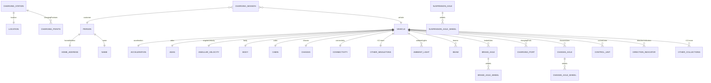
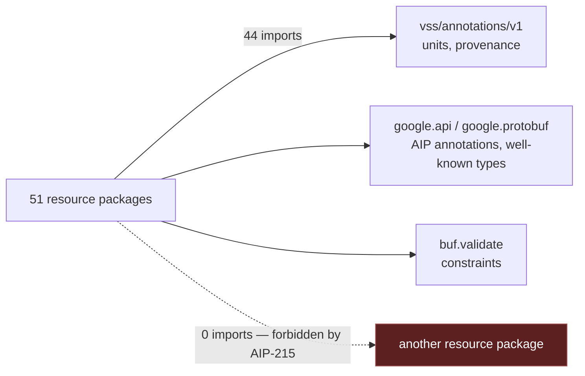

# COVESA protobuf reference

Generated from the COVESA Vehicle Data Model, spec revision `2026-09-02` (`cd4bc50`).

> [!IMPORTANT]
> Auto-generated by `sync docs` from the COVESA Vehicle Data Model,
> spec revision `2026-09-02` (`cd4bc50`).
> Do not edit by hand; run `just docs`.

| | |
| --- | --- |
| Packages | 51 |
| Resources | 51 |
| Collections / singletons | 28 / 23 |
| RPCs | 214 |

## How the resources relate

> **Two kinds of edge, and they are not interchangeable.** A `||--||` or
> `||--o{` is *containment*: the child's resource name extends the parent's,
> so a seat is `vehicles/{vehicle}/seats/{seat}` and cannot exist without its
> vehicle. A `}o--||` is an *association*: the field holds a `string` carrying
> the other resource's name, because AIP-215 forbids naming a message in
> another proto package.
>
> 23 singletons and 28 collections across 51 resources.

## What each package imports

> **The dashed edge is empty, and that is the claim.** Every one of the 44
> cross-package imports in this schema points at the annotation vocabulary;
> not one points at another resource. That is AIP-215 holding: a package
> contains everything it names, which is what lets a consumer read a cabin
> without transferring a powertrain.
>
> A resource that needs another names it by *resource name* instead — see
> the `}o--||` edges above. 153 imports resolve outside this repository, to
> googleapis and protovalidate.

## The vehicle

| Resource | Name | Shape | Reference |
| --- | --- | --- | --- |
| `Vehicle` | `vehicles/{vehicle}` | collection | [vehicle](vss/vehicle/README.md) |

## Assistance

| Resource | Name | Shape | Reference |
| --- | --- | --- | --- |
| `Adas` | `vehicles/{vehicle}/adas` | singleton | [adas](vss/assistance/adas/README.md) |
| `ObstacleDetection` | `vehicles/{vehicle}/obstacleDetections/{obstacle_detection}` | collection | [obstacle_detection](vss/assistance/obstacle_detection/README.md) |
| `Safety` | `vehicles/{vehicle}/safety` | singleton | [safety](vss/assistance/safety/README.md) |

## Exterior

| Resource | Name | Shape | Reference |
| --- | --- | --- | --- |
| `Beam` | `vehicles/{vehicle}/beams/{beam}` | collection | [beam](vss/exterior/beam/README.md) |
| `Body` | `vehicles/{vehicle}/body` | singleton | [body](vss/exterior/body/README.md) |
| `DirectionIndicator` | `vehicles/{vehicle}/directionIndicators/{direction_indicator}` | collection | [direction_indicator](vss/exterior/direction_indicator/README.md) |
| `Exterior` | `vehicles/{vehicle}/exterior` | singleton | [exterior](vss/exterior/exterior/README.md) |
| `Fog` | `vehicles/{vehicle}/fogs/{fog}` | collection | [fog](vss/exterior/fog/README.md) |
| `Mirrors` | `vehicles/{vehicle}/mirrors/{mirrors}` | collection | [mirrors](vss/exterior/mirrors/README.md) |
| `Trailer` | `vehicles/{vehicle}/trailer` | singleton | [trailer](vss/exterior/trailer/README.md) |
| `Trunk` | `vehicles/{vehicle}/trunks/{trunk}` | collection | [trunk](vss/exterior/trunk/README.md) |
| `Windshield` | `vehicles/{vehicle}/windshields/{windshield}` | collection | [windshield](vss/exterior/windshield/README.md) |

## Interior

| Resource | Name | Shape | Reference |
| --- | --- | --- | --- |
| `AmbientLight` | `vehicles/{vehicle}/ambientLights/{ambient_light}` | collection | [ambient_light](vss/interior/ambient_light/README.md) |
| `Cabin` | `vehicles/{vehicle}/cabin` | singleton | [cabin](vss/interior/cabin/README.md) |
| `Door` | `vehicles/{vehicle}/doors/{door}` | collection | [door](vss/interior/door/README.md) |
| `Driver` | `vehicles/{vehicle}/driver` | singleton | [driver](vss/interior/driver/README.md) |
| `Occupant` | `vehicles/{vehicle}/occupants/{occupant}` | collection | [occupant](vss/interior/occupant/README.md) |
| `Seat` | `vehicles/{vehicle}/seats/{seat}` | collection | [seat](vss/interior/seat/README.md) |
| `Spotlight` | `vehicles/{vehicle}/spotlights/{spotlight}` | collection | [spotlight](vss/interior/spotlight/README.md) |
| `Station` | `vehicles/{vehicle}/stations/{station}` | collection | [station](vss/interior/station/README.md) |

## Location

| Resource | Name | Shape | Reference |
| --- | --- | --- | --- |
| `CurrentLocation` | `vehicles/{vehicle}/currentLocation` | singleton | [current_location](vss/location/current_location/README.md) |

## Motion

| Resource | Name | Shape | Reference |
| --- | --- | --- | --- |
| `Acceleration` | `vehicles/{vehicle}/acceleration` | singleton | [acceleration](vss/motion/acceleration/README.md) |
| `AngularVelocity` | `vehicles/{vehicle}/angularVelocity` | singleton | [angular_velocity](vss/motion/angular_velocity/README.md) |
| `BrakeAxle` | `vehicles/{vehicle}/brakeAxles/{brake_axle}` | collection | [brake_axle](vss/motion/brake_axle/README.md) |
| `Wheel` | `vehicles/{vehicle}/brakeAxles/{brake_axle}/wheels/{wheel}` | collection | [brake_axle_wheel](vss/motion/brake_axle_wheel/README.md) |
| `Chassis` | `vehicles/{vehicle}/chassis` | singleton | [chassis](vss/motion/chassis/README.md) |
| `ChassisAxle` | `vehicles/{vehicle}/chassisAxles/{chassis_axle}` | collection | [chassis_axle](vss/motion/chassis_axle/README.md) |
| `Wheel` | `vehicles/{vehicle}/chassisAxles/{chassis_axle}/wheels/{wheel}` | collection | [chassis_axle_wheel](vss/motion/chassis_axle_wheel/README.md) |
| `ElectricAxle` | `vehicles/{vehicle}/electricAxles/{electric_axle}` | collection | [electric_axle](vss/motion/electric_axle/README.md) |
| `MotionManagement` | `vehicles/{vehicle}/motionManagement` | singleton | [motion_management](vss/motion/motion_management/README.md) |
| `Orientation` | `vehicles/{vehicle}/orientation` | singleton | [orientation](vss/motion/orientation/README.md) |
| `SuspensionAxle` | `vehicles/{vehicle}/suspensionAxles/{suspension_axle}` | collection | [suspension_axle](vss/motion/suspension_axle/README.md) |
| `Wheel` | `vehicles/{vehicle}/suspensionAxles/{suspension_axle}/wheels/{wheel}` | collection | [suspension_axle_wheel](vss/motion/suspension_axle_wheel/README.md) |

## Platform

| Resource | Name | Shape | Reference |
| --- | --- | --- | --- |
| `Connectivity` | `vehicles/{vehicle}/connectivity` | singleton | [connectivity](vss/platform/connectivity/README.md) |
| `ControlUnit` | `vehicles/{vehicle}/controlUnits/{control_unit}` | collection | [control_unit](vss/platform/control_unit/README.md) |
| `Diagnostics` | `vehicles/{vehicle}/diagnostics` | singleton | [diagnostics](vss/platform/diagnostics/README.md) |
| `Service` | `vehicles/{vehicle}/service` | singleton | [service](vss/platform/service/README.md) |
| `VehicleIdentification` | `vehicles/{vehicle}/vehicleIdentification` | singleton | [vehicle_identification](vss/platform/vehicle_identification/README.md) |
| `VersionVss` | `vehicles/{vehicle}/versionVss` | singleton | [version_vss](vss/platform/version_vss/README.md) |

## Propulsion

| Resource | Name | Shape | Reference |
| --- | --- | --- | --- |
| `ChargingPort` | `vehicles/{vehicle}/chargingPorts/{charging_port}` | collection | [charging_port](vss/propulsion/charging_port/README.md) |
| `ElectricMotor` | `vehicles/{vehicle}/electricMotors/{electric_motor}` | collection | [electric_motor](vss/propulsion/electric_motor/README.md) |
| `LowVoltageBattery` | `vehicles/{vehicle}/lowVoltageBattery` | singleton | [low_voltage_battery](vss/propulsion/low_voltage_battery/README.md) |
| `Powertrain` | `vehicles/{vehicle}/powertrain` | singleton | [powertrain](vss/propulsion/powertrain/README.md) |

## Beyond the vehicle

| Resource | Name | Shape | Reference |
| --- | --- | --- | --- |
| `ChargingPoints` | `chargingStations/{charging_station}/chargingPointses/{charging_points}` | collection | [charging_points](vdm/charging_points/README.md) |
| `ChargingSession` | `chargingSessions/{charging_session}` | collection | [charging_session](vdm/charging_session/README.md) |
| `ChargingStation` | `chargingStations/{charging_station}` | collection | [charging_station](vdm/charging_station/README.md) |
| `HomeAddress` | `people/{person}/homeAddress` | singleton | [home_address](vdm/home_address/README.md) |
| `Location` | `chargingStations/{charging_station}/location` | singleton | [location](vdm/location/README.md) |
| `Name` | `people/{person}/name` | singleton | [name](vdm/name/README.md) |
| `Person` | `people/{person}` | collection | [person](vdm/person/README.md) |

