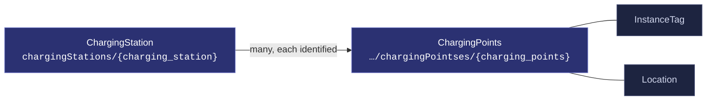
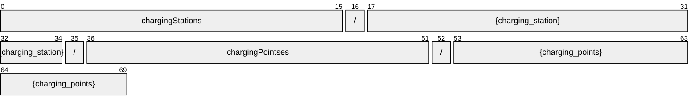
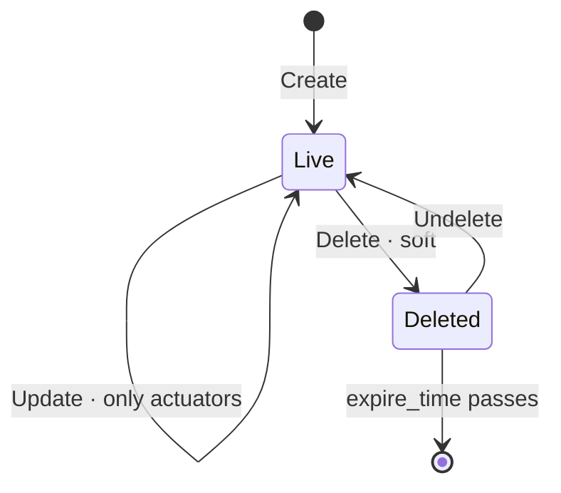

# ChargingPoints

[](https://github.com/COVESA/vehicle_signal_specification)
[](https://covesa.github.io/vehicle_signal_specification/)
[](https://aip.dev/121)
[](#methods)
[](#signals)
[](v1/)

ChargingPoints is a node of the COVESA Vehicle Signal Specification.

```
chargingStations/{charging_station}/chargingPointses/{charging_points}
```

## Where it sits



The 2 blue-grey boxes are **embedded messages**, not resources. They have no
name of their own and travel with the chargingPoints.

## Resource names

Every chargingPoints is addressed by a name that alternates collection and
identifier, per [AIP-122](https://aip.dev/122):



70 characters, alternating, which is what [AIP-123](https://aip.dev/123)
requires. An identifier is 80 random bits in Crockford base32, prefixed with
the resource's singular so the name opens with a letter — the randomness
half of a ULID with the timestamp half removed, because a ULID's leading
characters *are* a timestamp and a resource name should not publish when the
record was created. The vehicle is the exception: its identifier is its VIN,
which is already unique and already meaningful, the case AIP-122 prefers.

Rather than splitting that string by hand, use
[`resourcename`](https://github.com/the-protobuf-project/resourcename), which
implements AIP-122 templates in Go, Python, Rust, TypeScript, Swift and C:

```go
t := resourcename.ResourceTemplate("chargingStations/{charging_station}/chargingPointses/{charging_points}")
t.Parse("chargingStations/{charging_station}/chargingPointses/{charging_points}")
// map[chargingStation:chargingStation-yqey58b3bwr1x80j chargingPoints:chargingPoints-wd41sm2vhskeag05]
```

```python
t = resourcename.ResourceTemplate("chargingStations/{charging_station}/chargingPointses/{charging_points}")
t.parse("chargingStations/{charging_station}/chargingPointses/{charging_points}")
# {'chargingStation': 'chargingStation-yqey58b3bwr1x80j', 'chargingPoints': 'chargingPoints-wd41sm2vhskeag05'}
```

The template above is the `pattern` this resource declares in its
`google.api.resource` annotation, so the two cannot drift.

## Signals

9 fields: 7 AIP identity and lifecycle, 2 VSS signals. Field numbers 8–15 are reserved for identity fields a later revision may add, so adding one never renumbers a signal.

### Writable — actuators

The vehicle accepts these in an `update_mask`.

| Field | Type | Unit | VSS | Description |
| --- | --- | --- | --- | --- |
| `instance_tag` | `InstanceTag` | — | `ChargingStation.ChargingPoints.InstanceTag` | Which instance of this branch the values belong to. |
| `location` | `Location` | — | `ChargingStation.ChargingPoints.Location` | Location. |

<details>
<summary>Identity and lifecycle — 7 fields every resource carries</summary>

| Field | Type | Notes |
| --- | --- | --- |
| `name` | `string` | `chargingStations/{charging_station}/chargingPointses/{charging_points}`, server-assigned |
| `uid` | `string` | server-assigned UUID4, per [AIP-148](https://aip.dev/148) |
| `etag` | `string` | pass back on update to make the write conditional, per [AIP-154](https://aip.dev/154) |
| `create_time` `update_time` | `Timestamp` | when it was stored here |
| `delete_time` `expire_time` | `Timestamp` | soft delete; recoverable until `expire_time` |

</details>

## Methods

A collection, so the full set: **`Get`** · **`List`** · **`Create`** · **`Update`** · **`Delete`** · **`Undelete`**.



```http
GET    /v1/{name=chargingStations/*/chargingPointses/*}
PATCH  /v1/{chargingPoints.name=chargingStations/*/chargingPointses/*}
GET    /v1/{parent=chargingStations/*}/chargingPointses
POST   /v1/{parent=chargingStations/*}/chargingPointses
DELETE /v1/{name=chargingStations/*/chargingPointses/*}
POST   /v1/{name=chargingStations/*/chargingPointses/*}:undelete
```

A deleted chargingPoints is still returned by `Get` and hidden from `List`
unless `show_deleted` is set — which is what makes `Undelete` meaningful.

## Enums

#### `AreaInStation`

AreaInStation is an allowed-value set from the specification.

`UNSPECIFIED` · `UNDERGROUND` · `OUTDOOR`
<sub>emitted as `AREA_IN_STATION_UNDERGROUND`, and so on</sub>

#### `ChargingPointLabel`

ChargingPointLabel is an allowed-value set from the specification.

`UNSPECIFIED` · `POINT_A` · `POINT_B` · `POINT_C`
<sub>emitted as `CHARGING_POINT_LABEL_POINT_A`, and so on</sub>

---

<sub>Generated by `just docs` from COVESA VSS `2026-09-02` (`cd4bc50`) and VDM `2026-07-24` (`36bc939`). Do not edit by hand.<br>
Source: [`charging_points.proto`](v1/charging_points.proto) · [`service.proto`](v1/service.proto) · [`messages.proto`](v1/messages.proto)</sub>
