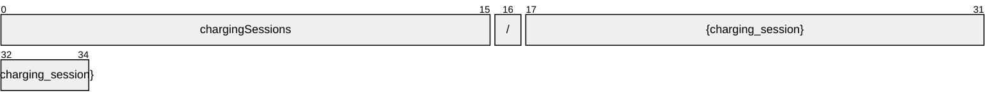
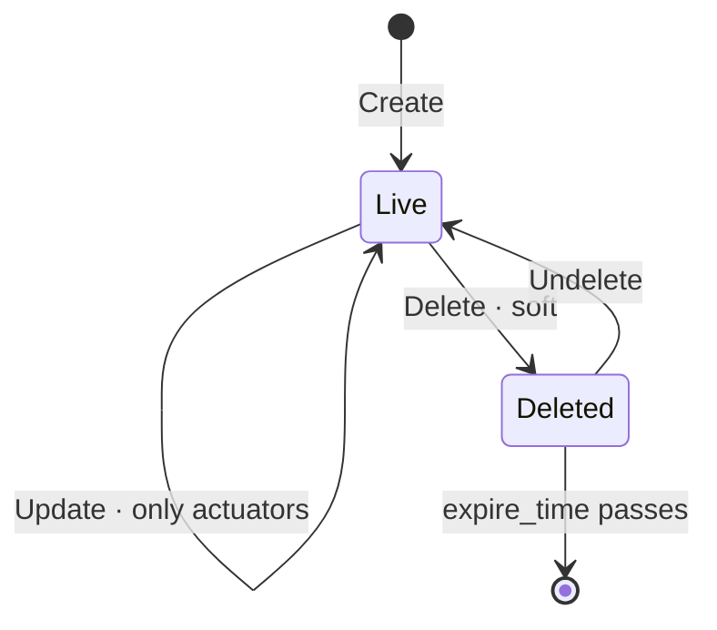

# ChargingSession

[](https://github.com/COVESA/vehicle_signal_specification)
[](https://covesa.github.io/vehicle_signal_specification/)
[](https://aip.dev/121)
[](#methods)
[](#signals)
[](v1/)

ChargingSession is a node of the COVESA Vehicle Signal Specification.

```
chargingSessions/{charging_session}
```

## Example

A chargingSession as this API returns it:

```json
{
  "name": "chargingSessions/{charging_session}",
  "uid": "b3f1c2de-4a5b-4c6d-8e9f-0a1b2c3d4e5f",
  "chargingPoint": "<charging point>",
  "customer": "<customer>",
  "endTime": "2026-09-02T10:15:30Z",
  "startTime": "2026-09-02T10:15:30Z",
  "vehicle": "<vehicle>"
}
```

The same data in the **VSS shape**, for a peer that speaks the specification
rather than this schema. `codec.ToVSS` produces it from
[`codec/manifest.json`](../../../../../codec/manifest.json):

```json
{
  "ChargingSession.ChargingPoint": "<charging point>",
  "ChargingSession.Customer": "<customer>",
  "ChargingSession.EndTime": "2026-09-02T10:15:30Z",
  "ChargingSession.StartTime": "2026-09-02T10:15:30Z",
  "ChargingSession.Vehicle": "<vehicle>"
}
```

Note what changed: signals are keyed by **fully qualified VSS name**, enum
constants drop to the spelling VSS writes, and the AIP fields — `name`,
`uid` — fall away, because VSS declares no signal for them. `codec.FromVSS`
reverses all three.

## Resource names

Every chargingSession is addressed by a name that alternates collection and
identifier, per [AIP-122](https://aip.dev/122):



35 characters, alternating, which is what [AIP-123](https://aip.dev/123)
requires. An identifier is 80 random bits in Crockford base32, prefixed with
the resource's singular so the name opens with a letter — the randomness
half of a ULID with the timestamp half removed, because a ULID's leading
characters *are* a timestamp and a resource name should not publish when the
record was created. The vehicle is the exception: its identifier is its VIN,
which is already unique and already meaningful, the case AIP-122 prefers.

Rather than splitting that string by hand, use
[`resourcename`](https://github.com/the-protobuf-project/resourcename), which
implements AIP-122 templates in Go, Python, Rust, TypeScript, Swift and C:

```go
t := resourcename.ResourceTemplate("chargingSessions/{charging_session}")
t.Parse("chargingSessions/{charging_session}")
// map[chargingSession:chargingSession-6cnhy35j3y66armv]
```

```python
t = resourcename.ResourceTemplate("chargingSessions/{charging_session}")
t.parse("chargingSessions/{charging_session}")
# {'chargingSession': 'chargingSession-6cnhy35j3y66armv'}
```

The template above is the `pattern` this resource declares in its
`google.api.resource` annotation, so the two cannot drift.

## Signals

12 fields: 7 AIP identity and lifecycle, 5 VSS signals. Field numbers 8–15
are reserved for identity fields a later revision may add, so adding one never
renumbers a signal.

### Writable — actuators

The vehicle accepts these in an `update_mask`.

| Field | Type | Unit | VSS | Description |
| --- | --- | --- | --- | --- |
| `charging_point` | `string` | — | `ChargingSession.ChargingPoint` | Charging point. |
| `customer` | `string` | — | `ChargingSession.Customer` | Customer. |
| `end_time` | `google.protobuf.Timestamp` | — | `ChargingSession.EndTime` | End time. |
| `start_time` | `google.protobuf.Timestamp` | — | `ChargingSession.StartTime` | Start time. |
| `vehicle` | `string` | — | `ChargingSession.Vehicle` | Vehicle. |

<details>
<summary>Identity and lifecycle — 7 fields every resource carries</summary>

| Field | Type | Notes |
| --- | --- | --- |
| `name` | `string` | `chargingSessions/{charging_session}`, server-assigned |
| `uid` | `string` | server-assigned UUID4, per [AIP-148](https://aip.dev/148) |
| `etag` | `string` | pass back on update to make the write conditional, per [AIP-154](https://aip.dev/154) |
| `create_time` `update_time` | `Timestamp` | when it was stored here |
| `delete_time` `expire_time` | `Timestamp` | soft delete; recoverable until `expire_time` |

</details>

## Methods

A collection, so the full set: **`Get`** · **`List`** · **`Create`** · **`Update`** · **`Delete`** · **`Undelete`**.



```http
GET    /v1/{name=chargingSessions/*}
PATCH  /v1/{chargingSession.name=chargingSessions/*}
GET    /v1/chargingSessions
POST   /v1/chargingSessions
DELETE /v1/{name=chargingSessions/*}
POST   /v1/{name=chargingSessions/*}:undelete
```

A deleted chargingSession is still returned by `Get` and hidden from `List`
unless `show_deleted` is set — which is what makes `Undelete` meaningful.

---

<sub>Generated by `just docs` from COVESA VSS `2026-09-02` (`cd4bc50`) and VDM `2026-07-24` (`36bc939`). Do not edit by hand.<br>
Source: [`charging_session.proto`](v1/charging_session.proto) · [`service.proto`](v1/service.proto) · [`messages.proto`](v1/messages.proto)</sub>
