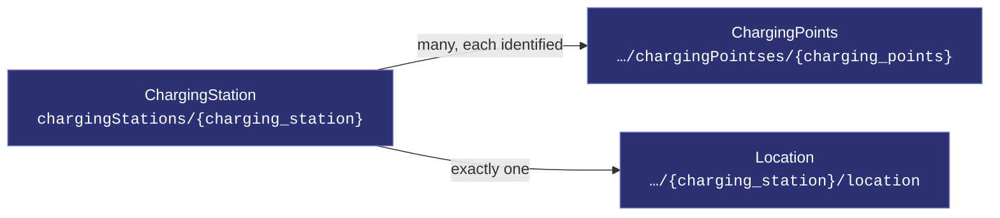
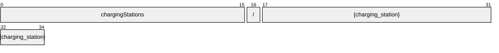
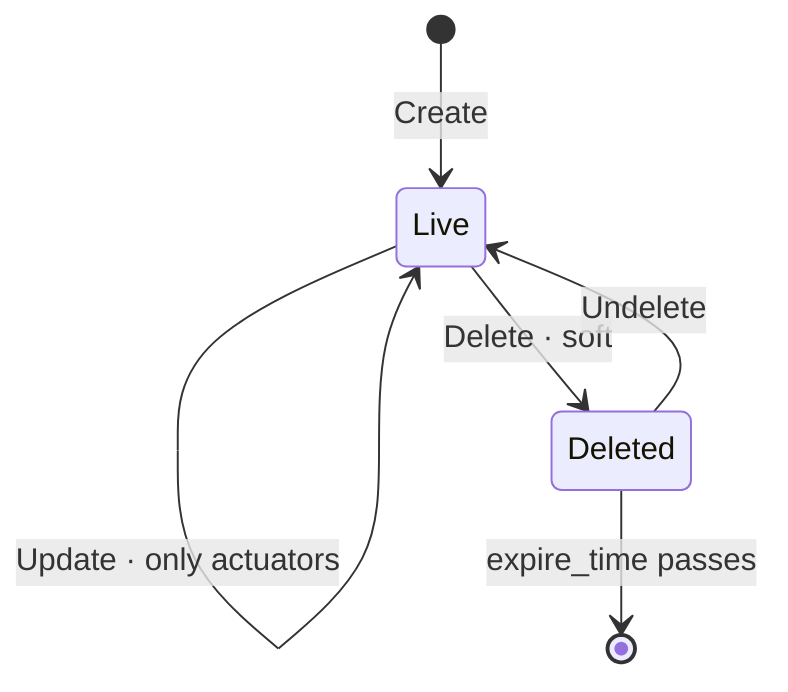

# ChargingStation

[](https://github.com/COVESA/vehicle_signal_specification)
[](https://covesa.github.io/vehicle_signal_specification/)
[](https://aip.dev/121)
[](#methods)
[](#signals)
[](v1/)

ChargingStation is a node of the COVESA Vehicle Signal Specification.

```
chargingStations/{charging_station}
```

## Where it sits



## Resource names

Every chargingStation is addressed by a name that alternates collection and
identifier, per [AIP-122](https://aip.dev/122):



35 characters, alternating, which is what [AIP-123](https://aip.dev/123)
requires. An identifier is 80 random bits in Crockford base32, prefixed with
the resource's singular so the name opens with a letter — the randomness
half of a ULID with the timestamp half removed, because a ULID's leading
characters *are* a timestamp and a resource name should not publish when the
record was created. The vehicle is the exception: its identifier is its VIN,
which is already unique and already meaningful, the case AIP-122 prefers.

Rather than splitting that string by hand, use
[`resourcename`](https://github.com/the-protobuf-project/resourcename), which
implements AIP-122 templates in Go, Python, Rust, TypeScript, Swift and C:

```go
t := resourcename.ResourceTemplate("chargingStations/{charging_station}")
t.Parse("chargingStations/{charging_station}")
// map[chargingStation:chargingStation-yqey58b3bwr1x80j]
```

```python
t = resourcename.ResourceTemplate("chargingStations/{charging_station}")
t.parse("chargingStations/{charging_station}")
# {'chargingStation': 'chargingStation-yqey58b3bwr1x80j'}
```

The template above is the `pattern` this resource declares in its
`google.api.resource` annotation, so the two cannot drift.

## Methods

A collection, so the full set: **`Get`** · **`List`** · **`Create`** · **`Update`** · **`Delete`** · **`Undelete`**.



```http
GET    /v1/{name=chargingStations/*}
PATCH  /v1/{chargingStation.name=chargingStations/*}
GET    /v1/chargingStations
POST   /v1/chargingStations
DELETE /v1/{name=chargingStations/*}
POST   /v1/{name=chargingStations/*}:undelete
```

A deleted chargingStation is still returned by `Get` and hidden from `List`
unless `show_deleted` is set — which is what makes `Undelete` meaningful.

---

<sub>Generated by `just docs` from COVESA VSS `2026-09-02` (`cd4bc50`) and VDM `2026-07-24` (`36bc939`). Do not edit by hand.<br>
Source: [`charging_station.proto`](v1/charging_station.proto) · [`service.proto`](v1/service.proto) · [`messages.proto`](v1/messages.proto)</sub>
