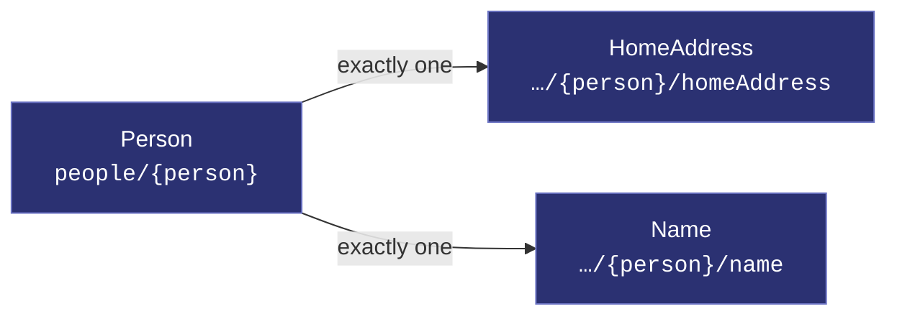
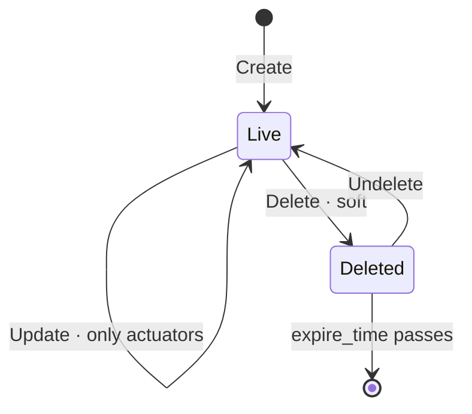

# Person

[](https://github.com/COVESA/vehicle_signal_specification)
[](https://covesa.github.io/vehicle_signal_specification/)
[](https://aip.dev/121)
[](#methods)
[](#signals)
[](v1/)

Person is a node of the COVESA Vehicle Signal Specification.

```
people/{person}
```

## Where it sits



## Example

A person as this API returns it:

```json
{
  "name": "people/person-0p77p8x3nd7e46x6",
  "uid": "b3f1c2de-4a5b-4c6d-8e9f-0a1b2c3d4e5f",
  "ageRange": "AGE_RANGE_TEEN",
  "vdmUid": "b3f1c2de-4a5b-4c6d-8e9f-0a1b2c3d4e5f"
}
```

The same data in the **VSS shape**, for a peer that speaks the specification
rather than this schema. `codec.ToVSS` produces it from
[`codec/manifest.json`](../../../../../codec/manifest.json):

```json
{
  "Person.AgeRange": "TEEN",
  "Person.Id": "b3f1c2de-4a5b-4c6d-8e9f-0a1b2c3d4e5f"
}
```

Note what changed: signals are keyed by **fully qualified VSS name**, enum
constants drop to the spelling VSS writes, and the AIP fields — `name`,
`uid` — fall away, because VSS declares no signal for them. `codec.FromVSS`
reverses all three.

## Resource names

Every person is addressed by a name that alternates collection and identifier,
per [AIP-122](https://aip.dev/122):


30 characters, alternating, which is what [AIP-123](https://aip.dev/123)
requires. An identifier is 80 random bits in Crockford base32, prefixed with
the resource's singular so the name opens with a letter — the randomness
half of a ULID with the timestamp half removed, because a ULID's leading
characters *are* a timestamp and a resource name should not publish when the
record was created. The vehicle is the exception: its identifier is its VIN,
which is already unique and already meaningful, the case AIP-122 prefers.

Rather than splitting that string by hand, use
[`resourcename`](https://github.com/the-protobuf-project/resourcename), which
implements AIP-122 templates in Go, Python, Rust, TypeScript, Swift and C:

```go
t := resourcename.ResourceTemplate("people/{person}")
t.Parse("people/person-0p77p8x3nd7e46x6")
// map[person:person-0p77p8x3nd7e46x6]
```

```python
t = resourcename.ResourceTemplate("people/{person}")
t.parse("people/person-0p77p8x3nd7e46x6")
# {'person': 'person-0p77p8x3nd7e46x6'}
```

The template above is the `pattern` this resource declares in its
`google.api.resource` annotation, so the two cannot drift.

## Signals

9 fields: 7 AIP identity and lifecycle, 2 VSS signals. Field numbers 8–15 are reserved for identity fields a later revision may add, so adding one never renumbers a signal.

### Writable — actuators

The vehicle accepts these in an `update_mask`.

| Field | Type | Unit | VSS | Description |
| --- | --- | --- | --- | --- |
| `age_range` | [`AgeRange`](#agerange) | — | `Person.AgeRange` | Age range. |
| `vdm_uid` | `string` | — | `Person.Id` | Vdm uid. |

<details>
<summary>Identity and lifecycle — 7 fields every resource carries</summary>

| Field | Type | Notes |
| --- | --- | --- |
| `name` | `string` | `people/{person}`, server-assigned |
| `uid` | `string` | server-assigned UUID4, per [AIP-148](https://aip.dev/148) |
| `etag` | `string` | pass back on update to make the write conditional, per [AIP-154](https://aip.dev/154) |
| `create_time` `update_time` | `Timestamp` | when it was stored here |
| `delete_time` `expire_time` | `Timestamp` | soft delete; recoverable until `expire_time` |

</details>

## Methods

A collection, so the full set: **`Get`** · **`List`** · **`Create`** · **`Update`** · **`Delete`** · **`Undelete`**.



```http
GET    /v1/{name=people/*}
PATCH  /v1/{person.name=people/*}
GET    /v1/people
POST   /v1/people
DELETE /v1/{name=people/*}
POST   /v1/{name=people/*}:undelete
```

A deleted person is still returned by `Get` and hidden from `List` unless
`show_deleted` is set — which is what makes `Undelete` meaningful.

## Enums

#### `AgeRange`

AgeRange is an allowed-value set from the specification.

`UNSPECIFIED` · `CHILD` · `TEEN` · `ADULT` · `SENIOR`
<sub>emitted as `AGE_RANGE_CHILD`, and so on</sub>

---

<sub>Generated by `just docs` from COVESA VSS `2026-09-02` (`cd4bc50`) and VDM `2026-07-24` (`36bc939`). Do not edit by hand.<br>
Source: [`person.proto`](v1/person.proto) · [`service.proto`](v1/service.proto) · [`messages.proto`](v1/messages.proto)</sub>
