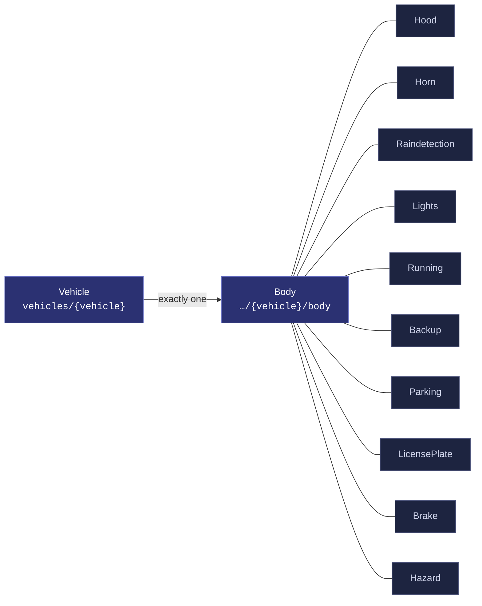
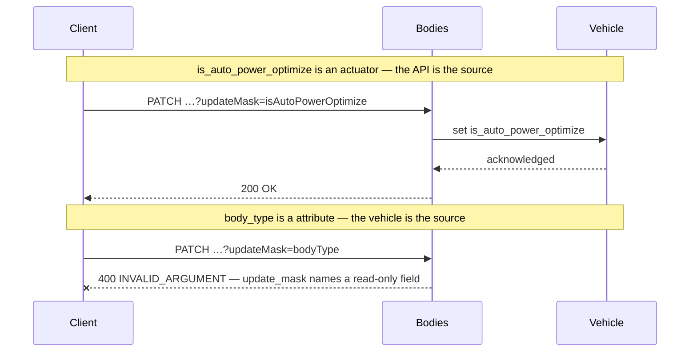
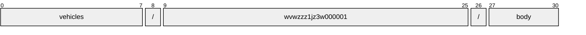
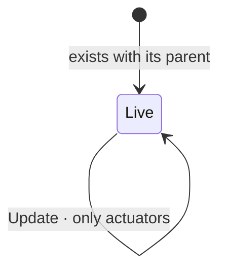

# Body

[](https://github.com/COVESA/vehicle_signal_specification)
[](https://covesa.github.io/vehicle_signal_specification/)
[](https://aip.dev/156)
[](#methods)
[](#signals)
[](v1/)

All body components.

```
vehicles/{vehicle}/body
```

## Where it sits



The 10 blue-grey boxes are **embedded messages**, not resources. They have no
name of their own and travel with the body.

## Example

A body as this API returns it:

```json
{
  "name": "vehicles/wvwzzz1jz3w000001/body",
  "uid": "b3f1c2de-4a5b-4c6d-8e9f-0a1b2c3d4e5f",
  "isAutoPowerOptimize": true,
  "powerOptimizeLevel": 3,
  "rearMainSpoilerPosition": 33.3,
  "bodyType": "<body type>"
}
```

The same data in the **VSS shape**, for a peer that speaks the specification
rather than this schema. `codec.ToVSS` produces it from
[`codec/manifest.json`](../../../../../codec/manifest.json):

```json
{
  "Vehicle.Body.IsAutoPowerOptimize": true,
  "Vehicle.Body.PowerOptimizeLevel": 3,
  "Vehicle.Body.RearMainSpoilerPosition": 33.3,
  "Vehicle.Body.BodyType": "<body type>"
}
```

Note what changed: signals are keyed by **fully qualified VSS name**, enum
constants drop to the spelling VSS writes, and the AIP fields — `name`,
`uid` — fall away, because VSS declares no signal for them. `codec.FromVSS`
reverses all three.

Writing to a body, and the one thing that will fail:



```http
PATCH /v1/vehicles/wvwzzz1jz3w000001/body?updateMask=isAutoPowerOptimize
{ "isAutoPowerOptimize": true }
```

The rejection is the schema working, not an inconvenience: VSS marks
`body_type` a attribute, so the vehicle is the only thing that can set it. A
mask naming it fails rather than being silently dropped, so a caller that
believed it had written the value finds out immediately.

## Resource names

Every body is addressed by a name that alternates collection and identifier,
per [AIP-122](https://aip.dev/122):



31 characters, alternating, which is what [AIP-123](https://aip.dev/123)
requires. An identifier is 80 random bits in Crockford base32, prefixed with
the resource's singular so the name opens with a letter — the randomness
half of a ULID with the timestamp half removed, because a ULID's leading
characters *are* a timestamp and a resource name should not publish when the
record was created. The vehicle is the exception: its identifier is its VIN,
which is already unique and already meaningful, the case AIP-122 prefers.

Rather than splitting that string by hand, use
[`resourcename`](https://github.com/the-protobuf-project/resourcename), which
implements AIP-122 templates in Go, Python, Rust, TypeScript, Swift and C:

```go
t := resourcename.ResourceTemplate("vehicles/{vehicle}/body")
t.Parse("vehicles/wvwzzz1jz3w000001/body")
// map[vehicle:wvwzzz1jz3w000001]
```

```python
t = resourcename.ResourceTemplate("vehicles/{vehicle}/body")
t.parse("vehicles/wvwzzz1jz3w000001/body")
# {'vehicle': 'wvwzzz1jz3w000001'}
```

The template above is the `pattern` this resource declares in its
`google.api.resource` annotation, so the two cannot drift.

## Signals

15 fields: 7 AIP identity and lifecycle, 8 VSS signals. Field numbers 8–15 are reserved for identity fields a later revision may add, so adding one never renumbers a signal.

### Writable — actuators

The vehicle accepts these in an `update_mask`.

| Field | Type | Unit | VSS | Description |
| --- | --- | --- | --- | --- |
| `hood` | `Hood` | — | `Vehicle.Body.Hood` | Hood status. Start position for Hood is Closed. |
| `horn` | `Horn` | — | `Vehicle.Body.Horn` | Horn signals. |
| `is_auto_power_optimize` | `bool` | — | `Vehicle.Body.IsAutoPowerOptimize` | Auto Power Optimization Flag When set to 'true', the system enables automatic power optimization, dynamically adjusting the power optimization level based on runtime conditions or features managed by the OEM. When set to 'false', manual control of the power optimization level is allowed. |
| `lights` | `Lights` | — | `Vehicle.Body.Lights` | Exterior lights. |
| `power_optimize_level` | `int32` | — | `Vehicle.Body.PowerOptimizeLevel` | Power optimization level for this branch/subsystem. A higher number indicates more aggressive power optimization. Level 0 indicates that all functionality is enabled, no power optimization enabled. Level 10 indicates most aggressive power optimization mode, only essential functionality enabled. |
| `raindetection` | `Raindetection` | — | `Vehicle.Body.Raindetection` | Rain sensor signals. |
| `rear_main_spoiler_position` | `double` | `percent` | `Vehicle.Body.RearMainSpoilerPosition` | Rear spoiler position, 0% = Spoiler fully stowed. 100% = Spoiler fully exposed. |

### Read-only — sensors and attributes

The vehicle reports these. An `update_mask` naming one is **rejected**, not
silently ignored.

| Field | Type | Unit | VSS | Description |
| --- | --- | --- | --- | --- |
| `body_type` | `string` | — | `Vehicle.Body.BodyType` | Body type code as defined by ISO 3779. |

<details>
<summary>Identity and lifecycle — 7 fields every resource carries</summary>

| Field | Type | Notes |
| --- | --- | --- |
| `name` | `string` | `vehicles/{vehicle}/body`, server-assigned |
| `uid` | `string` | server-assigned UUID4, per [AIP-148](https://aip.dev/148) |
| `etag` | `string` | pass back on update to make the write conditional, per [AIP-154](https://aip.dev/154) |
| `create_time` `update_time` | `Timestamp` | when it was stored here |
| `delete_time` `expire_time` | `Timestamp` | soft delete; recoverable until `expire_time` |

</details>

## Methods

A singleton, so **`Get`** · **`Update`** only, per
[AIP-156](https://aip.dev/156). Nothing can create a second or delete the only
one — that is the complete method set for a singleton, not a reduced one.



```http
GET    /v1/{name=vehicles/*/body}
PATCH  /v1/{body.name=vehicles/*/body}
```

## Enums

#### `Switch`

Switch controlling sliding action such as window, sunroof, or blind.

`UNSPECIFIED` · `INACTIVE` · `CLOSE` · `OPEN` · `ONE_SHOT_CLOSE` ·
`ONE_SHOT_OPEN`
<sub>emitted as `SWITCH_INACTIVE`, and so on</sub>

#### `LightSwitch`

Status of the vehicle main light switch.

`UNSPECIFIED` · `OFF` · `POSITION` · `DAYTIME_RUNNING_LIGHTS` · `AUTO` ·
`BEAM`
<sub>emitted as `LIGHT_SWITCH_OFF`, and so on</sub>

#### `IsActive`

Indicates if break-light is active. INACTIVE means lights are off. ACTIVE
means lights are on. ADAPTIVE means that break-light is indicating
emergency-breaking.

`UNSPECIFIED` · `INACTIVE` · `ACTIVE` · `ADAPTIVE`
<sub>emitted as `IS_ACTIVE_INACTIVE`, and so on</sub>

---

<sub>Generated by `just docs` from COVESA VSS `2026-09-02` (`cd4bc50`) and VDM `2026-07-24` (`36bc939`). Do not edit by hand.<br>
Source: [`body.proto`](v1/body.proto) · [`service.proto`](v1/service.proto) · [`messages.proto`](v1/messages.proto)</sub>
