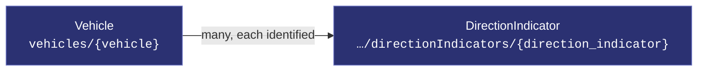
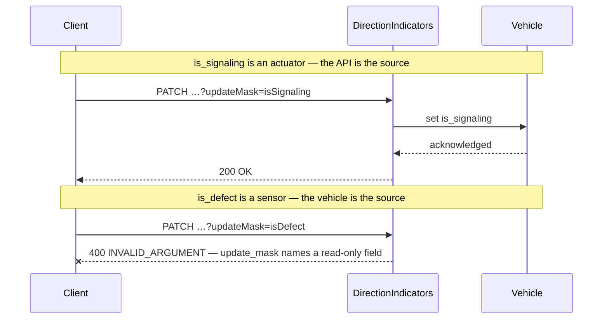
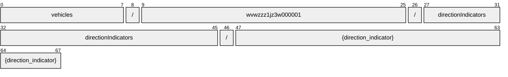
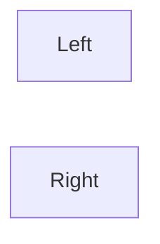
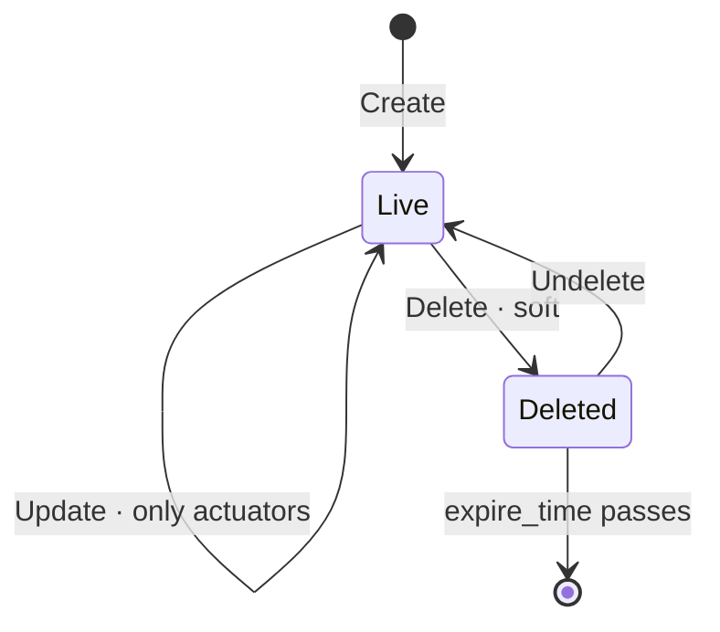

# DirectionIndicator

[](https://github.com/COVESA/vehicle_signal_specification)
[](https://covesa.github.io/vehicle_signal_specification/)
[](https://aip.dev/121)
[](#methods)
[](#signals)
[](v1/)

Indicator lights.

```
vehicles/{vehicle}/directionIndicators/{direction_indicator}
```

## Where it sits



In the specification this hangs beneath **Body**, but its name hangs off
**Vehicle**. AIP-123 requires a name to alternate collection and identifier,
and `body` is a singleton whose name ends in a literal — two literals in a
row is not a legal name. Nothing is lost: body has one occurrence, so the
segment would identify nothing, and the full VSS path survives in the branch
annotation.

## Example

A directionIndicator as this API returns it:

```json
{
  "name": "vehicles/wvwzzz1jz3w000001/directionIndicators/{direction_indicator}",
  "uid": "b3f1c2de-4a5b-4c6d-8e9f-0a1b2c3d4e5f",
  "isSignaling": true,
  "isDefect": true
}
```

The same data in the **VSS shape**, for a peer that speaks the specification
rather than this schema. `codec.ToVSS` produces it from
[`codec/manifest.json`](../../../../../codec/manifest.json):

```json
{
  "Vehicle.Body.Lights.DirectionIndicator.IsSignaling": true,
  "Vehicle.Body.Lights.DirectionIndicator.IsDefect": true
}
```

Note what changed: signals are keyed by **fully qualified VSS name**, enum
constants drop to the spelling VSS writes, and the AIP fields — `name`,
`uid` — fall away, because VSS declares no signal for them. `codec.FromVSS`
reverses all three.

Writing to a directionIndicator, and the one thing that will fail:



```http
PATCH /v1/vehicles/wvwzzz1jz3w000001/directionIndicators/{direction_indicator}?updateMask=isSignaling
{ "isSignaling": true }
```

The rejection is the schema working, not an inconvenience: VSS marks
`is_defect` a sensor, so the vehicle is the only thing that can set it. A mask
naming it fails rather than being silently dropped, so a caller that believed
it had written the value finds out immediately.

## Resource names

Every directionIndicator is addressed by a name that alternates collection and
identifier, per [AIP-122](https://aip.dev/122):



68 characters, alternating, which is what [AIP-123](https://aip.dev/123)
requires. An identifier is 80 random bits in Crockford base32, prefixed with
the resource's singular so the name opens with a letter — the randomness
half of a ULID with the timestamp half removed, because a ULID's leading
characters *are* a timestamp and a resource name should not publish when the
record was created. The vehicle is the exception: its identifier is its VIN,
which is already unique and already meaningful, the case AIP-122 prefers.

Rather than splitting that string by hand, use
[`resourcename`](https://github.com/the-protobuf-project/resourcename), which
implements AIP-122 templates in Go, Python, Rust, TypeScript, Swift and C:

```go
t := resourcename.ResourceTemplate("vehicles/{vehicle}/directionIndicators/{direction_indicator}")
t.Parse("vehicles/wvwzzz1jz3w000001/directionIndicators/{direction_indicator}")
// map[vehicle:wvwzzz1jz3w000001 directionIndicator:directionIndicator-2ma837ttfc49ahej]
```

```python
t = resourcename.ResourceTemplate("vehicles/{vehicle}/directionIndicators/{direction_indicator}")
t.parse("vehicles/wvwzzz1jz3w000001/directionIndicators/{direction_indicator}")
# {'vehicle': 'wvwzzz1jz3w000001', 'directionIndicator': 'directionIndicator-2ma837ttfc49ahej'}
```

The template above is the `pattern` this resource declares in its
`google.api.resource` annotation, so the two cannot drift.

## Signals

9 fields: 7 AIP identity and lifecycle, 2 VSS signals. Field numbers 8–15 are reserved for identity fields a later revision may add, so adding one never renumbers a signal.

### Writable — actuators

The vehicle accepts these in an `update_mask`.

| Field | Type | Unit | VSS | Description |
| --- | --- | --- | --- | --- |
| `is_signaling` | `bool` | — | `Vehicle.Body.Lights.DirectionIndicator.IsSignaling` | Indicates if light is signaling or off. True = signaling. False = Off. |

### Read-only — sensors and attributes

The vehicle reports these. An `update_mask` naming one is **rejected**, not
silently ignored.

| Field | Type | Unit | VSS | Description |
| --- | --- | --- | --- | --- |
| `is_defect` | `bool` | — | `Vehicle.Body.Lights.DirectionIndicator.IsDefect` | Indicates if light is defect. True = Light is defect. False = Light has no defect. |

<details>
<summary>Identity and lifecycle — 7 fields every resource carries</summary>

| Field | Type | Notes |
| --- | --- | --- |
| `name` | `string` | `vehicles/{vehicle}/directionIndicators/{direction_indicator}`, server-assigned |
| `uid` | `string` | server-assigned UUID4, per [AIP-148](https://aip.dev/148) |
| `etag` | `string` | pass back on update to make the write conditional, per [AIP-154](https://aip.dev/154) |
| `create_time` `update_time` | `Timestamp` | when it was stored here |
| `delete_time` `expire_time` | `Timestamp` | soft delete; recoverable until `expire_time` |

</details>

## Which directionIndicator



VSS expands this branch across Left, Right, so the combination names one
directionIndicator — which is what makes it a resource rather than a
repeated field. The axes are recorded in
[`codec/manifest.json`](../../../../../codec/manifest.json), which is the only
thing that says how to map an id back to a VSS path.

## Methods

A collection, so the full set: **`Get`** · **`List`** · **`Create`** · **`Update`** · **`Delete`** · **`Undelete`**.



```http
GET    /v1/{name=vehicles/*/directionIndicators/*}
PATCH  /v1/{directionIndicator.name=vehicles/*/directionIndicators/*}
GET    /v1/{parent=vehicles/*}/directionIndicators
POST   /v1/{parent=vehicles/*}/directionIndicators
DELETE /v1/{name=vehicles/*/directionIndicators/*}
POST   /v1/{name=vehicles/*/directionIndicators/*}:undelete
```

A deleted directionIndicator is still returned by `Get` and hidden from `List`
unless `show_deleted` is set — which is what makes `Undelete` meaningful.

---

<sub>Generated by `just docs` from COVESA VSS `2026-09-02` (`cd4bc50`) and VDM `2026-07-24` (`36bc939`). Do not edit by hand.<br>
Source: [`direction_indicator.proto`](v1/direction_indicator.proto) · [`service.proto`](v1/service.proto) · [`messages.proto`](v1/messages.proto)</sub>
