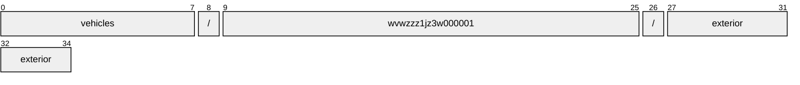
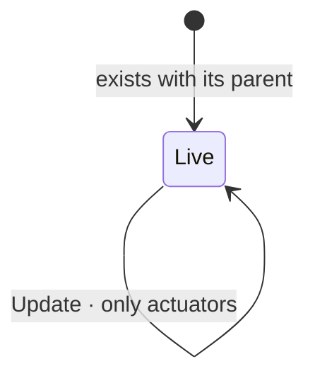

# Exterior

[](https://github.com/COVESA/vehicle_signal_specification)
[](https://covesa.github.io/vehicle_signal_specification/)
[](https://aip.dev/156)
[](#methods)
[](#signals)
[](v1/)

Information about exterior measured by vehicle.

```
vehicles/{vehicle}/exterior
```

## Where it sits


The 1 blue-grey box is **embedded messages**, not resources. They have no name
of their own and travel with the exterior.

## Example

A exterior as this API returns it:

```json
{
  "name": "vehicles/wvwzzz1jz3w000001/exterior",
  "uid": "b3f1c2de-4a5b-4c6d-8e9f-0a1b2c3d4e5f",
  "airPressure": 88.5,
  "airTemperature": 88.5,
  "humidity": 33.3,
  "lightIntensity": 33.3,
  "precipitationIntensity": 88.5
}
```

The same data in the **VSS shape**, for a peer that speaks the specification
rather than this schema. `codec.ToVSS` produces it from
[`codec/manifest.json`](../../../../../codec/manifest.json):

```json
{
  "Vehicle.Exterior.AirPressure": 88.5,
  "Vehicle.Exterior.AirTemperature": 88.5,
  "Vehicle.Exterior.Humidity": 33.3,
  "Vehicle.Exterior.LightIntensity": 33.3,
  "Vehicle.Exterior.PrecipitationIntensity": 88.5
}
```

Note what changed: signals are keyed by **fully qualified VSS name**, enum
constants drop to the spelling VSS writes, and the AIP fields — `name`,
`uid` — fall away, because VSS declares no signal for them. `codec.FromVSS`
reverses all three.

## Resource names

Every exterior is addressed by a name that alternates collection and
identifier, per [AIP-122](https://aip.dev/122):



35 characters, alternating, which is what [AIP-123](https://aip.dev/123)
requires. An identifier is 80 random bits in Crockford base32, prefixed with
the resource's singular so the name opens with a letter — the randomness
half of a ULID with the timestamp half removed, because a ULID's leading
characters *are* a timestamp and a resource name should not publish when the
record was created. The vehicle is the exception: its identifier is its VIN,
which is already unique and already meaningful, the case AIP-122 prefers.

Rather than splitting that string by hand, use
[`resourcename`](https://github.com/the-protobuf-project/resourcename), which
implements AIP-122 templates in Go, Python, Rust, TypeScript, Swift and C:

```go
t := resourcename.ResourceTemplate("vehicles/{vehicle}/exterior")
t.Parse("vehicles/wvwzzz1jz3w000001/exterior")
// map[vehicle:wvwzzz1jz3w000001]
```

```python
t = resourcename.ResourceTemplate("vehicles/{vehicle}/exterior")
t.parse("vehicles/wvwzzz1jz3w000001/exterior")
# {'vehicle': 'wvwzzz1jz3w000001'}
```

The template above is the `pattern` this resource declares in its
`google.api.resource` annotation, so the two cannot drift.

## Signals

22 fields: 7 AIP identity and lifecycle, 15 VSS signals. Field numbers 8–15 are reserved for identity fields a later revision may add, so adding one never renumbers a signal.

### Writable — actuators

The vehicle accepts these in an `update_mask`.

| Field | Type | Unit | VSS | Description |
| --- | --- | --- | --- | --- |
| `air_quality` | `AirQuality` | — | `Vehicle.Exterior.AirQuality` | Signals describing the composition of the ambient air outside the vehicle. |

### Read-only — sensors and attributes

The vehicle reports these. An `update_mask` naming one is **rejected**, not
silently ignored.

| Field | Type | Unit | VSS | Description |
| --- | --- | --- | --- | --- |
| `air_pressure` | `double` | `hPa` | `Vehicle.Exterior.AirPressure` | Atmospheric air pressure outside the vehicle. |
| `air_temperature` | `double` | `Celsius` | `Vehicle.Exterior.AirTemperature` | Air temperature outside the vehicle. |
| `humidity` | `double` | `percent` | `Vehicle.Exterior.Humidity` | Relative humidity outside the vehicle. 0 = Dry, 100 = Air fully saturated. |
| `light_intensity` | `double` | `percent` | `Vehicle.Exterior.LightIntensity` | Light intensity outside the vehicle. 0 = No light detected, 100 = Fully lit. |
| `precipitation_intensity` | `double` | `mm/h` | `Vehicle.Exterior.PrecipitationIntensity` | Precipitation intensity in millimeters per hour. |
| `precipitation_type` | [`PrecipitationType`](#precipitationtype) | — | `Vehicle.Exterior.PrecipitationType` | Type of precipitation currently detected outside the vehicle. |
| `road_obstruction` | [`RoadObstruction`](#roadobstruction) | — | `Vehicle.Exterior.RoadObstruction` | Type of road obstruction detected ahead of the vehicle. |
| `road_surface_condition` | [`RoadSurfaceCondition`](#roadsurfacecondition) | — | `Vehicle.Exterior.RoadSurfaceCondition` | Assessed condition of the road surface beneath or ahead of the vehicle. |
| `road_surface_contaminant` | [`RoadSurfaceContaminant`](#roadsurfacecontaminant) | — | `Vehicle.Exterior.RoadSurfaceContaminant` | Detected non-weather surface contaminant on the road beneath or ahead of the vehicle. |
| `road_surface_temperature` | `double` | `Celsius` | `Vehicle.Exterior.RoadSurfaceTemperature` | Temperature of the road surface beneath or ahead of the vehicle. |
| `visibility_condition` | [`VisibilityCondition`](#visibilitycondition) | — | `Vehicle.Exterior.VisibilityCondition` | Assessed visibility condition outside the vehicle. |
| `visibility_distance` | `double` | `m` | `Vehicle.Exterior.VisibilityDistance` | Estimated visible distance ahead of the vehicle in current conditions. |
| `wind_direction` | `double` | `degrees` | `Vehicle.Exterior.WindDirection` | Wind direction in degrees (meteorological convention, 0 = North, 90 = East). |
| `wind_speed` | `double` | `m/s` | `Vehicle.Exterior.WindSpeed` | Surface wind speed outside the vehicle. |

<details>
<summary>Identity and lifecycle — 7 fields every resource carries</summary>

| Field | Type | Notes |
| --- | --- | --- |
| `name` | `string` | `vehicles/{vehicle}/exterior`, server-assigned |
| `uid` | `string` | server-assigned UUID4, per [AIP-148](https://aip.dev/148) |
| `etag` | `string` | pass back on update to make the write conditional, per [AIP-154](https://aip.dev/154) |
| `create_time` `update_time` | `Timestamp` | when it was stored here |
| `delete_time` `expire_time` | `Timestamp` | soft delete; recoverable until `expire_time` |

</details>

## Methods

A singleton, so **`Get`** · **`Update`** only, per
[AIP-156](https://aip.dev/156). Nothing can create a second or delete the only
one — that is the complete method set for a singleton, not a reduced one.



```http
GET    /v1/{name=vehicles/*/exterior}
PATCH  /v1/{exterior.name=vehicles/*/exterior}
```

## Enums

#### `RoadSurfaceCondition`

Assessed condition of the road surface beneath or ahead of the vehicle.

`UNKNOWN` · `DRY` · `WET` · `SNOW` · `ICE` · `SLUSH` · `WET_ICE` ·
`LOOSE_GRAVEL`
<sub>emitted as `ROAD_SURFACE_CONDITION_UNKNOWN`, and so on</sub>

#### `RoadSurfaceContaminant`

Detected non-weather surface contaminant on the road beneath or ahead of the
vehicle.

`UNKNOWN` · `MUD` · `CHIPPINGS` · `OIL` · `FUEL` · `NONE`
<sub>emitted as `ROAD_SURFACE_CONTAMINANT_UNKNOWN`, and so on</sub>

#### `RoadObstruction`

Type of road obstruction detected ahead of the vehicle.

`UNKNOWN` · `TREE` · `AVALANCHE` · `ROCKFALLS` · `SHED_LOAD` ·
`LAND_SLIP` · `ANIMAL` · `ANIMAL_LARGE` · `ANIMAL_HERD` · `NONE` ·
`FLOODING`
<sub>emitted as `ROAD_OBSTRUCTION_UNKNOWN`, and so on</sub>

#### `VisibilityCondition`

Assessed visibility condition outside the vehicle.

`UNKNOWN` · `CLEAR` · `MIST` · `LOW_HEAVY_RAIN` · `LOW_HEAVY_SNOW` ·
`LOW_SMOKE` · `LOW_FOG` · `LOW_SUN_GLARE`
<sub>emitted as `VISIBILITY_CONDITION_UNKNOWN`, and so on</sub>

#### `PrecipitationType`

Type of precipitation currently detected outside the vehicle.

`UNKNOWN` · `NONE` · `RAIN` · `MIXED_RAIN_SNOW` · `SNOW` · `HAIL`
<sub>emitted as `PRECIPITATION_TYPE_UNKNOWN`, and so on</sub>

---

<sub>Generated by `just docs` from COVESA VSS `2026-09-02` (`cd4bc50`) and VDM `2026-07-24` (`36bc939`). Do not edit by hand.<br>
Source: [`exterior.proto`](v1/exterior.proto) · [`service.proto`](v1/service.proto) · [`messages.proto`](v1/messages.proto)</sub>
