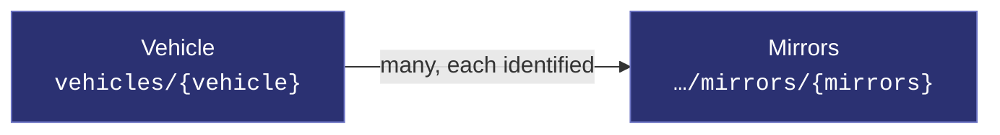
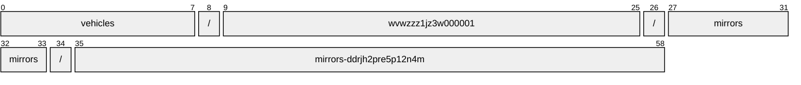
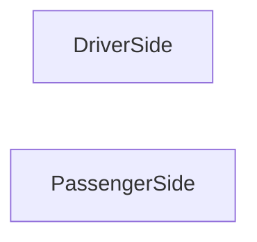
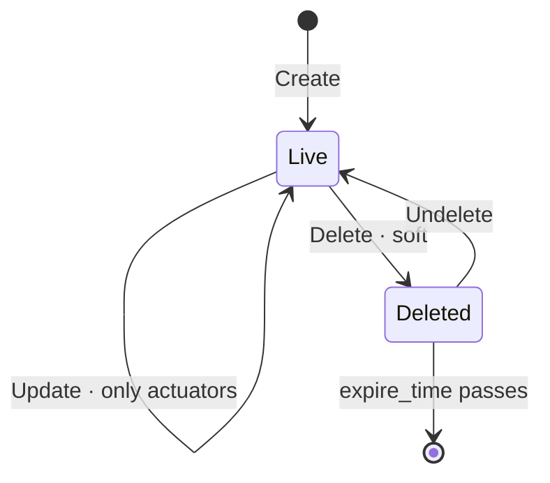

# Mirrors

[](https://github.com/COVESA/vehicle_signal_specification)
[](https://covesa.github.io/vehicle_signal_specification/)
[](https://aip.dev/121)
[](#methods)
[](#signals)
[](v1/)

All mirrors.

```
vehicles/{vehicle}/mirrors/{mirrors}
```

## Where it sits



In the specification this hangs beneath **Body**, but its name hangs off
**Vehicle**. AIP-123 requires a name to alternate collection and identifier,
and `body` is a singleton whose name ends in a literal — two literals in a
row is not a legal name. Nothing is lost: body has one occurrence, so the
segment would identify nothing, and the full VSS path survives in the branch
annotation.

## Example

A mirrors as this API returns it:

```json
{
  "name": "vehicles/wvwzzz1jz3w000001/mirrors/mirrors-ddrjh2pre5p12n4m",
  "uid": "b3f1c2de-4a5b-4c6d-8e9f-0a1b2c3d4e5f",
  "isFolded": true,
  "isHeatingOn": true,
  "isLocked": true,
  "pan": -33,
  "tilt": -33
}
```

The same data in the **VSS shape**, for a peer that speaks the specification
rather than this schema. `codec.ToVSS` produces it from
[`codec/manifest.json`](../../../../../codec/manifest.json):

```json
{
  "Vehicle.Body.Mirrors.IsFolded": true,
  "Vehicle.Body.Mirrors.IsHeatingOn": true,
  "Vehicle.Body.Mirrors.IsLocked": true,
  "Vehicle.Body.Mirrors.Pan": -33,
  "Vehicle.Body.Mirrors.Tilt": -33
}
```

Note what changed: signals are keyed by **fully qualified VSS name**, enum
constants drop to the spelling VSS writes, and the AIP fields — `name`,
`uid` — fall away, because VSS declares no signal for them. `codec.FromVSS`
reverses all three.

## Resource names

Every mirrors is addressed by a name that alternates collection and
identifier, per [AIP-122](https://aip.dev/122):



59 characters, alternating, which is what [AIP-123](https://aip.dev/123)
requires. An identifier is 80 random bits in Crockford base32, prefixed with
the resource's singular so the name opens with a letter — the randomness
half of a ULID with the timestamp half removed, because a ULID's leading
characters *are* a timestamp and a resource name should not publish when the
record was created. The vehicle is the exception: its identifier is its VIN,
which is already unique and already meaningful, the case AIP-122 prefers.

Rather than splitting that string by hand, use
[`resourcename`](https://github.com/the-protobuf-project/resourcename), which
implements AIP-122 templates in Go, Python, Rust, TypeScript, Swift and C:

```go
t := resourcename.ResourceTemplate("vehicles/{vehicle}/mirrors/{mirrors}")
t.Parse("vehicles/wvwzzz1jz3w000001/mirrors/mirrors-ddrjh2pre5p12n4m")
// map[vehicle:wvwzzz1jz3w000001 mirrors:mirrors-ddrjh2pre5p12n4m]
```

```python
t = resourcename.ResourceTemplate("vehicles/{vehicle}/mirrors/{mirrors}")
t.parse("vehicles/wvwzzz1jz3w000001/mirrors/mirrors-ddrjh2pre5p12n4m")
# {'vehicle': 'wvwzzz1jz3w000001', 'mirrors': 'mirrors-ddrjh2pre5p12n4m'}
```

The template above is the `pattern` this resource declares in its
`google.api.resource` annotation, so the two cannot drift.

## Signals

13 fields: 7 AIP identity and lifecycle, 6 VSS signals. Field numbers 8–15 are reserved for identity fields a later revision may add, so adding one never renumbers a signal.

### Writable — actuators

The vehicle accepts these in an `update_mask`.

| Field | Type | Unit | VSS | Description |
| --- | --- | --- | --- | --- |
| `is_folded` | `bool` | — | `Vehicle.Body.Mirrors.IsFolded` | Is mirror folded? True = Fully or partially folded. False = Fully unfolded. |
| `is_heating_on` | `bool` | — | `Vehicle.Body.Mirrors.IsHeatingOn` | Mirror Heater on or off. True = Heater On. False = Heater Off. |
| `is_locked` | `bool` | — | `Vehicle.Body.Mirrors.IsLocked` | Is mirror movement locked? True = Locked, mirror will not react to Tilt/Pan change. False = Unlocked. |
| `pan` | `int32` | `percent` | `Vehicle.Body.Mirrors.Pan` | Mirror pan as a percent. 0 = Center Position. 100 = Fully Left Position. -100 = Fully Right Position. |
| `tilt` | `int32` | `percent` | `Vehicle.Body.Mirrors.Tilt` | Mirror tilt as a percent. 0 = Center Position. 100 = Fully Upward Position. -100 = Fully Downward Position. |
| `yaw` | `int32` | `percent` | `Vehicle.Body.Mirrors.Yaw` | Relative mirror yaw angle, measured from the vehicle sprung mass X-axis as defined by ISO 23150:2023 to the mirror X-axis, around the vehicle Z-axis (right-hand rule). 0 = Mirror in default position. Exact position (yaw relative to vehicle X-axis) is vehicle dependent. 100 = Maximum yaw. Mirror rotated clockwise as much as possible around Z-axis. -100 = Minimum yaw. Mirror rotated counter-clockwise as much as possible around Z-axis. |

<details>
<summary>Identity and lifecycle — 7 fields every resource carries</summary>

| Field | Type | Notes |
| --- | --- | --- |
| `name` | `string` | `vehicles/{vehicle}/mirrors/{mirrors}`, server-assigned |
| `uid` | `string` | server-assigned UUID4, per [AIP-148](https://aip.dev/148) |
| `etag` | `string` | pass back on update to make the write conditional, per [AIP-154](https://aip.dev/154) |
| `create_time` `update_time` | `Timestamp` | when it was stored here |
| `delete_time` `expire_time` | `Timestamp` | soft delete; recoverable until `expire_time` |

</details>

## Which mirrors



VSS expands this branch across DriverSide, PassengerSide, so the combination
names one mirrors — which is what makes it a resource rather than a repeated
field. The axes are recorded in
[`codec/manifest.json`](../../../../../codec/manifest.json), which is the only
thing that says how to map an id back to a VSS path.

## Methods

A collection, so the full set: **`Get`** · **`List`** · **`Create`** · **`Update`** · **`Delete`** · **`Undelete`**.



```http
GET    /v1/{name=vehicles/*/mirrors/*}
PATCH  /v1/{mirrors.name=vehicles/*/mirrors/*}
GET    /v1/{parent=vehicles/*}/mirrors
POST   /v1/{parent=vehicles/*}/mirrors
DELETE /v1/{name=vehicles/*/mirrors/*}
POST   /v1/{name=vehicles/*/mirrors/*}:undelete
```

A deleted mirrors is still returned by `Get` and hidden from `List` unless
`show_deleted` is set — which is what makes `Undelete` meaningful.

---

<sub>Generated by `just docs` from COVESA VSS `2026-09-02` (`cd4bc50`) and VDM `2026-07-24` (`36bc939`). Do not edit by hand.<br>
Source: [`mirrors.proto`](v1/mirrors.proto) · [`service.proto`](v1/service.proto) · [`messages.proto`](v1/messages.proto)</sub>
