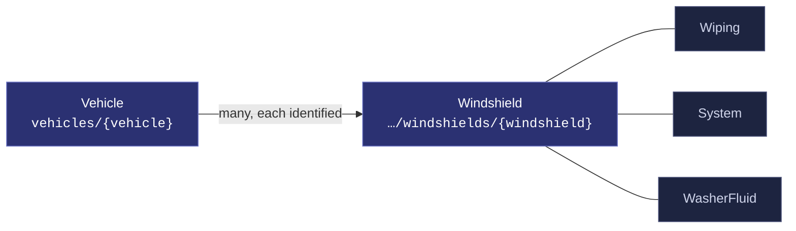
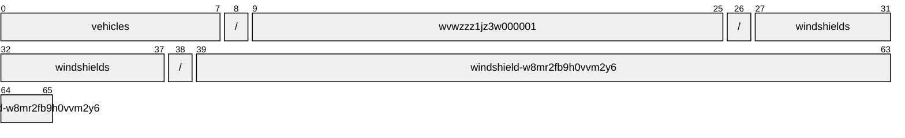
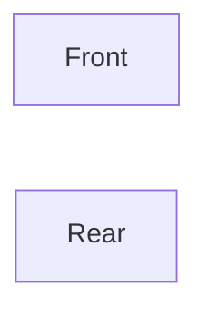
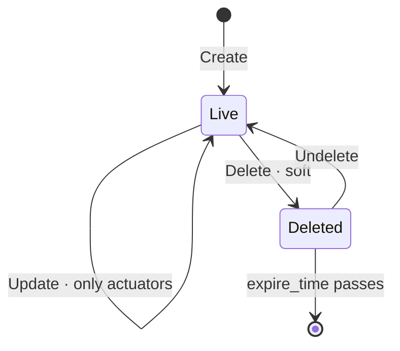

# Windshield

[](https://github.com/COVESA/vehicle_signal_specification)
[](https://covesa.github.io/vehicle_signal_specification/)
[](https://aip.dev/121)
[](#methods)
[](#signals)
[](v1/)

Windshield signals.

```
vehicles/{vehicle}/windshields/{windshield}
```

## Where it sits



In the specification this hangs beneath **Body**, but its name hangs off
**Vehicle**. AIP-123 requires a name to alternate collection and identifier,
and `body` is a singleton whose name ends in a literal — two literals in a
row is not a legal name. Nothing is lost: body has one occurrence, so the
segment would identify nothing, and the full VSS path survives in the branch
annotation.

The 3 blue-grey boxes are **embedded messages**, not resources. They have no
name of their own and travel with the windshield.

## Example

A windshield as this API returns it:

```json
{
  "name": "vehicles/wvwzzz1jz3w000001/windshields/windshield-w8mr2fb9h0vvm2y6",
  "uid": "b3f1c2de-4a5b-4c6d-8e9f-0a1b2c3d4e5f",
  "isHeatingOn": true
}
```

The same data in the **VSS shape**, for a peer that speaks the specification
rather than this schema. `codec.ToVSS` produces it from
[`codec/manifest.json`](../../../../../codec/manifest.json):

```json
{
  "Vehicle.Body.Windshield.IsHeatingOn": true
}
```

Note what changed: signals are keyed by **fully qualified VSS name**, enum
constants drop to the spelling VSS writes, and the AIP fields — `name`,
`uid` — fall away, because VSS declares no signal for them. `codec.FromVSS`
reverses all three.

## Resource names

Every windshield is addressed by a name that alternates collection and
identifier, per [AIP-122](https://aip.dev/122):



66 characters, alternating, which is what [AIP-123](https://aip.dev/123)
requires. An identifier is 80 random bits in Crockford base32, prefixed with
the resource's singular so the name opens with a letter — the randomness
half of a ULID with the timestamp half removed, because a ULID's leading
characters *are* a timestamp and a resource name should not publish when the
record was created. The vehicle is the exception: its identifier is its VIN,
which is already unique and already meaningful, the case AIP-122 prefers.

Rather than splitting that string by hand, use
[`resourcename`](https://github.com/the-protobuf-project/resourcename), which
implements AIP-122 templates in Go, Python, Rust, TypeScript, Swift and C:

```go
t := resourcename.ResourceTemplate("vehicles/{vehicle}/windshields/{windshield}")
t.Parse("vehicles/wvwzzz1jz3w000001/windshields/windshield-w8mr2fb9h0vvm2y6")
// map[vehicle:wvwzzz1jz3w000001 windshield:windshield-w8mr2fb9h0vvm2y6]
```

```python
t = resourcename.ResourceTemplate("vehicles/{vehicle}/windshields/{windshield}")
t.parse("vehicles/wvwzzz1jz3w000001/windshields/windshield-w8mr2fb9h0vvm2y6")
# {'vehicle': 'wvwzzz1jz3w000001', 'windshield': 'windshield-w8mr2fb9h0vvm2y6'}
```

The template above is the `pattern` this resource declares in its
`google.api.resource` annotation, so the two cannot drift.

## Signals

10 fields: 7 AIP identity and lifecycle, 3 VSS signals. Field numbers 8–15 are reserved for identity fields a later revision may add, so adding one never renumbers a signal.

### Writable — actuators

The vehicle accepts these in an `update_mask`.

| Field | Type | Unit | VSS | Description |
| --- | --- | --- | --- | --- |
| `is_heating_on` | `bool` | — | `Vehicle.Body.Windshield.IsHeatingOn` | Windshield heater status. False - off, True - on. |
| `washer_fluid` | `WasherFluid` | — | `Vehicle.Body.Windshield.WasherFluid` | Windshield washer fluid signals |
| `wiping` | `Wiping` | — | `Vehicle.Body.Windshield.Wiping` | Windshield wiper signals. |

<details>
<summary>Identity and lifecycle — 7 fields every resource carries</summary>

| Field | Type | Notes |
| --- | --- | --- |
| `name` | `string` | `vehicles/{vehicle}/windshields/{windshield}`, server-assigned |
| `uid` | `string` | server-assigned UUID4, per [AIP-148](https://aip.dev/148) |
| `etag` | `string` | pass back on update to make the write conditional, per [AIP-154](https://aip.dev/154) |
| `create_time` `update_time` | `Timestamp` | when it was stored here |
| `delete_time` `expire_time` | `Timestamp` | soft delete; recoverable until `expire_time` |

</details>

## Which windshield



VSS expands this branch across Front, Rear, so the combination names one
windshield — which is what makes it a resource rather than a repeated field.
The axes are recorded in
[`codec/manifest.json`](../../../../../codec/manifest.json), which is the only
thing that says how to map an id back to a VSS path.

## Methods

A collection, so the full set: **`Get`** · **`List`** · **`Create`** · **`Update`** · **`Delete`** · **`Undelete`**.



```http
GET    /v1/{name=vehicles/*/windshields/*}
PATCH  /v1/{windshield.name=vehicles/*/windshields/*}
GET    /v1/{parent=vehicles/*}/windshields
POST   /v1/{parent=vehicles/*}/windshields
DELETE /v1/{name=vehicles/*/windshields/*}
POST   /v1/{name=vehicles/*/windshields/*}:undelete
```

A deleted windshield is still returned by `Get` and hidden from `List` unless
`show_deleted` is set — which is what makes `Undelete` meaningful.

## Enums

#### `WipingMode`

Wiper mode requested by user/driver. INTERVAL indicates intermittent wiping,
with fixed time interval between each wipe. RAIN_SENSOR indicates intermittent
wiping based on rain intensity.

`UNSPECIFIED` · `OFF` · `SLOW` · `MEDIUM` · `FAST` · `INTERVAL` ·
`RAIN_SENSOR`
<sub>emitted as `WIPING_MODE_OFF`, and so on</sub>

#### `SystemMode`

Requested mode of wiper system. STOP_HOLD means that the wipers shall move to
position given by TargetPosition and then hold the position. WIPE means that
wipers shall move to the position given by TargetPosition and then hold the
position if no new TargetPosition is requested. PLANT_MODE means that wiping
is disabled. Exact behavior is vehicle specific. EMERGENCY_STOP means that
wiping shall be immediately stopped without holding the position.

`UNSPECIFIED` · `STOP_HOLD` · `WIPE` · `PLANT_MODE` · `EMERGENCY_STOP`
<sub>emitted as `SYSTEM_MODE_STOP_HOLD`, and so on</sub>

---

<sub>Generated by `just docs` from COVESA VSS `2026-09-02` (`cd4bc50`) and VDM `2026-07-24` (`36bc939`). Do not edit by hand.<br>
Source: [`windshield.proto`](v1/windshield.proto) · [`service.proto`](v1/service.proto) · [`messages.proto`](v1/messages.proto)</sub>
