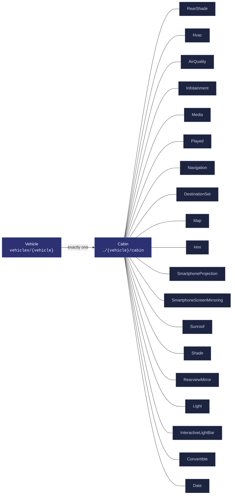
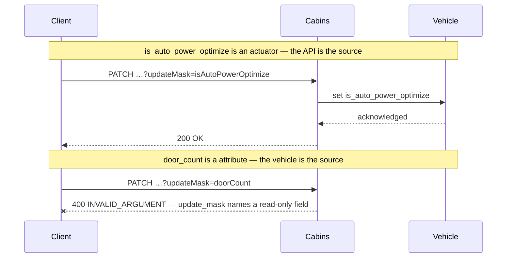
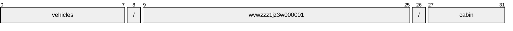
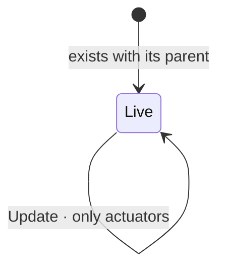

# Cabin

[](https://github.com/COVESA/vehicle_signal_specification)
[](https://covesa.github.io/vehicle_signal_specification/)
[](https://aip.dev/156)
[](#methods)
[](#signals)
[](v1/)

All in-cabin components, including doors.

```
vehicles/{vehicle}/cabin
```

## Where it sits



The 19 blue-grey boxes are **embedded messages**, not resources. They have no
name of their own and travel with the cabin.

## Example

A cabin as this API returns it:

```json
{
  "name": "vehicles/wvwzzz1jz3w000001/cabin",
  "uid": "b3f1c2de-4a5b-4c6d-8e9f-0a1b2c3d4e5f",
  "isAutoPowerOptimize": true,
  "isWindowChildLockEngaged": true,
  "powerOptimizeLevel": 3,
  "doorCount": 42,
  "driverPosition": "VEHICLE_CABIN_DRIVER_POSITION_MIDDLE"
}
```

The same data in the **VSS shape**, for a peer that speaks the specification
rather than this schema. `codec.ToVSS` produces it from
[`codec/manifest.json`](../../../../../codec/manifest.json):

```json
{
  "Vehicle.Cabin.IsAutoPowerOptimize": true,
  "Vehicle.Cabin.IsWindowChildLockEngaged": true,
  "Vehicle.Cabin.PowerOptimizeLevel": 3,
  "Vehicle.Cabin.DoorCount": 42,
  "Vehicle.Cabin.DriverPosition": "MIDDLE"
}
```

Note what changed: signals are keyed by **fully qualified VSS name**, enum
constants drop to the spelling VSS writes, and the AIP fields — `name`,
`uid` — fall away, because VSS declares no signal for them. `codec.FromVSS`
reverses all three.

Writing to a cabin, and the one thing that will fail:



```http
PATCH /v1/vehicles/wvwzzz1jz3w000001/cabin?updateMask=isAutoPowerOptimize
{ "isAutoPowerOptimize": true }
```

The rejection is the schema working, not an inconvenience: VSS marks
`door_count` a attribute, so the vehicle is the only thing that can set it. A
mask naming it fails rather than being silently dropped, so a caller that
believed it had written the value finds out immediately.

## Resource names

Every cabin is addressed by a name that alternates collection and identifier,
per [AIP-122](https://aip.dev/122):



32 characters, alternating, which is what [AIP-123](https://aip.dev/123)
requires. An identifier is 80 random bits in Crockford base32, prefixed with
the resource's singular so the name opens with a letter — the randomness
half of a ULID with the timestamp half removed, because a ULID's leading
characters *are* a timestamp and a resource name should not publish when the
record was created. The vehicle is the exception: its identifier is its VIN,
which is already unique and already meaningful, the case AIP-122 prefers.

Rather than splitting that string by hand, use
[`resourcename`](https://github.com/the-protobuf-project/resourcename), which
implements AIP-122 templates in Go, Python, Rust, TypeScript, Swift and C:

```go
t := resourcename.ResourceTemplate("vehicles/{vehicle}/cabin")
t.Parse("vehicles/wvwzzz1jz3w000001/cabin")
// map[vehicle:wvwzzz1jz3w000001]
```

```python
t = resourcename.ResourceTemplate("vehicles/{vehicle}/cabin")
t.parse("vehicles/wvwzzz1jz3w000001/cabin")
# {'vehicle': 'wvwzzz1jz3w000001'}
```

The template above is the `pattern` this resource declares in its
`google.api.resource` annotation, so the two cannot drift.

## Signals

14 fields: 7 AIP identity and lifecycle, 7 VSS signals. Field numbers 8–15
are reserved for identity fields a later revision may add, so adding one never
renumbers a signal.

### Writable — actuators

The vehicle accepts these in an `update_mask`.

| Field | Type | Unit | VSS | Description |
| --- | --- | --- | --- | --- |
| `is_auto_power_optimize` | `bool` | — | `Vehicle.Cabin.IsAutoPowerOptimize` | Auto Power Optimization Flag When set to 'true', the system enables automatic power optimization, dynamically adjusting the power optimization level based on runtime conditions or features managed by the OEM. When set to 'false', manual control of the power optimization level is allowed. |
| `is_window_child_lock_engaged` | `bool` | — | `Vehicle.Cabin.IsWindowChildLockEngaged` | Is window child lock engaged. True = Engaged. False = Disengaged. |
| `power_optimize_level` | `int32` | — | `Vehicle.Cabin.PowerOptimizeLevel` | Power optimization level for this branch/subsystem. A higher number indicates more aggressive power optimization. Level 0 indicates that all functionality is enabled, no power optimization enabled. Level 10 indicates most aggressive power optimization mode, only essential functionality enabled. |

### Read-only — sensors and attributes

The vehicle reports these. An `update_mask` naming one is **rejected**, not
silently ignored.

| Field | Type | Unit | VSS | Description |
| --- | --- | --- | --- | --- |
| `door_count` | `int32` | — | `Vehicle.Cabin.DoorCount` | Number of doors in vehicle. |
| `driver_position` | [`VehicleCabinDriverPosition`](#vehiclecabindriverposition) | — | `Vehicle.Cabin.DriverPosition` | The position of the driver seat in row 1. |
| `seat_pos_count` | `repeated int32` | — | `Vehicle.Cabin.SeatPosCount` | Number of seats across each row from the front to the rear. |
| `seat_row_count` | `int32` | — | `Vehicle.Cabin.SeatRowCount` | Number of seat rows in vehicle. |

<details>
<summary>Identity and lifecycle — 7 fields every resource carries</summary>

| Field | Type | Notes |
| --- | --- | --- |
| `name` | `string` | `vehicles/{vehicle}/cabin`, server-assigned |
| `uid` | `string` | server-assigned UUID4, per [AIP-148](https://aip.dev/148) |
| `etag` | `string` | pass back on update to make the write conditional, per [AIP-154](https://aip.dev/154) |
| `create_time` `update_time` | `Timestamp` | when it was stored here |
| `delete_time` `expire_time` | `Timestamp` | soft delete; recoverable until `expire_time` |

</details>

## Embedded messages

19 messages travel inside the cabin and have no name of their own. Address a
field on one through its owner — `rear_shade.<field>` — not directly.

<details>
<summary><code>RearShade</code> — Rear window shade. Open = Retracted, Closed = Deployed. Start position for RearShade is Open/Retracted.</summary>

| Field | Type | Unit | VSS | Description |
| --- | --- | --- | --- | --- |
| `is_open` | `bool` | — | `Vehicle.Cabin.RearShade.IsOpen` | Is item open or closed? True = Fully or partially open. False = Fully closed. |
| `position` | `int32` | `percent` | `Vehicle.Cabin.RearShade.Position` | Item position. 0 = Start position 100 = End position. |
| `switch_control` | [`CabinRearShadeSwitch`](#cabinrearshadeswitch) | — | `Vehicle.Cabin.RearShade.Switch` | Switch controlling sliding action such as window, sunroof, or blind. |

</details>

<details>
<summary><code>Hvac</code> — Climate control</summary>

| Field | Type | Unit | VSS | Description |
| --- | --- | --- | --- | --- |
| `ambient_air_temperature` | `double` | `Celsius` | `Vehicle.Cabin.HVAC.AmbientAirTemperature` | Ambient air temperature inside the vehicle. |
| `is_air_conditioning_active` | `bool` | — | `Vehicle.Cabin.HVAC.IsAirConditioningActive` | Is Air conditioning active. |
| `is_auto_power_optimize` | `bool` | — | `Vehicle.Cabin.HVAC.IsAutoPowerOptimize` | Auto Power Optimization Flag When set to 'true', the system enables automatic power optimization, dynamically adjusting the power optimization level based on runtime conditions or features managed by the OEM. When set to 'false', manual control of the power optimization level is allowed. |
| `is_front_defroster_active` | `bool` | — | `Vehicle.Cabin.HVAC.IsFrontDefrosterActive` | Is front defroster active. |
| `is_rear_defroster_active` | `bool` | — | `Vehicle.Cabin.HVAC.IsRearDefrosterActive` | Is rear defroster active. |
| `is_recirculation_active` | `bool` | — | `Vehicle.Cabin.HVAC.IsRecirculationActive` | Is recirculation active. |
| `power_optimize_level` | `int32` | — | `Vehicle.Cabin.HVAC.PowerOptimizeLevel` | Power optimization level for this branch/subsystem. A higher number indicates more aggressive power optimization. Level 0 indicates that all functionality is enabled, no power optimization enabled. Level 10 indicates most aggressive power optimization mode, only essential functionality enabled. |

</details>

<details>
<summary><code>AirQuality</code> — Signals describing the composition of the air inside the vehicle cabin.</summary>

| Field | Type | Unit | VSS | Description |
| --- | --- | --- | --- | --- |
| `co2` | `double` | `ppm` | `Vehicle.Cabin.AirQuality.CO2` | Carbon dioxide (CO2) concentration. |
| `no2` | `double` | `ppb` | `Vehicle.Cabin.AirQuality.NO2` | Nitrogen dioxide (NO2) concentration. |
| `ozone` | `double` | `ppb` | `Vehicle.Cabin.AirQuality.Ozone` | Ozone (O3) concentration. |
| `pm1` | `double` | `ug/m^3` | `Vehicle.Cabin.AirQuality.PM1` | Mass concentration of particulate matter with aerodynamic diameter of 1 micrometer or less (PM1.0). |
| `pm10` | `double` | `ug/m^3` | `Vehicle.Cabin.AirQuality.PM10` | Mass concentration of particulate matter with aerodynamic diameter of 10 micrometers or less (PM10). |
| `pm25` | `double` | `ug/m^3` | `Vehicle.Cabin.AirQuality.PM25` | Mass concentration of particulate matter with aerodynamic diameter of 2.5 micrometers or less (PM2.5). |
| `tvoc` | `double` | `ppb` | `Vehicle.Cabin.AirQuality.TVOC` | Total volatile organic compounds (TVOC) concentration. |

</details>

<details>
<summary><code>Infotainment</code> — Infotainment system.</summary>

| Field | Type | Unit | VSS | Description |
| --- | --- | --- | --- | --- |
| `hmi` | `Hmi` | — | `Vehicle.Cabin.Infotainment.HMI` | HMI related signals |
| `is_auto_power_optimize` | `bool` | — | `Vehicle.Cabin.Infotainment.IsAutoPowerOptimize` | Auto Power Optimization Flag When set to 'true', the system enables automatic power optimization, dynamically adjusting the power optimization level based on runtime conditions or features managed by the OEM. When set to 'false', manual control of the power optimization level is allowed. |
| `media` | `Media` | — | `Vehicle.Cabin.Infotainment.Media` | All Media actions |
| `navigation` | `Navigation` | — | `Vehicle.Cabin.Infotainment.Navigation` | All navigation actions |
| `power_optimize_level` | `int32` | — | `Vehicle.Cabin.Infotainment.PowerOptimizeLevel` | Power optimization level for this branch/subsystem. A higher number indicates more aggressive power optimization. Level 0 indicates that all functionality is enabled, no power optimization enabled. Level 10 indicates most aggressive power optimization mode, only essential functionality enabled. |
| `smartphone_projection` | `SmartphoneProjection` | — | `Vehicle.Cabin.Infotainment.SmartphoneProjection` | All smartphone projection actions. |
| `smartphone_screen_mirroring` | `SmartphoneScreenMirroring` | — | `Vehicle.Cabin.Infotainment.SmartphoneScreenMirroring` | All smartphone screen mirroring actions. |

</details>

<details>
<summary><code>Media</code> — All Media actions</summary>

| Field | Type | Unit | VSS | Description |
| --- | --- | --- | --- | --- |
| `action` | [`InfotainmentMediaAction`](#infotainmentmediaaction) | — | `Vehicle.Cabin.Infotainment.Media.Action` | Tells if the media was |
| `declined_uri` | `string` | — | `Vehicle.Cabin.Infotainment.Media.DeclinedURI` | URI of suggested media that was declined |
| `played` | `Played` | — | `Vehicle.Cabin.Infotainment.Media.Played` | Collection of signals updated in concert when a new media is played |
| `selected_uri` | `string` | — | `Vehicle.Cabin.Infotainment.Media.SelectedURI` | URI of suggested media that was selected |
| `volume` | `int32` | `percent` | `Vehicle.Cabin.Infotainment.Media.Volume` | Current Media Volume |

</details>

<details>
<summary><code>Played</code> — Collection of signals updated in concert when a new media is played</summary>

| Field | Type | Unit | VSS | Description |
| --- | --- | --- | --- | --- |
| `album` | `string` | — | `Vehicle.Cabin.Infotainment.Media.Played.Album` | Name of album being played |
| `artist` | `string` | — | `Vehicle.Cabin.Infotainment.Media.Played.Artist` | Name of artist being played |
| `genre` | `string` | — | `Vehicle.Cabin.Infotainment.Media.Played.Genre` | Name of genre being played |
| `playback_rate` | `double` | — | `Vehicle.Cabin.Infotainment.Media.Played.PlaybackRate` | Current playback rate of media being played. |
| `source` | [`MediaPlayedSource`](#mediaplayedsource) | — | `Vehicle.Cabin.Infotainment.Media.Played.Source` | Media selected for playback |
| `track` | `string` | — | `Vehicle.Cabin.Infotainment.Media.Played.Track` | Name of track being played |
| `uri` | `string` | — | `Vehicle.Cabin.Infotainment.Media.Played.URI` | User Resource associated with the media |

</details>

<details>
<summary><code>Navigation</code> — All navigation actions</summary>

| Field | Type | Unit | VSS | Description |
| --- | --- | --- | --- | --- |
| `destination_set` | `DestinationSet` | — | `Vehicle.Cabin.Infotainment.Navigation.DestinationSet` | A navigation has been selected. |
| `guidance_voice` | [`InfotainmentNavigationGuidanceVoice`](#infotainmentnavigationguidancevoice) | — | `Vehicle.Cabin.Infotainment.Navigation.GuidanceVoice` | Navigation guidance state that was selected. |
| `map_control` | `Map` | — | `Vehicle.Cabin.Infotainment.Navigation.Map` | All map actions |
| `mute` | [`InfotainmentNavigationMute`](#infotainmentnavigationmute) | — | `Vehicle.Cabin.Infotainment.Navigation.Mute` | Navigation mute state that was selected. |
| `volume` | `int32` | `percent` | `Vehicle.Cabin.Infotainment.Navigation.Volume` | Current navigation volume |

</details>

<details>
<summary><code>DestinationSet</code> — A navigation has been selected.</summary>

| Field | Type | Unit | VSS | Description |
| --- | --- | --- | --- | --- |
| `latitude` | `double` | `degrees` | `Vehicle.Cabin.Infotainment.Navigation.DestinationSet.Latitude` | Latitude of destination in WGS 84 geodetic coordinates. |
| `longitude` | `double` | `degrees` | `Vehicle.Cabin.Infotainment.Navigation.DestinationSet.Longitude` | Longitude of destination in WGS 84 geodetic coordinates. |

</details>

<details>
<summary><code>Map</code> — All map actions</summary>

| Field | Type | Unit | VSS | Description |
| --- | --- | --- | --- | --- |
| `is_auto_scale_mode_used` | `bool` | — | `Vehicle.Cabin.Infotainment.Navigation.Map.IsAutoScaleModeUsed` | Used to select auto-scaling mode. This feature dynamically adjusts the zoom level of the map to provide an optimal view based on the current speed of the vehicle |

</details>

<details>
<summary><code>Hmi</code> — HMI related signals</summary>

| Field | Type | Unit | VSS | Description |
| --- | --- | --- | --- | --- |
| `brightness` | `double` | `percent` | `Vehicle.Cabin.Infotainment.HMI.Brightness` | Brightness of the HMI, relative to supported range. 0 = Lowest brightness possible. 100 = Maximum Brightness possible. |
| `current_language` | `string` | — | `Vehicle.Cabin.Infotainment.HMI.CurrentLanguage` | ISO 639-1 standard language code for the current HMI |
| `date_format` | [`InfotainmentHmiDateFormat`](#infotainmenthmidateformat) | — | `Vehicle.Cabin.Infotainment.HMI.DateFormat` | Date format used in the current HMI |
| `day_night_mode` | [`InfotainmentHmiDayNightMode`](#infotainmenthmidaynightmode) | — | `Vehicle.Cabin.Infotainment.HMI.DayNightMode` | Current display theme |
| `display_off_duration` | `int32` | `s` | `Vehicle.Cabin.Infotainment.HMI.DisplayOffDuration` | Duration in seconds before the display is turned off. Value shall be 0 if screen never shall turn off. |
| `distance_unit` | [`InfotainmentHmiDistanceUnit`](#infotainmenthmidistanceunit) | — | `Vehicle.Cabin.Infotainment.HMI.DistanceUnit` | Distance unit used in the current HMI |
| `ev_economy_units` | [`InfotainmentHmiEvEconomyUnits`](#infotainmenthmieveconomyunits) | — | `Vehicle.Cabin.Infotainment.HMI.EVEconomyUnits` | EV fuel economy unit used in the current HMI |
| `ev_energy_units` | [`InfotainmentHmiEvEnergyUnits`](#infotainmenthmievenergyunits) | — | `Vehicle.Cabin.Infotainment.HMI.EVEnergyUnits` | EV energy unit used in the current HMI |
| `font_size` | [`InfotainmentHmiFontSize`](#infotainmenthmifontsize) | — | `Vehicle.Cabin.Infotainment.HMI.FontSize` | Font size used in the current HMI |
| `fuel_economy_units` | [`InfotainmentHmiFuelEconomyUnits`](#infotainmenthmifueleconomyunits) | — | `Vehicle.Cabin.Infotainment.HMI.FuelEconomyUnits` | Fuel economy unit used in the current HMI |
| `fuel_volume_unit` | [`InfotainmentHmiFuelVolumeUnit`](#infotainmenthmifuelvolumeunit) | — | `Vehicle.Cabin.Infotainment.HMI.FuelVolumeUnit` | Fuel volume unit used in the current HMI |
| `is_screen_always_on` | `bool` | — | `Vehicle.Cabin.Infotainment.HMI.IsScreenAlwaysOn` | Used to prevent the screen going black if no action placed. |
| `last_action_time` | `google.protobuf.Timestamp` | `iso8601` | `Vehicle.Cabin.Infotainment.HMI.LastActionTime` | Time for last hmi action, formatted according to ISO 8601 with UTC time zone. |
| `speed_unit` | [`InfotainmentHmiSpeedUnit`](#infotainmenthmispeedunit) | — | `Vehicle.Cabin.Infotainment.HMI.SpeedUnit` | Speed unit used in the current HMI |
| `temperature_unit` | [`InfotainmentHmiTemperatureUnit`](#infotainmenthmitemperatureunit) | — | `Vehicle.Cabin.Infotainment.HMI.TemperatureUnit` | Temperature unit used in the current HMI |
| `time_format` | [`InfotainmentHmiTimeFormat`](#infotainmenthmitimeformat) | — | `Vehicle.Cabin.Infotainment.HMI.TimeFormat` | Time format used in the current HMI |
| `tire_pressure_unit` | [`InfotainmentHmiTirePressureUnit`](#infotainmenthmitirepressureunit) | — | `Vehicle.Cabin.Infotainment.HMI.TirePressureUnit` | Tire pressure unit used in the current HMI |

</details>

<details>
<summary><code>SmartphoneProjection</code> — All smartphone projection actions.</summary>

| Field | Type | Unit | VSS | Description |
| --- | --- | --- | --- | --- |
| `active` | [`InfotainmentSmartphoneProjectionActive`](#infotainmentsmartphoneprojectionactive) | — | `Vehicle.Cabin.Infotainment.SmartphoneProjection.Active` | Projection activation info. |
| `source` | [`InfotainmentSmartphoneProjectionSource`](#infotainmentsmartphoneprojectionsource) | — | `Vehicle.Cabin.Infotainment.SmartphoneProjection.Source` | Connectivity source selected for projection. |
| `supported_mode` | [`repeated InfotainmentSmartphoneProjectionSupportedMode`](#repeated infotainmentsmartphoneprojectionsupportedmode) | — | `Vehicle.Cabin.Infotainment.SmartphoneProjection.SupportedMode` | Supportable list for projection. |

</details>

<details>
<summary><code>SmartphoneScreenMirroring</code> — All smartphone screen mirroring actions.</summary>

| Field | Type | Unit | VSS | Description |
| --- | --- | --- | --- | --- |
| `active` | [`InfotainmentSmartphoneScreenMirroringActive`](#infotainmentsmartphonescreenmirroringactive) | — | `Vehicle.Cabin.Infotainment.SmartphoneScreenMirroring.Active` | Mirroring activation info. |
| `source` | [`InfotainmentSmartphoneScreenMirroringSource`](#infotainmentsmartphonescreenmirroringsource) | — | `Vehicle.Cabin.Infotainment.SmartphoneScreenMirroring.Source` | Connectivity source selected for mirroring. |

</details>

<details>
<summary><code>Sunroof</code> — Sun roof status.</summary>

| Field | Type | Unit | VSS | Description |
| --- | --- | --- | --- | --- |
| `position` | `int32` | `percent` | `Vehicle.Cabin.Sunroof.Position` | Sunroof position. 0 = Fully closed 100 = Fully opened. -100 = Fully tilted. |
| `shade` | `Shade` | — | `Vehicle.Cabin.Sunroof.Shade` | Sun roof shade status. Open = Retracted, Closed = Deployed. Start position for Sunroof.Shade is Open/Retracted. |
| `switch_control` | [`CabinSunroofSwitch`](#cabinsunroofswitch) | — | `Vehicle.Cabin.Sunroof.Switch` | Switch controlling sliding action such as window, sunroof, or shade. |

</details>

<details>
<summary><code>Shade</code> — Sun roof shade status. Open = Retracted, Closed = Deployed. Start position for Sunroof.Shade is Open/Retracted.</summary>

| Field | Type | Unit | VSS | Description |
| --- | --- | --- | --- | --- |
| `is_open` | `bool` | — | `Vehicle.Cabin.Sunroof.Shade.IsOpen` | Is item open or closed? True = Fully or partially open. False = Fully closed. |
| `position` | `int32` | `percent` | `Vehicle.Cabin.Sunroof.Shade.Position` | Item position. 0 = Start position 100 = End position. |
| `switch_control` | [`SunroofShadeSwitch`](#sunroofshadeswitch) | — | `Vehicle.Cabin.Sunroof.Shade.Switch` | Switch controlling sliding action such as window, sunroof, or blind. |

</details>

<details>
<summary><code>RearviewMirror</code> — Rear-view mirror.</summary>

| Field | Type | Unit | VSS | Description |
| --- | --- | --- | --- | --- |
| `dimming_level` | `int32` | `percent` | `Vehicle.Cabin.RearviewMirror.DimmingLevel` | Dimming level of rear-view mirror. 0 = Undimmed. 100 = Fully dimmed. |

</details>

<details>
<summary><code>Light</code> — Light that is part of the Cabin.</summary>

| Field | Type | Unit | VSS | Description |
| --- | --- | --- | --- | --- |
| `interactive_light_bar` | `InteractiveLightBar` | — | `Vehicle.Cabin.Light.InteractiveLightBar` | Decorative coloured light bar that supports effects, usually mounted on the dashboard (e.g. BMW i7 Interactive bar). |
| `is_dome_on` | `bool` | — | `Vehicle.Cabin.Light.IsDomeOn` | Is central dome light on |
| `is_glove_box_on` | `bool` | — | `Vehicle.Cabin.Light.IsGloveBoxOn` | Is glove box light on |
| `perceived_ambient_light` | `int32` | `percent` | `Vehicle.Cabin.Light.PerceivedAmbientLight` | The percentage of ambient light that is measured (e.g., by a sensor) inside the cabin. 0 = No ambient light. 100 = Full brightness. |

</details>

<details>
<summary><code>InteractiveLightBar</code> — Decorative coloured light bar that supports effects, usually mounted on the dashboard (e.g. BMW i7 Interactive bar).</summary>

| Field | Type | Unit | VSS | Description |
| --- | --- | --- | --- | --- |
| `color` | `string` | — | `Vehicle.Cabin.Light.InteractiveLightBar.Color` | Hexadecimal color code represented as a 3-byte RGB (i.e. Red, Green, and Blue) value preceded by a hash symbol "#". Allowed range "#000000" to "#FFFFFF". |
| `effect` | `string` | — | `Vehicle.Cabin.Light.InteractiveLightBar.Effect` | Light effect selection from a predefined set of allowed values. |
| `intensity` | `int32` | `percent` | `Vehicle.Cabin.Light.InteractiveLightBar.Intensity` | How much of the maximum possible brightness of the light is used. 1 = Maximum attenuation, 100 = No attenuation (i.e. full brightness). |
| `is_light_on` | `bool` | — | `Vehicle.Cabin.Light.InteractiveLightBar.IsLightOn` | Indicates whether the light is turned on. True = On, False = Off. |

</details>

<details>
<summary><code>Convertible</code> — Convertible roof.</summary>

| Field | Type | Unit | VSS | Description |
| --- | --- | --- | --- | --- |
| `roof_position` | [`CabinConvertibleState`](#cabinconvertiblestate) | — | `Vehicle.Cabin.Convertible.Status` | Roof status on convertible vehicles. |

</details>

<details>
<summary><code>Date</code> — Date is a calendar date: a year, a month and a day.</summary>

| Field | Type | Unit | VSS | Description |
| --- | --- | --- | --- | --- |
| `day` | `int32` | — | `Vehicle.Cabin.Date.Day` | Day of the month, valid for the year and month. |
| `month` | `int32` | — | `Vehicle.Cabin.Date.Month` | Month of the year. |
| `year` | `int32` | — | `Vehicle.Cabin.Date.Year` | Year of the date. |

</details>

## Methods

A singleton, so **`Get`** · **`Update`** only, per
[AIP-156](https://aip.dev/156). Nothing can create a second or delete the only
one — that is the complete method set for a singleton, not a reduced one.



```http
GET    /v1/{name=vehicles/*/cabin}
PATCH  /v1/{cabin.name=vehicles/*/cabin}
```

## Enums

#### `VehicleCabinDriverPosition`

The position of the driver seat in row 1.

`UNSPECIFIED` · `LEFT` · `MIDDLE` · `RIGHT`
<sub>emitted as `VEHICLE_CABIN_DRIVER_POSITION_LEFT`, and so on</sub>

#### `CabinRearShadeSwitch`

Switch controlling sliding action such as window, sunroof, or blind.

`UNSPECIFIED` · `INACTIVE` · `CLOSE` · `OPEN` · `ONE_SHOT_CLOSE` ·
`ONE_SHOT_OPEN`
<sub>emitted as `CABIN_REAR_SHADE_SWITCH_INACTIVE`, and so on</sub>

#### `InfotainmentMediaAction`

Tells if the media was

`UNSPECIFIED` · `UNKNOWN` · `STOP` · `PLAY` · `FAST_FORWARD` ·
`FAST_BACKWARD` · `SKIP_FORWARD` · `SKIP_BACKWARD`
<sub>emitted as `INFOTAINMENT_MEDIA_ACTION_UNKNOWN`, and so on</sub>

#### `MediaPlayedSource`

Media selected for playback

`UNSPECIFIED` · `UNKNOWN` · `SIRIUS_XM` · `AM` · `FM` · `DAB` · `TV` ·
`CD` · `DVD` · `AUX` · `USB` · `DISK` · `BLUETOOTH` · `INTERNET` ·
`VOICE` · `BEEP`
<sub>emitted as `MEDIA_PLAYED_SOURCE_UNKNOWN`, and so on</sub>

#### `InfotainmentNavigationMute`

Navigation mute state that was selected.

`UNSPECIFIED` · `MUTED` · `ALERT_ONLY` · `UNMUTED`
<sub>emitted as `INFOTAINMENT_NAVIGATION_MUTE_MUTED`, and so on</sub>

#### `InfotainmentNavigationGuidanceVoice`

Navigation guidance state that was selected.

`UNSPECIFIED` · `STANDARD_MALE` · `STANDARD_FEMALE` · `ETC`
<sub>emitted as `INFOTAINMENT_NAVIGATION_GUIDANCE_VOICE_STANDARD_MALE`, and so on</sub>

#### `InfotainmentHmiFontSize`

Font size used in the current HMI

`UNSPECIFIED` · `STANDARD` · `LARGE` · `EXTRA_LARGE`
<sub>emitted as `INFOTAINMENT_HMI_FONT_SIZE_STANDARD`, and so on</sub>

#### `InfotainmentHmiDateFormat`

Date format used in the current HMI

`UNSPECIFIED` · `YYYY_MM_DD` · `DD_MM_YYYY` · `MM_DD_YYYY` · `YY_MM_DD` ·
`DD_MM_YY` · `MM_DD_YY`
<sub>emitted as `INFOTAINMENT_HMI_DATE_FORMAT_YYYY_MM_DD`, and so on</sub>

#### `InfotainmentHmiTimeFormat`

Time format used in the current HMI

`UNSPECIFIED` · `HR_12` · `HR_24`
<sub>emitted as `INFOTAINMENT_HMI_TIME_FORMAT_HR_12`, and so on</sub>

#### `InfotainmentHmiDistanceUnit`

Distance unit used in the current HMI

`UNSPECIFIED` · `MILES` · `KILOMETERS`
<sub>emitted as `INFOTAINMENT_HMI_DISTANCE_UNIT_MILES`, and so on</sub>

#### `InfotainmentHmiFuelVolumeUnit`

Fuel volume unit used in the current HMI

`UNSPECIFIED` · `LITER` · `GALLON_US` · `GALLON_UK`
<sub>emitted as `INFOTAINMENT_HMI_FUEL_VOLUME_UNIT_LITER`, and so on</sub>

#### `InfotainmentHmiFuelEconomyUnits`

Fuel economy unit used in the current HMI

`UNSPECIFIED` · `MPG_UK` · `MPG_US` · `MILES_PER_LITER` ·
`KILOMETERS_PER_LITER` · `LITERS_PER_100_KILOMETERS`
<sub>emitted as `INFOTAINMENT_HMI_FUEL_ECONOMY_UNITS_MPG_UK`, and so on</sub>

#### `InfotainmentHmiEvEconomyUnits`

EV fuel economy unit used in the current HMI

`UNSPECIFIED` · `MILES_PER_KILOWATT_HOUR` · `KILOMETERS_PER_KILOWATT_HOUR`
· `KILOWATT_HOURS_PER_100_MILES` · `KILOWATT_HOURS_PER_100_KILOMETERS` ·
`WATT_HOURS_PER_MILE` · `WATT_HOURS_PER_KILOMETER`
<sub>emitted as `INFOTAINMENT_HMI_EV_ECONOMY_UNITS_MILES_PER_KILOWATT_HOUR`, and so on</sub>

#### `InfotainmentHmiTemperatureUnit`

Temperature unit used in the current HMI

`UNSPECIFIED` · `C` · `F`
<sub>emitted as `INFOTAINMENT_HMI_TEMPERATURE_UNIT_C`, and so on</sub>

#### `InfotainmentHmiTirePressureUnit`

Tire pressure unit used in the current HMI

`UNSPECIFIED` · `PSI` · `KPA` · `BAR`
<sub>emitted as `INFOTAINMENT_HMI_TIRE_PRESSURE_UNIT_PSI`, and so on</sub>

#### `InfotainmentHmiSpeedUnit`

Speed unit used in the current HMI

`UNSPECIFIED` · `METERS_PER_SECOND` · `MILES_PER_HOUR` ·
`KILOMETERS_PER_HOUR`
<sub>emitted as `INFOTAINMENT_HMI_SPEED_UNIT_METERS_PER_SECOND`, and so on</sub>

#### `InfotainmentHmiEvEnergyUnits`

EV energy unit used in the current HMI

`UNSPECIFIED` · `WATT_HOURS` · `AMPERE_HOURS` · `KILOWATT_HOURS`
<sub>emitted as `INFOTAINMENT_HMI_EV_ENERGY_UNITS_WATT_HOURS`, and so on</sub>

#### `InfotainmentHmiDayNightMode`

Current display theme

`UNSPECIFIED` · `DAY` · `NIGHT`
<sub>emitted as `INFOTAINMENT_HMI_DAY_NIGHT_MODE_DAY`, and so on</sub>

#### `InfotainmentSmartphoneProjectionActive`

Projection activation info.

`UNSPECIFIED` · `NONE` · `ACTIVE` · `INACTIVE`
<sub>emitted as `INFOTAINMENT_SMARTPHONE_PROJECTION_ACTIVE_NONE`, and so on</sub>

#### `InfotainmentSmartphoneProjectionSource`

Connectivity source selected for projection.

`UNSPECIFIED` · `USB` · `BLUETOOTH` · `WIFI`
<sub>emitted as `INFOTAINMENT_SMARTPHONE_PROJECTION_SOURCE_USB`, and so on</sub>

#### `InfotainmentSmartphoneProjectionSupportedMode`

Supportable list for projection.

`UNSPECIFIED` · `ANDROID_AUTO` · `APPLE_CARPLAY` · `MIRROR_LINK` · `OTHER`
<sub>emitted as `INFOTAINMENT_SMARTPHONE_PROJECTION_SUPPORTED_MODE_ANDROID_AUTO`, and so on</sub>

#### `InfotainmentSmartphoneScreenMirroringActive`

Mirroring activation info.

`UNSPECIFIED` · `NONE` · `ACTIVE` · `INACTIVE`
<sub>emitted as `INFOTAINMENT_SMARTPHONE_SCREEN_MIRRORING_ACTIVE_NONE`, and so on</sub>

#### `InfotainmentSmartphoneScreenMirroringSource`

Connectivity source selected for mirroring.

`UNSPECIFIED` · `USB` · `BLUETOOTH` · `WIFI`
<sub>emitted as `INFOTAINMENT_SMARTPHONE_SCREEN_MIRRORING_SOURCE_USB`, and so on</sub>

#### `CabinSunroofSwitch`

Switch controlling sliding action such as window, sunroof, or shade.

`UNSPECIFIED` · `INACTIVE` · `CLOSE` · `OPEN` · `ONE_SHOT_CLOSE` ·
`ONE_SHOT_OPEN` · `TILT_UP` · `TILT_DOWN`
<sub>emitted as `CABIN_SUNROOF_SWITCH_INACTIVE`, and so on</sub>

#### `SunroofShadeSwitch`

Switch controlling sliding action such as window, sunroof, or blind.

`UNSPECIFIED` · `INACTIVE` · `CLOSE` · `OPEN` · `ONE_SHOT_CLOSE` ·
`ONE_SHOT_OPEN`
<sub>emitted as `SUNROOF_SHADE_SWITCH_INACTIVE`, and so on</sub>

#### `CabinConvertibleState`

Roof status on convertible vehicles.

`UNSPECIFIED` · `UNDEFINED` · `CLOSED` · `OPEN` · `CLOSING` · `OPENING`
· `STALLED`
<sub>emitted as `CABIN_CONVERTIBLE_STATE_UNDEFINED`, and so on</sub>

---

<sub>Generated by `just docs` from COVESA VSS `2026-09-02` (`cd4bc50`) and VDM `2026-07-24` (`36bc939`). Do not edit by hand.<br>
Source: [`cabin.proto`](v1/cabin.proto) · [`service.proto`](v1/service.proto) · [`messages.proto`](v1/messages.proto)</sub>
