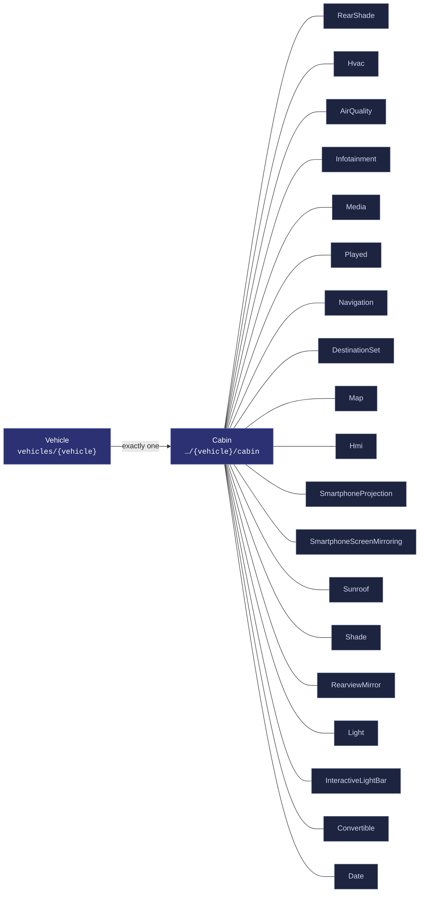
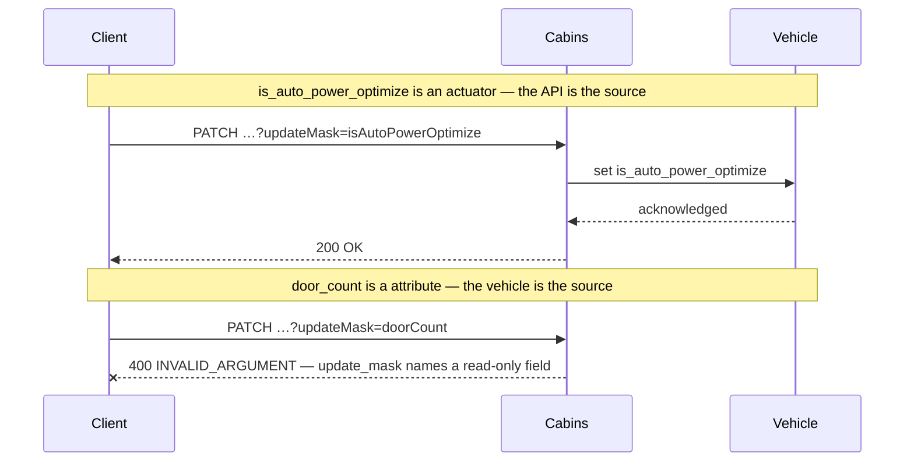
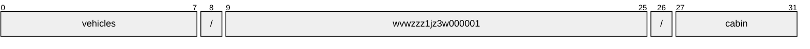
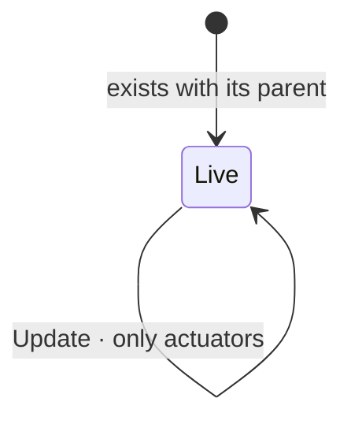

# Cabin

[](https://github.com/COVESA/vehicle_signal_specification)
[](https://covesa.github.io/vehicle_signal_specification/)
[](https://aip.dev/156)
[](#methods)
[](#signals)
[](v1/)

All in-cabin components, including doors.

```
vehicles/{vehicle}/cabin
```

## Where it sits



The 19 blue-grey boxes are **embedded messages**, not resources. They have no
name of their own and travel with the cabin.

## Example

A cabin as this API returns it:

```json
{
  "name": "vehicles/wvwzzz1jz3w000001/cabin",
  "uid": "b3f1c2de-4a5b-4c6d-8e9f-0a1b2c3d4e5f",
  "isAutoPowerOptimize": true,
  "isWindowChildLockEngaged": true,
  "powerOptimizeLevel": 3,
  "doorCount": 42,
  "driverPosition": "VEHICLE_CABIN_DRIVER_POSITION_MIDDLE"
}
```

The same data in the **VSS shape**, for a peer that speaks the specification
rather than this schema. `codec.ToVSS` produces it from
[`codec/manifest.json`](../../../../../codec/manifest.json):

```json
{
  "Vehicle.Cabin.IsAutoPowerOptimize": true,
  "Vehicle.Cabin.IsWindowChildLockEngaged": true,
  "Vehicle.Cabin.PowerOptimizeLevel": 3,
  "Vehicle.Cabin.DoorCount": 42,
  "Vehicle.Cabin.DriverPosition": "MIDDLE"
}
```

Note what changed: signals are keyed by **fully qualified VSS name**, enum
constants drop to the spelling VSS writes, and the AIP fields — `name`,
`uid` — fall away, because VSS declares no signal for them. `codec.FromVSS`
reverses all three.

Writing to a cabin, and the one thing that will fail:



```http
PATCH /v1/vehicles/wvwzzz1jz3w000001/cabin?updateMask=isAutoPowerOptimize
{ "isAutoPowerOptimize": true }
```

The rejection is the schema working, not an inconvenience: VSS marks
`door_count` a attribute, so the vehicle is the only thing that can set it. A
mask naming it fails rather than being silently dropped, so a caller that
believed it had written the value finds out immediately.

## Resource names

Every cabin is addressed by a name that alternates collection and identifier,
per [AIP-122](https://aip.dev/122):



32 characters, alternating, which is what [AIP-123](https://aip.dev/123)
requires. An identifier is 80 random bits in Crockford base32, prefixed with
the resource's singular so the name opens with a letter — the randomness
half of a ULID with the timestamp half removed, because a ULID's leading
characters *are* a timestamp and a resource name should not publish when the
record was created. The vehicle is the exception: its identifier is its VIN,
which is already unique and already meaningful, the case AIP-122 prefers.

Rather than splitting that string by hand, use
[`resourcename`](https://github.com/the-protobuf-project/resourcename), which
implements AIP-122 templates in Go, Python, Rust, TypeScript, Swift and C:

```go
t := resourcename.ResourceTemplate("vehicles/{vehicle}/cabin")
t.Parse("vehicles/wvwzzz1jz3w000001/cabin")
// map[vehicle:wvwzzz1jz3w000001]
```

```python
t = resourcename.ResourceTemplate("vehicles/{vehicle}/cabin")
t.parse("vehicles/wvwzzz1jz3w000001/cabin")
# {'vehicle': 'wvwzzz1jz3w000001'}
```

The template above is the `pattern` this resource declares in its
`google.api.resource` annotation, so the two cannot drift.

## Signals

22 fields: 7 AIP identity and lifecycle, 15 VSS signals. Field numbers 8–15 are reserved for identity fields a later revision may add, so adding one never renumbers a signal.

### Writable — actuators

The vehicle accepts these in an `update_mask`.

| Field | Type | Unit | VSS | Description |
| --- | --- | --- | --- | --- |
| `air_quality` | `AirQuality` | — | `Vehicle.Cabin.AirQuality` | Signals describing the composition of the air inside the vehicle cabin. |
| `convertible` | `Convertible` | — | `Vehicle.Cabin.Convertible` | Convertible roof. |
| `hvac` | `Hvac` | — | `Vehicle.Cabin.HVAC` | Climate control |
| `infotainment` | `Infotainment` | — | `Vehicle.Cabin.Infotainment` | Infotainment system. |
| `is_auto_power_optimize` | `bool` | — | `Vehicle.Cabin.IsAutoPowerOptimize` | Auto Power Optimization Flag When set to 'true', the system enables automatic power optimization, dynamically adjusting the power optimization level based on runtime conditions or features managed by the OEM. When set to 'false', manual control of the power optimization level is allowed. |
| `is_window_child_lock_engaged` | `bool` | — | `Vehicle.Cabin.IsWindowChildLockEngaged` | Is window child lock engaged. True = Engaged. False = Disengaged. |
| `light` | `Light` | — | `Vehicle.Cabin.Light` | Light that is part of the Cabin. |
| `power_optimize_level` | `int32` | — | `Vehicle.Cabin.PowerOptimizeLevel` | Power optimization level for this branch/subsystem. A higher number indicates more aggressive power optimization. Level 0 indicates that all functionality is enabled, no power optimization enabled. Level 10 indicates most aggressive power optimization mode, only essential functionality enabled. |
| `rear_shade` | `RearShade` | — | `Vehicle.Cabin.RearShade` | Rear window shade. Open = Retracted, Closed = Deployed. Start position for RearShade is Open/Retracted. |
| `rearview_mirror` | `RearviewMirror` | — | `Vehicle.Cabin.RearviewMirror` | Rear-view mirror. |
| `sunroof` | `Sunroof` | — | `Vehicle.Cabin.Sunroof` | Sun roof status. |

### Read-only — sensors and attributes

The vehicle reports these. An `update_mask` naming one is **rejected**, not
silently ignored.

| Field | Type | Unit | VSS | Description |
| --- | --- | --- | --- | --- |
| `door_count` | `int32` | — | `Vehicle.Cabin.DoorCount` | Number of doors in vehicle. |
| `driver_position` | [`VehicleCabinDriverPosition`](#vehiclecabindriverposition) | — | `Vehicle.Cabin.DriverPosition` | The position of the driver seat in row 1. |
| `seat_pos_count` | `repeated int32` | — | `Vehicle.Cabin.SeatPosCount` | Number of seats across each row from the front to the rear. |
| `seat_row_count` | `int32` | — | `Vehicle.Cabin.SeatRowCount` | Number of seat rows in vehicle. |

<details>
<summary>Identity and lifecycle — 7 fields every resource carries</summary>

| Field | Type | Notes |
| --- | --- | --- |
| `name` | `string` | `vehicles/{vehicle}/cabin`, server-assigned |
| `uid` | `string` | server-assigned UUID4, per [AIP-148](https://aip.dev/148) |
| `etag` | `string` | pass back on update to make the write conditional, per [AIP-154](https://aip.dev/154) |
| `create_time` `update_time` | `Timestamp` | when it was stored here |
| `delete_time` `expire_time` | `Timestamp` | soft delete; recoverable until `expire_time` |

</details>

## Methods

A singleton, so **`Get`** · **`Update`** only, per
[AIP-156](https://aip.dev/156). Nothing can create a second or delete the only
one — that is the complete method set for a singleton, not a reduced one.



```http
GET    /v1/{name=vehicles/*/cabin}
PATCH  /v1/{cabin.name=vehicles/*/cabin}
```

## Enums

#### `VehicleCabinDriverPosition`

The position of the driver seat in row 1.

`UNSPECIFIED` · `LEFT` · `MIDDLE` · `RIGHT`
<sub>emitted as `VEHICLE_CABIN_DRIVER_POSITION_LEFT`, and so on</sub>

#### `CabinRearShadeSwitch`

Switch controlling sliding action such as window, sunroof, or blind.

`UNSPECIFIED` · `INACTIVE` · `CLOSE` · `OPEN` · `ONE_SHOT_CLOSE` ·
`ONE_SHOT_OPEN`
<sub>emitted as `CABIN_REAR_SHADE_SWITCH_INACTIVE`, and so on</sub>

#### `InfotainmentMediaAction`

Tells if the media was

`UNSPECIFIED` · `UNKNOWN` · `STOP` · `PLAY` · `FAST_FORWARD` ·
`FAST_BACKWARD` · `SKIP_FORWARD` · `SKIP_BACKWARD`
<sub>emitted as `INFOTAINMENT_MEDIA_ACTION_UNKNOWN`, and so on</sub>

#### `MediaPlayedSource`

Media selected for playback

`UNSPECIFIED` · `UNKNOWN` · `SIRIUS_XM` · `AM` · `FM` · `DAB` · `TV` ·
`CD` · `DVD` · `AUX` · `USB` · `DISK` · `BLUETOOTH` · `INTERNET` ·
`VOICE` · `BEEP`
<sub>emitted as `MEDIA_PLAYED_SOURCE_UNKNOWN`, and so on</sub>

#### `InfotainmentNavigationMute`

Navigation mute state that was selected.

`UNSPECIFIED` · `MUTED` · `ALERT_ONLY` · `UNMUTED`
<sub>emitted as `INFOTAINMENT_NAVIGATION_MUTE_MUTED`, and so on</sub>

#### `InfotainmentNavigationGuidanceVoice`

Navigation guidance state that was selected.

`UNSPECIFIED` · `STANDARD_MALE` · `STANDARD_FEMALE` · `ETC`
<sub>emitted as `INFOTAINMENT_NAVIGATION_GUIDANCE_VOICE_STANDARD_MALE`, and so on</sub>

#### `InfotainmentHmiFontSize`

Font size used in the current HMI

`UNSPECIFIED` · `STANDARD` · `LARGE` · `EXTRA_LARGE`
<sub>emitted as `INFOTAINMENT_HMI_FONT_SIZE_STANDARD`, and so on</sub>

#### `InfotainmentHmiDateFormat`

Date format used in the current HMI

`UNSPECIFIED` · `YYYY_MM_DD` · `DD_MM_YYYY` · `MM_DD_YYYY` · `YY_MM_DD` ·
`DD_MM_YY` · `MM_DD_YY`
<sub>emitted as `INFOTAINMENT_HMI_DATE_FORMAT_YYYY_MM_DD`, and so on</sub>

#### `InfotainmentHmiTimeFormat`

Time format used in the current HMI

`UNSPECIFIED` · `HR_12` · `HR_24`
<sub>emitted as `INFOTAINMENT_HMI_TIME_FORMAT_HR_12`, and so on</sub>

#### `InfotainmentHmiDistanceUnit`

Distance unit used in the current HMI

`UNSPECIFIED` · `MILES` · `KILOMETERS`
<sub>emitted as `INFOTAINMENT_HMI_DISTANCE_UNIT_MILES`, and so on</sub>

#### `InfotainmentHmiFuelVolumeUnit`

Fuel volume unit used in the current HMI

`UNSPECIFIED` · `LITER` · `GALLON_US` · `GALLON_UK`
<sub>emitted as `INFOTAINMENT_HMI_FUEL_VOLUME_UNIT_LITER`, and so on</sub>

#### `InfotainmentHmiFuelEconomyUnits`

Fuel economy unit used in the current HMI

`UNSPECIFIED` · `MPG_UK` · `MPG_US` · `MILES_PER_LITER` ·
`KILOMETERS_PER_LITER` · `LITERS_PER_100_KILOMETERS`
<sub>emitted as `INFOTAINMENT_HMI_FUEL_ECONOMY_UNITS_MPG_UK`, and so on</sub>

#### `InfotainmentHmiEvEconomyUnits`

EV fuel economy unit used in the current HMI

`UNSPECIFIED` · `MILES_PER_KILOWATT_HOUR` · `KILOMETERS_PER_KILOWATT_HOUR`
· `KILOWATT_HOURS_PER_100_MILES` · `KILOWATT_HOURS_PER_100_KILOMETERS` ·
`WATT_HOURS_PER_MILE` · `WATT_HOURS_PER_KILOMETER`
<sub>emitted as `INFOTAINMENT_HMI_EV_ECONOMY_UNITS_MILES_PER_KILOWATT_HOUR`, and so on</sub>

#### `InfotainmentHmiTemperatureUnit`

Temperature unit used in the current HMI

`UNSPECIFIED` · `C` · `F`
<sub>emitted as `INFOTAINMENT_HMI_TEMPERATURE_UNIT_C`, and so on</sub>

#### `InfotainmentHmiTirePressureUnit`

Tire pressure unit used in the current HMI

`UNSPECIFIED` · `PSI` · `KPA` · `BAR`
<sub>emitted as `INFOTAINMENT_HMI_TIRE_PRESSURE_UNIT_PSI`, and so on</sub>

#### `InfotainmentHmiSpeedUnit`

Speed unit used in the current HMI

`UNSPECIFIED` · `METERS_PER_SECOND` · `MILES_PER_HOUR` ·
`KILOMETERS_PER_HOUR`
<sub>emitted as `INFOTAINMENT_HMI_SPEED_UNIT_METERS_PER_SECOND`, and so on</sub>

#### `InfotainmentHmiEvEnergyUnits`

EV energy unit used in the current HMI

`UNSPECIFIED` · `WATT_HOURS` · `AMPERE_HOURS` · `KILOWATT_HOURS`
<sub>emitted as `INFOTAINMENT_HMI_EV_ENERGY_UNITS_WATT_HOURS`, and so on</sub>

#### `InfotainmentHmiDayNightMode`

Current display theme

`UNSPECIFIED` · `DAY` · `NIGHT`
<sub>emitted as `INFOTAINMENT_HMI_DAY_NIGHT_MODE_DAY`, and so on</sub>

#### `InfotainmentSmartphoneProjectionActive`

Projection activation info.

`UNSPECIFIED` · `NONE` · `ACTIVE` · `INACTIVE`
<sub>emitted as `INFOTAINMENT_SMARTPHONE_PROJECTION_ACTIVE_NONE`, and so on</sub>

#### `InfotainmentSmartphoneProjectionSource`

Connectivity source selected for projection.

`UNSPECIFIED` · `USB` · `BLUETOOTH` · `WIFI`
<sub>emitted as `INFOTAINMENT_SMARTPHONE_PROJECTION_SOURCE_USB`, and so on</sub>

#### `InfotainmentSmartphoneProjectionSupportedMode`

Supportable list for projection.

`UNSPECIFIED` · `ANDROID_AUTO` · `APPLE_CARPLAY` · `MIRROR_LINK` · `OTHER`
<sub>emitted as `INFOTAINMENT_SMARTPHONE_PROJECTION_SUPPORTED_MODE_ANDROID_AUTO`, and so on</sub>

#### `InfotainmentSmartphoneScreenMirroringActive`

Mirroring activation info.

`UNSPECIFIED` · `NONE` · `ACTIVE` · `INACTIVE`
<sub>emitted as `INFOTAINMENT_SMARTPHONE_SCREEN_MIRRORING_ACTIVE_NONE`, and so on</sub>

#### `InfotainmentSmartphoneScreenMirroringSource`

Connectivity source selected for mirroring.

`UNSPECIFIED` · `USB` · `BLUETOOTH` · `WIFI`
<sub>emitted as `INFOTAINMENT_SMARTPHONE_SCREEN_MIRRORING_SOURCE_USB`, and so on</sub>

#### `CabinSunroofSwitch`

Switch controlling sliding action such as window, sunroof, or shade.

`UNSPECIFIED` · `INACTIVE` · `CLOSE` · `OPEN` · `ONE_SHOT_CLOSE` ·
`ONE_SHOT_OPEN` · `TILT_UP` · `TILT_DOWN`
<sub>emitted as `CABIN_SUNROOF_SWITCH_INACTIVE`, and so on</sub>

#### `SunroofShadeSwitch`

Switch controlling sliding action such as window, sunroof, or blind.

`UNSPECIFIED` · `INACTIVE` · `CLOSE` · `OPEN` · `ONE_SHOT_CLOSE` ·
`ONE_SHOT_OPEN`
<sub>emitted as `SUNROOF_SHADE_SWITCH_INACTIVE`, and so on</sub>

#### `CabinConvertibleState`

Roof status on convertible vehicles.

`UNSPECIFIED` · `UNDEFINED` · `CLOSED` · `OPEN` · `CLOSING` · `OPENING`
· `STALLED`
<sub>emitted as `CABIN_CONVERTIBLE_STATE_UNDEFINED`, and so on</sub>

---

<sub>Generated by `just docs` from COVESA VSS `2026-09-02` (`cd4bc50`) and VDM `2026-07-24` (`36bc939`). Do not edit by hand.<br>
Source: [`cabin.proto`](v1/cabin.proto) · [`service.proto`](v1/service.proto) · [`messages.proto`](v1/messages.proto)</sub>
