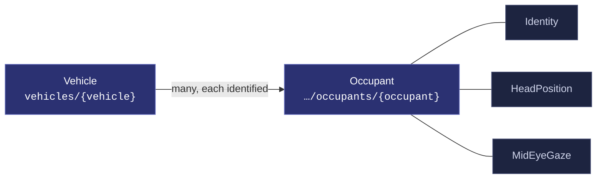
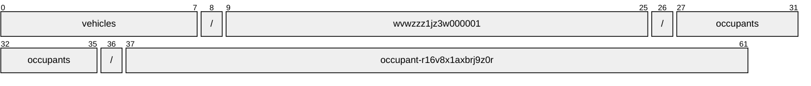
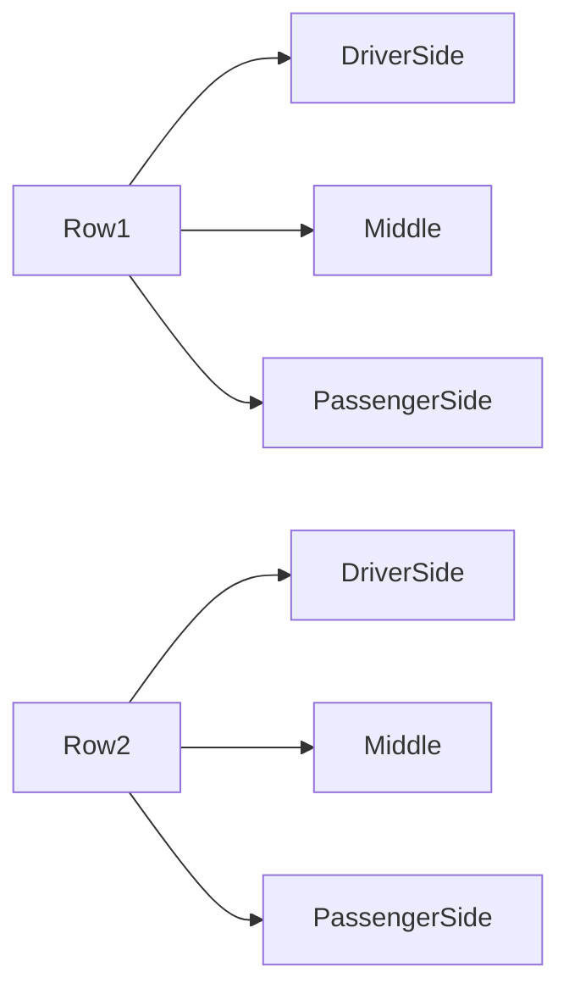
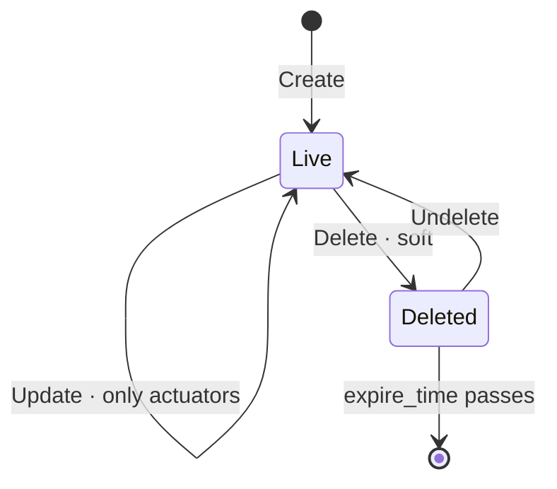

# Occupant

[](https://github.com/COVESA/vehicle_signal_specification)
[](https://covesa.github.io/vehicle_signal_specification/)
[](https://aip.dev/121)
[](#methods)
[](#signals)
[](v1/)

Occupant (Driver or Passenger) data.

```
vehicles/{vehicle}/occupants/{occupant}
```

## Where it sits



The 3 blue-grey boxes are **embedded messages**, not resources. They have no
name of their own and travel with the occupant.

## Resource names

Every occupant is addressed by a name that alternates collection and
identifier, per [AIP-122](https://aip.dev/122):



62 characters, alternating, which is what [AIP-123](https://aip.dev/123)
requires. An identifier is 80 random bits in Crockford base32, prefixed with
the resource's singular so the name opens with a letter — the randomness
half of a ULID with the timestamp half removed, because a ULID's leading
characters *are* a timestamp and a resource name should not publish when the
record was created. The vehicle is the exception: its identifier is its VIN,
which is already unique and already meaningful, the case AIP-122 prefers.

Rather than splitting that string by hand, use
[`resourcename`](https://github.com/the-protobuf-project/resourcename), which
implements AIP-122 templates in Go, Python, Rust, TypeScript, Swift and C:

```go
t := resourcename.ResourceTemplate("vehicles/{vehicle}/occupants/{occupant}")
t.Parse("vehicles/wvwzzz1jz3w000001/occupants/occupant-r16v8x1axbrj9z0r")
// map[vehicle:wvwzzz1jz3w000001 occupant:occupant-r16v8x1axbrj9z0r]
```

```python
t = resourcename.ResourceTemplate("vehicles/{vehicle}/occupants/{occupant}")
t.parse("vehicles/wvwzzz1jz3w000001/occupants/occupant-r16v8x1axbrj9z0r")
# {'vehicle': 'wvwzzz1jz3w000001', 'occupant': 'occupant-r16v8x1axbrj9z0r'}
```

The template above is the `pattern` this resource declares in its
`google.api.resource` annotation, so the two cannot drift.

## Which occupant



VSS expands this branch across Row1, Row2 × DriverSide, Middle,
PassengerSide, so the combination names one occupant — which is what makes
it a resource rather than a repeated field. The axes are recorded in
[`codec/manifest.json`](../../../../../codec/manifest.json), which is the only
thing that says how to map an id back to a VSS path.

## Methods

A collection, so the full set: **`Get`** · **`List`** · **`Create`** · **`Update`** · **`Delete`** · **`Undelete`**.



```http
GET    /v1/{name=vehicles/*/occupants/*}
PATCH  /v1/{occupant.name=vehicles/*/occupants/*}
GET    /v1/{parent=vehicles/*}/occupants
POST   /v1/{parent=vehicles/*}/occupants
DELETE /v1/{name=vehicles/*/occupants/*}
POST   /v1/{name=vehicles/*/occupants/*}:undelete
```

A deleted occupant is still returned by `Get` and hidden from `List` unless
`show_deleted` is set — which is what makes `Undelete` meaningful.

---

<sub>Generated by `just docs` from COVESA VSS `2026-09-02` (`cd4bc50`) and VDM `2026-07-24` (`36bc939`). Do not edit by hand.<br>
Source: [`occupant.proto`](v1/occupant.proto) · [`service.proto`](v1/service.proto) · [`messages.proto`](v1/messages.proto)</sub>
