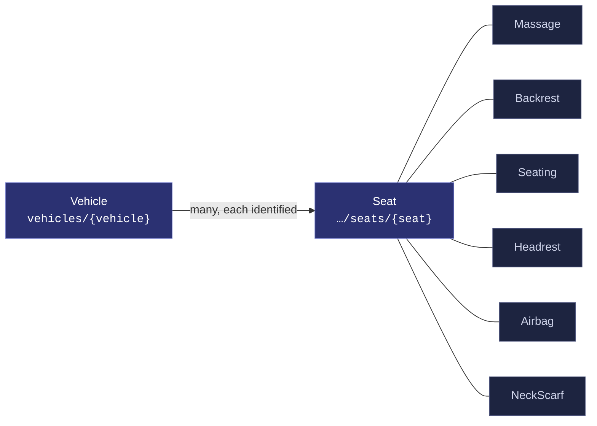
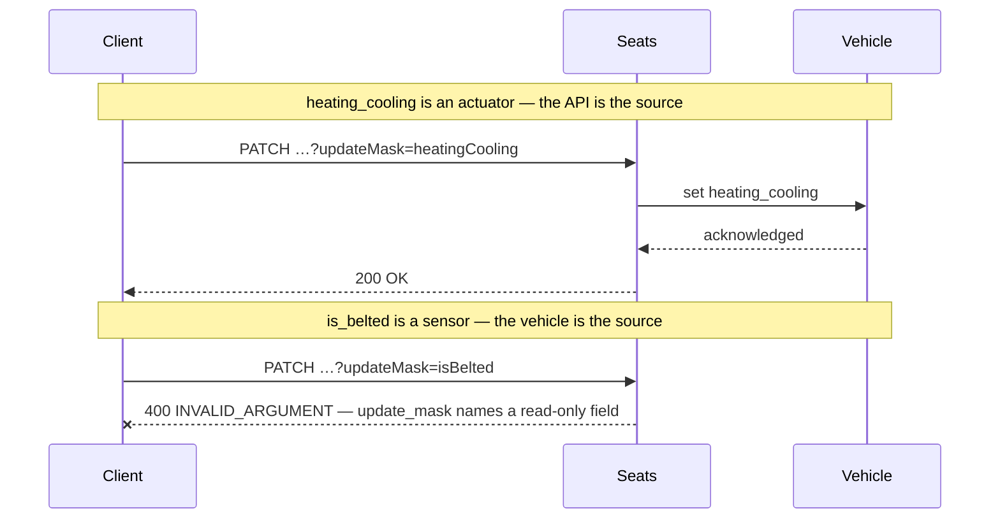
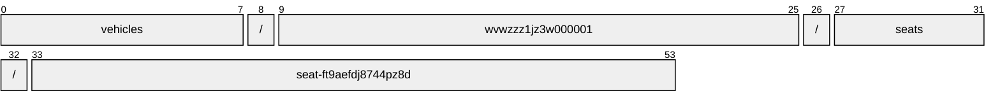
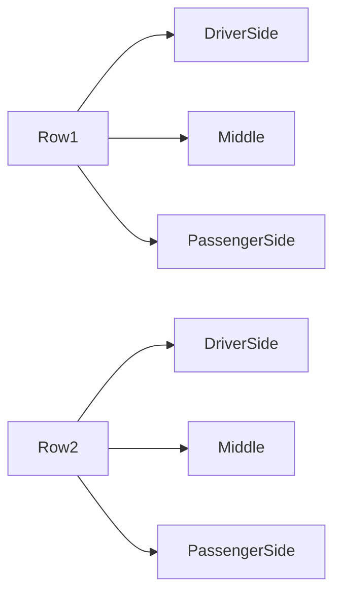
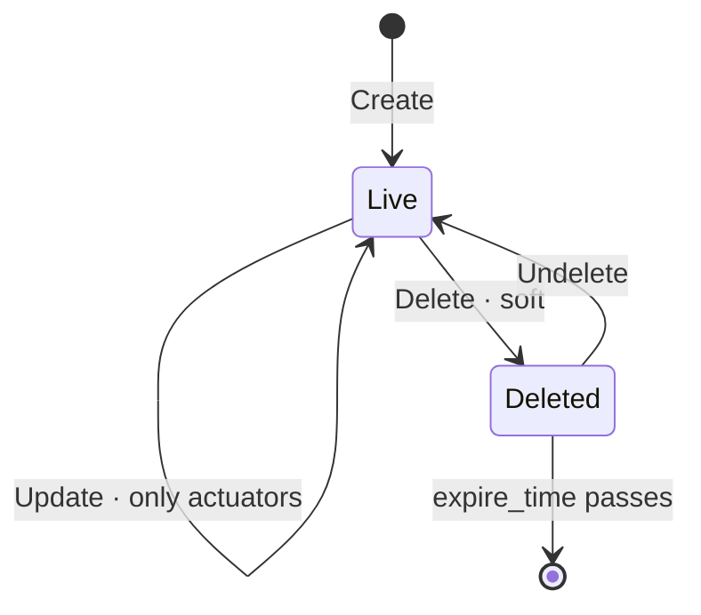

# Seat

[](https://github.com/COVESA/vehicle_signal_specification)
[](https://covesa.github.io/vehicle_signal_specification/)
[](https://aip.dev/121)
[](#methods)
[](#signals)
[](v1/)

All seats.

```
vehicles/{vehicle}/seats/{seat}
```

## Where it sits



In the specification this hangs beneath **Cabin**, but its name hangs off
**Vehicle**. AIP-123 requires a name to alternate collection and identifier,
and `cabin` is a singleton whose name ends in a literal — two literals in a
row is not a legal name. Nothing is lost: cabin has one occurrence, so the
segment would identify nothing, and the full VSS path survives in the branch
annotation.

The 6 blue-grey boxes are **embedded messages**, not resources. They have no
name of their own and travel with the seat.

## Example

A seat as this API returns it:

```json
{
  "name": "vehicles/wvwzzz1jz3w000001/seats/seat-ft9aefdj8744pz8d",
  "uid": "b3f1c2de-4a5b-4c6d-8e9f-0a1b2c3d4e5f",
  "heatingCooling": -33,
  "height": 42,
  "isBackwardSwitchEngaged": true,
  "isCoolerSwitchEngaged": true,
  "isDecreaseMassageLevelSwitchEngaged": true
}
```

The same data in the **VSS shape**, for a peer that speaks the specification
rather than this schema. `codec.ToVSS` produces it from
[`codec/manifest.json`](../../../../../codec/manifest.json):

```json
{
  "Vehicle.Cabin.Seat.HeatingCooling": -33,
  "Vehicle.Cabin.Seat.Height": 42,
  "Vehicle.Cabin.Seat.IsBackwardSwitchEngaged": true,
  "Vehicle.Cabin.Seat.IsCoolerSwitchEngaged": true,
  "Vehicle.Cabin.Seat.IsDecreaseMassageLevelSwitchEngaged": true
}
```

Note what changed: signals are keyed by **fully qualified VSS name**, enum
constants drop to the spelling VSS writes, and the AIP fields — `name`,
`uid` — fall away, because VSS declares no signal for them. `codec.FromVSS`
reverses all three.

Writing to a seat, and the one thing that will fail:



```http
PATCH /v1/vehicles/wvwzzz1jz3w000001/seats/seat-ft9aefdj8744pz8d?updateMask=heatingCooling
{ "heatingCooling": -33 }
```

The rejection is the schema working, not an inconvenience: VSS marks
`is_belted` a sensor, so the vehicle is the only thing that can set it. A mask
naming it fails rather than being silently dropped, so a caller that believed
it had written the value finds out immediately.

## Resource names

Every seat is addressed by a name that alternates collection and identifier,
per [AIP-122](https://aip.dev/122):



54 characters, alternating, which is what [AIP-123](https://aip.dev/123)
requires. An identifier is 80 random bits in Crockford base32, prefixed with
the resource's singular so the name opens with a letter — the randomness
half of a ULID with the timestamp half removed, because a ULID's leading
characters *are* a timestamp and a resource name should not publish when the
record was created. The vehicle is the exception: its identifier is its VIN,
which is already unique and already meaningful, the case AIP-122 prefers.

Rather than splitting that string by hand, use
[`resourcename`](https://github.com/the-protobuf-project/resourcename), which
implements AIP-122 templates in Go, Python, Rust, TypeScript, Swift and C:

```go
t := resourcename.ResourceTemplate("vehicles/{vehicle}/seats/{seat}")
t.Parse("vehicles/wvwzzz1jz3w000001/seats/seat-ft9aefdj8744pz8d")
// map[vehicle:wvwzzz1jz3w000001 seat:seat-ft9aefdj8744pz8d]
```

```python
t = resourcename.ResourceTemplate("vehicles/{vehicle}/seats/{seat}")
t.parse("vehicles/wvwzzz1jz3w000001/seats/seat-ft9aefdj8744pz8d")
# {'vehicle': 'wvwzzz1jz3w000001', 'seat': 'seat-ft9aefdj8744pz8d'}
```

The template above is the `pattern` this resource declares in its
`google.api.resource` annotation, so the two cannot drift.

## Signals

24 fields: 7 AIP identity and lifecycle, 17 VSS signals. Field numbers 8–15
are reserved for identity fields a later revision may add, so adding one never
renumbers a signal.

### Writable — actuators

The vehicle accepts these in an `update_mask`.

| Field | Type | Unit | VSS | Description |
| --- | --- | --- | --- | --- |
| `heating_cooling` | `int32` | `percent` | `Vehicle.Cabin.Seat.HeatingCooling` | Heating or Cooling requsted for the Item. -100 = Maximum cooling, 0 = Heating/cooling deactivated, 100 = Maximum heating. |
| `height` | `int32` | `mm` | `Vehicle.Cabin.Seat.Height` | Seat position on vehicle z-axis. Position is relative within available movable range of the seating. 0 = Lowermost position supported. |
| `is_backward_switch_engaged` | `bool` | — | `Vehicle.Cabin.Seat.IsBackwardSwitchEngaged` | Seat backward switch engaged. |
| `is_cooler_switch_engaged` | `bool` | — | `Vehicle.Cabin.Seat.IsCoolerSwitchEngaged` | Cooler switch for Seat heater. |
| `is_decrease_massage_level_switch_engaged` | `bool` | — | `Vehicle.Cabin.Seat.IsDecreaseMassageLevelSwitchEngaged` | Decrease massage level switch engaged. |
| `is_down_switch_engaged` | `bool` | — | `Vehicle.Cabin.Seat.IsDownSwitchEngaged` | Seat down switch engaged. |
| `is_forward_switch_engaged` | `bool` | — | `Vehicle.Cabin.Seat.IsForwardSwitchEngaged` | Seat forward switch engaged. |
| `is_increase_massage_level_switch_engaged` | `bool` | — | `Vehicle.Cabin.Seat.IsIncreaseMassageLevelSwitchEngaged` | Increase massage level switch engaged. |
| `is_tilt_backward_switch_engaged` | `bool` | — | `Vehicle.Cabin.Seat.IsTiltBackwardSwitchEngaged` | Tilt backward switch engaged. |
| `is_tilt_forward_switch_engaged` | `bool` | — | `Vehicle.Cabin.Seat.IsTiltForwardSwitchEngaged` | Tilt forward switch engaged. |
| `is_up_switch_engaged` | `bool` | — | `Vehicle.Cabin.Seat.IsUpSwitchEngaged` | Seat up switch engaged. |
| `is_warmer_switch_engaged` | `bool` | — | `Vehicle.Cabin.Seat.IsWarmerSwitchEngaged` | Warmer switch for Seat heater. |
| `position` | `int32` | `mm` | `Vehicle.Cabin.Seat.Position` | Seat position on vehicle x-axis. Position is relative to the frontmost position supported by the seat. 0 = Frontmost position supported. |
| `seat_belt_height` | `int32` | `mm` | `Vehicle.Cabin.Seat.SeatBeltHeight` | Seat belt position on vehicle z-axis. Position is relative within available movable range of the seat belt. 0 = Lowermost position supported. |
| `tilt` | `double` | `degrees` | `Vehicle.Cabin.Seat.Tilt` | Tilting of seat (seating and backrest) relative to vehicle x-axis. 0 = seat bottom is flat, seat bottom and vehicle x-axis are parallel. Positive degrees = seat tilted backwards, seat x-axis tilted upward, seat z-axis is tilted backward. |

### Read-only — sensors and attributes

The vehicle reports these. An `update_mask` naming one is **rejected**, not
silently ignored.

| Field | Type | Unit | VSS | Description |
| --- | --- | --- | --- | --- |
| `is_belted` | `bool` | — | `Vehicle.Cabin.Seat.IsBelted` | Is the belt engaged. |
| `occupancy_status` | [`OccupancyState`](#occupancystate) | — | `Vehicle.Cabin.Seat.OccupancyStatus` | Occupancy status of the seat. |

<details>
<summary>Identity and lifecycle — 7 fields every resource carries</summary>

| Field | Type | Notes |
| --- | --- | --- |
| `name` | `string` | `vehicles/{vehicle}/seats/{seat}`, server-assigned |
| `uid` | `string` | server-assigned UUID4, per [AIP-148](https://aip.dev/148) |
| `etag` | `string` | pass back on update to make the write conditional, per [AIP-154](https://aip.dev/154) |
| `create_time` `update_time` | `Timestamp` | when it was stored here |
| `delete_time` `expire_time` | `Timestamp` | soft delete; recoverable until `expire_time` |

</details>

## Embedded messages

6 messages travel inside the seat and have no name of their own. Address a
field on one through its owner — `massage.<field>` — not directly.

<details>
<summary><code>Massage</code> — Massage related information for the seat.</summary>

| Field | Type | Unit | VSS | Description |
| --- | --- | --- | --- | --- |
| `activation` | [`State`](#state) | — | `Vehicle.Cabin.Seat.Massage.Status` | Massage status. |
| `is_available` | `bool` | — | `Vehicle.Cabin.Seat.Massage.IsAvailable` | True if the seat have the massage capability |
| `level` | `int32` | `percent` | `Vehicle.Cabin.Seat.Massage.Level` | Seat massage level. 0 = off. 100 = max massage. |
| `supported_types` | `repeated string` | — | `Vehicle.Cabin.Seat.Massage.SupportedTypes` | Type of massage. |
| `type_active` | `string` | — | `Vehicle.Cabin.Seat.Massage.TypeActive` | Type of massage active. |

</details>

<details>
<summary><code>Backrest</code> — Describes signals related to the backrest of the seat.</summary>

| Field | Type | Unit | VSS | Description |
| --- | --- | --- | --- | --- |
| `bottom_lumbar_support` | `double` | `percent` | `Vehicle.Cabin.Seat.Backrest.BottomLumbarSupport` | Bottom lumbar support (in/out position). 0 = Innermost position. 100 = Outermost position. |
| `heating_cooling` | `int32` | `percent` | `Vehicle.Cabin.Seat.Backrest.HeatingCooling` | Heating or Cooling requsted for the Item. -100 = Maximum cooling, 0 = Heating/cooling deactivated, 100 = Maximum heating. |
| `is_less_lumbar_support_switch_engaged` | `bool` | — | `Vehicle.Cabin.Seat.Backrest.IsLessLumbarSupportSwitchEngaged` | Is switch for less lumbar support engaged. |
| `is_less_side_bolster_support_switch_engaged` | `bool` | — | `Vehicle.Cabin.Seat.Backrest.IsLessSideBolsterSupportSwitchEngaged` | Is switch for less side bolster support engaged. |
| `is_lumbar_down_switch_engaged` | `bool` | — | `Vehicle.Cabin.Seat.Backrest.IsLumbarDownSwitchEngaged` | Lumbar down switch engaged. |
| `is_lumbar_up_switch_engaged` | `bool` | — | `Vehicle.Cabin.Seat.Backrest.IsLumbarUpSwitchEngaged` | Lumbar up switch engaged. |
| `is_more_lumbar_support_switch_engaged` | `bool` | — | `Vehicle.Cabin.Seat.Backrest.IsMoreLumbarSupportSwitchEngaged` | Is switch for more lumbar support engaged. |
| `is_more_side_bolster_support_switch_engaged` | `bool` | — | `Vehicle.Cabin.Seat.Backrest.IsMoreSideBolsterSupportSwitchEngaged` | Is switch for more side bolster support engaged. |
| `is_recline_backward_switch_engaged` | `bool` | — | `Vehicle.Cabin.Seat.Backrest.IsReclineBackwardSwitchEngaged` | Backrest recline backward switch engaged. |
| `is_recline_forward_switch_engaged` | `bool` | — | `Vehicle.Cabin.Seat.Backrest.IsReclineForwardSwitchEngaged` | Backrest recline forward switch engaged. |
| `lumbar_height` | `int32` | `mm` | `Vehicle.Cabin.Seat.Backrest.LumbarHeight` | Height of lumbar support. Position is relative within available movable range of the lumbar support. 0 = Lowermost position supported. |
| `lumbar_support` | `double` | `percent` | `Vehicle.Cabin.Seat.Backrest.LumbarSupport` | Lumbar support (in/out position). 0 = Innermost position. 100 = Outermost position. |
| `mid_lumbar_support` | `double` | `percent` | `Vehicle.Cabin.Seat.Backrest.MidLumbarSupport` | Mid lumbar support (in/out position). 0 = Innermost position. 100 = Outermost position. |
| `recline` | `double` | `degrees` | `Vehicle.Cabin.Seat.Backrest.Recline` | Backrest recline compared to seat z-axis (seat vertical axis). 0 degrees = Upright/Vertical backrest. Negative degrees for forward recline. Positive degrees for backward recline. |
| `side_bolster_support` | `double` | `percent` | `Vehicle.Cabin.Seat.Backrest.SideBolsterSupport` | Side bolster support. 0 = Minimum support (widest side bolster setting). 100 = Maximum support. |
| `side_bolster_support_left` | `double` | `percent` | `Vehicle.Cabin.Seat.Backrest.SideBolsterSupportLeft` | Side bolster support left. 0 = Minimum support (widest side bolster setting). 100 = Maximum support. |
| `side_bolster_support_right` | `double` | `percent` | `Vehicle.Cabin.Seat.Backrest.SideBolsterSupportRight` | Side bolster support right. 0 = Minimum support (widest side bolster setting). 100 = Maximum support. |
| `top_lumbar_support` | `double` | `percent` | `Vehicle.Cabin.Seat.Backrest.TopLumbarSupport` | Top lumbar support (in/out position). 0 = Innermost position. 100 = Outermost position. |
| `upper_shoulder_support` | `double` | `percent` | `Vehicle.Cabin.Seat.Backrest.UpperShoulderSupport` | Upper shoulder support. 0 = Minimum support (widest side bolster setting). 100 = Maximum support. |

</details>

<details>
<summary><code>Seating</code> — Describes signals related to the seat bottom of the seat.</summary>

| Field | Type | Unit | VSS | Description |
| --- | --- | --- | --- | --- |
| `heating_cooling` | `int32` | `percent` | `Vehicle.Cabin.Seat.Seating.HeatingCooling` | Heating or Cooling requsted for the Item. -100 = Maximum cooling, 0 = Heating/cooling deactivated, 100 = Maximum heating. |
| `is_backward_switch_engaged` | `bool` | — | `Vehicle.Cabin.Seat.Seating.IsBackwardSwitchEngaged` | Is switch to decrease seating length engaged. |
| `is_forward_switch_engaged` | `bool` | — | `Vehicle.Cabin.Seat.Seating.IsForwardSwitchEngaged` | Is switch to increase seating length engaged. |
| `length` | `int32` | `mm` | `Vehicle.Cabin.Seat.Seating.Length` | Length adjustment of seating. 0 = Adjustable part of seating in rearmost position (Shortest length of seating). |
| `side_bolster_support_left` | `double` | `percent` | `Vehicle.Cabin.Seat.Seating.SideBolsterSupportLeft` | Seat bottom side bolster support left. 0 = Minimum support (widest side bolster setting). 100 = Maximum support. |
| `side_bolster_support_right` | `double` | `percent` | `Vehicle.Cabin.Seat.Seating.SideBolsterSupportRight` | Seat bottom side bolster support right. 0 = Minimum support (widest side bolster setting). 100 = Maximum support. |

</details>

<details>
<summary><code>Headrest</code> — Headrest settings.</summary>

| Field | Type | Unit | VSS | Description |
| --- | --- | --- | --- | --- |
| `angle` | `double` | `degrees` | `Vehicle.Cabin.Seat.Headrest.Angle` | Headrest angle, relative to backrest, 0 degrees if parallel to backrest, Positive degrees = tilted forward. |
| `height` | `int32` | `mm` | `Vehicle.Cabin.Seat.Headrest.Height` | Position of headrest relative to movable range of the head rest. 0 = Bottommost position supported. |
| `is_backward_switch_engaged` | `bool` | — | `Vehicle.Cabin.Seat.Headrest.IsBackwardSwitchEngaged` | Headrest backward switch engaged. |
| `is_down_switch_engaged` | `bool` | — | `Vehicle.Cabin.Seat.Headrest.IsDownSwitchEngaged` | Headrest down switch engaged. |
| `is_forward_switch_engaged` | `bool` | — | `Vehicle.Cabin.Seat.Headrest.IsForwardSwitchEngaged` | Headrest forward switch engaged. |
| `is_up_switch_engaged` | `bool` | — | `Vehicle.Cabin.Seat.Headrest.IsUpSwitchEngaged` | Headrest up switch engaged. |

</details>

<details>
<summary><code>Airbag</code> — Airbag signals.</summary>

| Field | Type | Unit | VSS | Description |
| --- | --- | --- | --- | --- |
| `is_deployed` | `bool` | — | `Vehicle.Cabin.Seat.Airbag.IsDeployed` | Airbag deployment status. True = Airbag deployed. False = Airbag not deployed. |
| `is_enabled` | `bool` | — | `Vehicle.Cabin.Seat.Airbag.IsEnabled` | Airbag enabled status. True = Airbag enabled. False = Airbag not enabled. |

</details>

<details>
<summary><code>NeckScarf</code> — NeckScarf settings.</summary>

| Field | Type | Unit | VSS | Description |
| --- | --- | --- | --- | --- |
| `fan_speed` | `int32` | `percent` | `Vehicle.Cabin.Seat.NeckScarf.FanSpeed` | Speed of the fan. |
| `heating_cooling` | `int32` | `percent` | `Vehicle.Cabin.Seat.NeckScarf.HeatingCooling` | Heating or Cooling requsted for the Item. -100 = Maximum cooling, 0 = Heating/cooling deactivated, 100 = Maximum heating. |

</details>

## Which seat



VSS expands this branch across Row1, Row2 × DriverSide, Middle,
PassengerSide, so the combination names one seat — which is what makes it a
resource rather than a repeated field. The axes are recorded in
[`codec/manifest.json`](../../../../../codec/manifest.json), which is the only
thing that says how to map an id back to a VSS path.

## Methods

A collection, so the full set: **`Get`** · **`List`** · **`Create`** · **`Update`** · **`Delete`** · **`Undelete`**.



```http
GET    /v1/{name=vehicles/*/seats/*}
PATCH  /v1/{seat.name=vehicles/*/seats/*}
GET    /v1/{parent=vehicles/*}/seats
POST   /v1/{parent=vehicles/*}/seats
DELETE /v1/{name=vehicles/*/seats/*}
POST   /v1/{name=vehicles/*/seats/*}:undelete
```

A deleted seat is still returned by `Get` and hidden from `List` unless
`show_deleted` is set — which is what makes `Undelete` meaningful.

## Enums

#### `OccupancyState`

Occupancy status of the seat.

`UNSPECIFIED` · `UNKNOWN` · `OCCUPIED` · `EMPTY`
<sub>emitted as `OCCUPANCY_STATE_UNKNOWN`, and so on</sub>

#### `State`

Massage status.

`UNSPECIFIED` · `ON` · `OFF`
<sub>emitted as `STATE_ON_VALUE`, and so on</sub>

---

<sub>Generated by `just docs` from COVESA VSS `2026-09-02` (`cd4bc50`) and VDM `2026-07-24` (`36bc939`). Do not edit by hand.<br>
Source: [`seat.proto`](v1/seat.proto) · [`service.proto`](v1/service.proto) · [`messages.proto`](v1/messages.proto)</sub>
