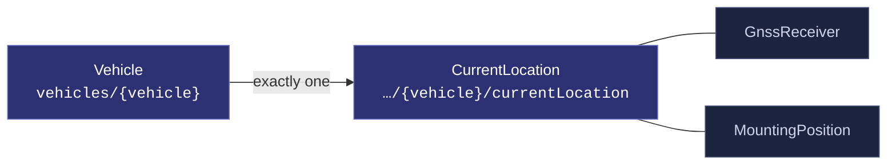
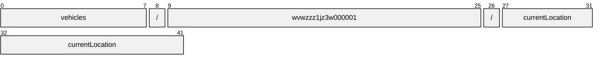
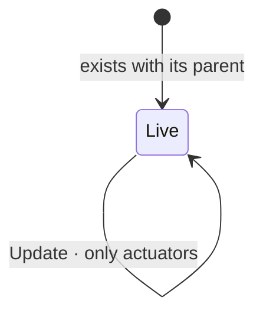

# CurrentLocation

[](https://github.com/COVESA/vehicle_signal_specification)
[](https://covesa.github.io/vehicle_signal_specification/)
[](https://aip.dev/156)
[](#methods)
[](#signals)
[](v1/)

The current latitude and longitude of the vehicle.

```
vehicles/{vehicle}/currentLocation
```

## Where it sits



The 2 blue-grey boxes are **embedded messages**, not resources. They have no
name of their own and travel with the currentLocation.

## Example

A currentLocation as this API returns it:

```json
{
  "name": "vehicles/wvwzzz1jz3w000001/currentLocation",
  "uid": "b3f1c2de-4a5b-4c6d-8e9f-0a1b2c3d4e5f",
  "altitude": 88.5,
  "heading": 120,
  "horizontalAccuracy": 88.5,
  "latitude": -30,
  "longitude": -60
}
```

The same data in the **VSS shape**, for a peer that speaks the specification
rather than this schema. `codec.ToVSS` produces it from
[`codec/manifest.json`](../../../../../codec/manifest.json):

```json
{
  "Vehicle.CurrentLocation.Altitude": 88.5,
  "Vehicle.CurrentLocation.Heading": 120,
  "Vehicle.CurrentLocation.HorizontalAccuracy": 88.5,
  "Vehicle.CurrentLocation.Latitude": -30,
  "Vehicle.CurrentLocation.Longitude": -60
}
```

Note what changed: signals are keyed by **fully qualified VSS name**, enum
constants drop to the spelling VSS writes, and the AIP fields — `name`,
`uid` — fall away, because VSS declares no signal for them. `codec.FromVSS`
reverses all three.

## Resource names

Every currentLocation is addressed by a name that alternates collection and
identifier, per [AIP-122](https://aip.dev/122):



42 characters, alternating, which is what [AIP-123](https://aip.dev/123)
requires. An identifier is 80 random bits in Crockford base32, prefixed with
the resource's singular so the name opens with a letter — the randomness
half of a ULID with the timestamp half removed, because a ULID's leading
characters *are* a timestamp and a resource name should not publish when the
record was created. The vehicle is the exception: its identifier is its VIN,
which is already unique and already meaningful, the case AIP-122 prefers.

Rather than splitting that string by hand, use
[`resourcename`](https://github.com/the-protobuf-project/resourcename), which
implements AIP-122 templates in Go, Python, Rust, TypeScript, Swift and C:

```go
t := resourcename.ResourceTemplate("vehicles/{vehicle}/currentLocation")
t.Parse("vehicles/wvwzzz1jz3w000001/currentLocation")
// map[vehicle:wvwzzz1jz3w000001]
```

```python
t = resourcename.ResourceTemplate("vehicles/{vehicle}/currentLocation")
t.parse("vehicles/wvwzzz1jz3w000001/currentLocation")
# {'vehicle': 'wvwzzz1jz3w000001'}
```

The template above is the `pattern` this resource declares in its
`google.api.resource` annotation, so the two cannot drift.

## Signals

15 fields: 7 AIP identity and lifecycle, 8 VSS signals. Field numbers 8–15 are reserved for identity fields a later revision may add, so adding one never renumbers a signal.

### Writable — actuators

The vehicle accepts these in an `update_mask`.

| Field | Type | Unit | VSS | Description |
| --- | --- | --- | --- | --- |
| `gnss_receiver` | `GnssReceiver` | — | `Vehicle.CurrentLocation.GNSSReceiver` | Information on the GNSS receiver used for determining current location. |

### Read-only — sensors and attributes

The vehicle reports these. An `update_mask` naming one is **rejected**, not
silently ignored.

| Field | Type | Unit | VSS | Description |
| --- | --- | --- | --- | --- |
| `altitude` | `double` | `m` | `Vehicle.CurrentLocation.Altitude` | Current altitude relative to WGS 84 reference ellipsoid, as measured at the position of GNSS receiver antenna. |
| `heading` | `double` | `degrees` | `Vehicle.CurrentLocation.Heading` | Current heading relative to geographic north. 0 = North, 90 = East, 180 = South, 270 = West. |
| `horizontal_accuracy` | `double` | `m` | `Vehicle.CurrentLocation.HorizontalAccuracy` | Accuracy of the latitude and longitude coordinates. |
| `latitude` | `double` | `degrees` | `Vehicle.CurrentLocation.Latitude` | Current latitude of vehicle in WGS 84 geodetic coordinates, as measured at the position of GNSS receiver antenna. |
| `longitude` | `double` | `degrees` | `Vehicle.CurrentLocation.Longitude` | Current longitude of vehicle in WGS 84 geodetic coordinates, as measured at the position of GNSS receiver antenna. |
| `observation_time` | `google.protobuf.Timestamp` | `iso8601` | `Vehicle.CurrentLocation.Timestamp` | Timestamp from GNSS system for current location, formatted according to ISO 8601 with UTC time zone. |
| `vertical_accuracy` | `double` | `m` | `Vehicle.CurrentLocation.VerticalAccuracy` | Accuracy of altitude. |

<details>
<summary>Identity and lifecycle — 7 fields every resource carries</summary>

| Field | Type | Notes |
| --- | --- | --- |
| `name` | `string` | `vehicles/{vehicle}/currentLocation`, server-assigned |
| `uid` | `string` | server-assigned UUID4, per [AIP-148](https://aip.dev/148) |
| `etag` | `string` | pass back on update to make the write conditional, per [AIP-154](https://aip.dev/154) |
| `create_time` `update_time` | `Timestamp` | when it was stored here |
| `delete_time` `expire_time` | `Timestamp` | soft delete; recoverable until `expire_time` |

</details>

## Methods

A singleton, so **`Get`** · **`Update`** only, per
[AIP-156](https://aip.dev/156). Nothing can create a second or delete the only
one — that is the complete method set for a singleton, not a reduced one.



```http
GET    /v1/{name=vehicles/*/currentLocation}
PATCH  /v1/{currentLocation.name=vehicles/*/currentLocation}
```

## Enums

#### `FixType`

Fix status of GNSS receiver.

`UNSPECIFIED` · `NONE` · `TWO_D` · `TWO_D_SATELLITE_BASED_AUGMENTATION` ·
`TWO_D_GROUND_BASED_AUGMENTATION` ·
`TWO_D_SATELLITE_AND_GROUND_BASED_AUGMENTATION` · `THREE_D` ·
`THREE_D_SATELLITE_BASED_AUGMENTATION` · `THREE_D_GROUND_BASED_AUGMENTATION`
· `THREE_D_SATELLITE_AND_GROUND_BASED_AUGMENTATION`
<sub>emitted as `FIX_TYPE_NONE`, and so on</sub>

---

<sub>Generated by `just docs` from COVESA VSS `2026-09-02` (`cd4bc50`) and VDM `2026-07-24` (`36bc939`). Do not edit by hand.<br>
Source: [`current_location.proto`](v1/current_location.proto) · [`service.proto`](v1/service.proto) · [`messages.proto`](v1/messages.proto)</sub>
