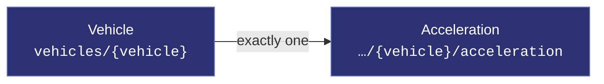
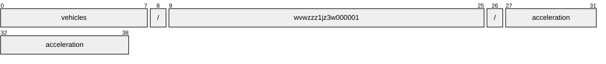
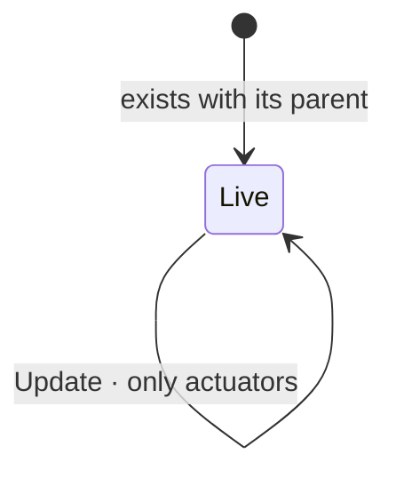

# Acceleration

[](https://github.com/COVESA/vehicle_signal_specification)
[](https://covesa.github.io/vehicle_signal_specification/)
[](https://aip.dev/156)
[](#methods)
[](#signals)
[](v1/)

Spatial acceleration. Axis definitions according to ISO 8855.

```
vehicles/{vehicle}/acceleration
```

## Where it sits



## Example

A acceleration as this API returns it:

```json
{
  "name": "vehicles/wvwzzz1jz3w000001/acceleration",
  "uid": "b3f1c2de-4a5b-4c6d-8e9f-0a1b2c3d4e5f",
  "lateral": 88.5,
  "longitudinal": 88.5,
  "vertical": 88.5
}
```

The same data in the **VSS shape**, for a peer that speaks the specification
rather than this schema. `codec.ToVSS` produces it from
[`codec/manifest.json`](../../../../../codec/manifest.json):

```json
{
  "Vehicle.Acceleration.Lateral": 88.5,
  "Vehicle.Acceleration.Longitudinal": 88.5,
  "Vehicle.Acceleration.Vertical": 88.5
}
```

Note what changed: signals are keyed by **fully qualified VSS name**, enum
constants drop to the spelling VSS writes, and the AIP fields — `name`,
`uid` — fall away, because VSS declares no signal for them. `codec.FromVSS`
reverses all three.

## Resource names

Every acceleration is addressed by a name that alternates collection and
identifier, per [AIP-122](https://aip.dev/122):



39 characters, alternating, which is what [AIP-123](https://aip.dev/123)
requires. An identifier is 80 random bits in Crockford base32, prefixed with
the resource's singular so the name opens with a letter — the randomness
half of a ULID with the timestamp half removed, because a ULID's leading
characters *are* a timestamp and a resource name should not publish when the
record was created. The vehicle is the exception: its identifier is its VIN,
which is already unique and already meaningful, the case AIP-122 prefers.

Rather than splitting that string by hand, use
[`resourcename`](https://github.com/the-protobuf-project/resourcename), which
implements AIP-122 templates in Go, Python, Rust, TypeScript, Swift and C:

```go
t := resourcename.ResourceTemplate("vehicles/{vehicle}/acceleration")
t.Parse("vehicles/wvwzzz1jz3w000001/acceleration")
// map[vehicle:wvwzzz1jz3w000001]
```

```python
t = resourcename.ResourceTemplate("vehicles/{vehicle}/acceleration")
t.parse("vehicles/wvwzzz1jz3w000001/acceleration")
# {'vehicle': 'wvwzzz1jz3w000001'}
```

The template above is the `pattern` this resource declares in its
`google.api.resource` annotation, so the two cannot drift.

## Signals

10 fields: 7 AIP identity and lifecycle, 3 VSS signals. Field numbers 8–15 are reserved for identity fields a later revision may add, so adding one never renumbers a signal.

### Read-only — sensors and attributes

The vehicle reports these. An `update_mask` naming one is **rejected**, not
silently ignored.

| Field | Type | Unit | VSS | Description |
| --- | --- | --- | --- | --- |
| `lateral` | `double` | `m/s^2` | `Vehicle.Acceleration.Lateral` | Vehicle acceleration in Y (lateral acceleration). |
| `longitudinal` | `double` | `m/s^2` | `Vehicle.Acceleration.Longitudinal` | Vehicle acceleration in X (longitudinal acceleration). |
| `vertical` | `double` | `m/s^2` | `Vehicle.Acceleration.Vertical` | Vehicle acceleration in Z (vertical acceleration). |

<details>
<summary>Identity and lifecycle — 7 fields every resource carries</summary>

| Field | Type | Notes |
| --- | --- | --- |
| `name` | `string` | `vehicles/{vehicle}/acceleration`, server-assigned |
| `uid` | `string` | server-assigned UUID4, per [AIP-148](https://aip.dev/148) |
| `etag` | `string` | pass back on update to make the write conditional, per [AIP-154](https://aip.dev/154) |
| `create_time` `update_time` | `Timestamp` | when it was stored here |
| `delete_time` `expire_time` | `Timestamp` | soft delete; recoverable until `expire_time` |

</details>

## Methods

A singleton, so **`Get`** · **`Update`** only, per
[AIP-156](https://aip.dev/156). Nothing can create a second or delete the only
one — that is the complete method set for a singleton, not a reduced one.



```http
GET    /v1/{name=vehicles/*/acceleration}
PATCH  /v1/{acceleration.name=vehicles/*/acceleration}
```

---

<sub>Generated by `just docs` from COVESA VSS `2026-09-02` (`cd4bc50`) and VDM `2026-07-24` (`36bc939`). Do not edit by hand.<br>
Source: [`acceleration.proto`](v1/acceleration.proto) · [`service.proto`](v1/service.proto) · [`messages.proto`](v1/messages.proto)</sub>
