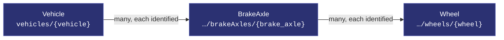
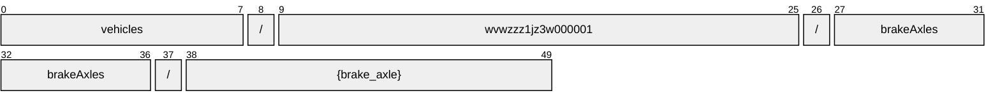
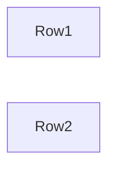
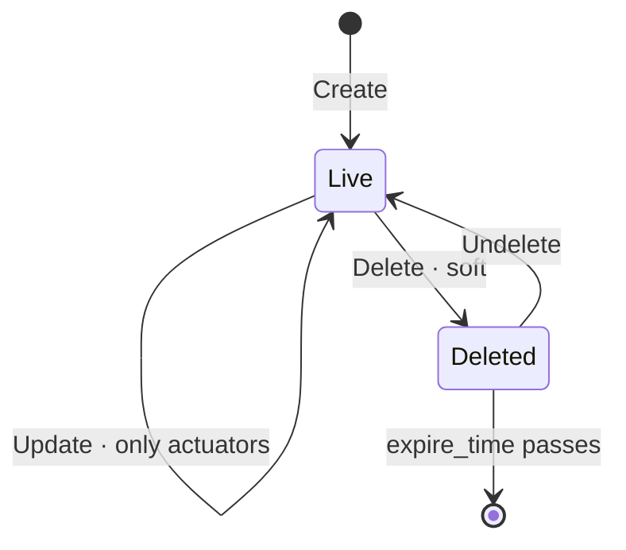

# BrakeAxle

[](https://github.com/COVESA/vehicle_signal_specification)
[](https://covesa.github.io/vehicle_signal_specification/)
[](https://aip.dev/121)
[](#methods)
[](#signals)
[](v1/)

MotionManagement for brake actuation for a specific electric axle.

```
vehicles/{vehicle}/brakeAxles/{brake_axle}
```

## Where it sits



In the specification this hangs beneath **MotionManagement**, but its name
hangs off **Vehicle**. AIP-123 requires a name to alternate collection and
identifier, and `motionManagement` is a singleton whose name ends in a literal
— two literals in a row is not a legal name. Nothing is lost:
motionManagement has one occurrence, so the segment would identify nothing,
and the full VSS path survives in the branch annotation.

## Example

A brakeAxle as this API returns it:

```json
{
  "name": "vehicles/wvwzzz1jz3w000001/brakeAxles/{brake_axle}",
  "uid": "b3f1c2de-4a5b-4c6d-8e9f-0a1b2c3d4e5f",
  "torqueDistributionFrictionRightMaximum": 33,
  "torqueDistributionFrictionRightMinimum": 33,
  "torqueElectricMinimum": 42,
  "torqueFrictionDifferenceMaximum": 42
}
```

The same data in the **VSS shape**, for a peer that speaks the specification
rather than this schema. `codec.ToVSS` produces it from
[`codec/manifest.json`](../../../../../codec/manifest.json):

```json
{
  "Vehicle.MotionManagement.Brake.Axle.TorqueDistributionFrictionRightMaximum": 33,
  "Vehicle.MotionManagement.Brake.Axle.TorqueDistributionFrictionRightMinimum": 33,
  "Vehicle.MotionManagement.Brake.Axle.TorqueElectricMinimum": 42,
  "Vehicle.MotionManagement.Brake.Axle.TorqueFrictionDifferenceMaximum": 42
}
```

Note what changed: signals are keyed by **fully qualified VSS name**, enum
constants drop to the spelling VSS writes, and the AIP fields — `name`,
`uid` — fall away, because VSS declares no signal for them. `codec.FromVSS`
reverses all three.

## Resource names

Every brakeAxle is addressed by a name that alternates collection and
identifier, per [AIP-122](https://aip.dev/122):



50 characters, alternating, which is what [AIP-123](https://aip.dev/123)
requires. An identifier is 80 random bits in Crockford base32, prefixed with
the resource's singular so the name opens with a letter — the randomness
half of a ULID with the timestamp half removed, because a ULID's leading
characters *are* a timestamp and a resource name should not publish when the
record was created. The vehicle is the exception: its identifier is its VIN,
which is already unique and already meaningful, the case AIP-122 prefers.

Rather than splitting that string by hand, use
[`resourcename`](https://github.com/the-protobuf-project/resourcename), which
implements AIP-122 templates in Go, Python, Rust, TypeScript, Swift and C:

```go
t := resourcename.ResourceTemplate("vehicles/{vehicle}/brakeAxles/{brake_axle}")
t.Parse("vehicles/wvwzzz1jz3w000001/brakeAxles/{brake_axle}")
// map[vehicle:wvwzzz1jz3w000001 brakeAxle:brakeAxle-dnv07zgkexvqgcrf]
```

```python
t = resourcename.ResourceTemplate("vehicles/{vehicle}/brakeAxles/{brake_axle}")
t.parse("vehicles/wvwzzz1jz3w000001/brakeAxles/{brake_axle}")
# {'vehicle': 'wvwzzz1jz3w000001', 'brakeAxle': 'brakeAxle-dnv07zgkexvqgcrf'}
```

The template above is the `pattern` this resource declares in its
`google.api.resource` annotation, so the two cannot drift.

## Signals

11 fields: 7 AIP identity and lifecycle, 4 VSS signals. Field numbers 8–15 are reserved for identity fields a later revision may add, so adding one never renumbers a signal.

### Writable — actuators

The vehicle accepts these in an `update_mask`.

| Field | Type | Unit | VSS | Description |
| --- | --- | --- | --- | --- |
| `torque_distribution_friction_right_maximum` | `int32` | `percent` | `Vehicle.MotionManagement.Brake.Axle.TorqueDistributionFrictionRightMaximum` | Maximum distribution range of the friction brake request on the axle to the right wheel. 0% = Complete friction torque shall be shifted to the left wheel. 50% = At most 50% friction torque may be shifted to the right wheel. 100% = Complete friction torque may be shifted to the right wheel. |
| `torque_distribution_friction_right_minimum` | `int32` | `percent` | `Vehicle.MotionManagement.Brake.Axle.TorqueDistributionFrictionRightMinimum` | Minimum distribution range of the friction brake request on the axle to the right wheel. 0% = Complete friction torque may be shifted to the left wheel. 50% = At least 50% friction torque shall be shifted to the right wheel. 100% = Complete friction torque shall be shifted to the right wheel. |
| `torque_electric_minimum` | `int32` | `Nm` | `Vehicle.MotionManagement.Brake.Axle.TorqueElectricMinimum` | Limit for regenerative brake torque at given axle. Brake Torque < 0Nm. |
| `torque_friction_difference_maximum` | `int32` | `Nm` | `Vehicle.MotionManagement.Brake.Axle.TorqueFrictionDifferenceMaximum` | Maximum absolute wheel torque difference between left and right wheel for friction brake. |

<details>
<summary>Identity and lifecycle — 7 fields every resource carries</summary>

| Field | Type | Notes |
| --- | --- | --- |
| `name` | `string` | `vehicles/{vehicle}/brakeAxles/{brake_axle}`, server-assigned |
| `uid` | `string` | server-assigned UUID4, per [AIP-148](https://aip.dev/148) |
| `etag` | `string` | pass back on update to make the write conditional, per [AIP-154](https://aip.dev/154) |
| `create_time` `update_time` | `Timestamp` | when it was stored here |
| `delete_time` `expire_time` | `Timestamp` | soft delete; recoverable until `expire_time` |

</details>

## Which brakeAxle



VSS expands this branch across Row1, Row2, so the combination names one
brakeAxle — which is what makes it a resource rather than a repeated field.
The axes are recorded in
[`codec/manifest.json`](../../../../../codec/manifest.json), which is the only
thing that says how to map an id back to a VSS path.

## Methods

A collection, so the full set: **`Get`** · **`List`** · **`Create`** · **`Update`** · **`Delete`** · **`Undelete`**.



```http
GET    /v1/{name=vehicles/*/brakeAxles/*}
PATCH  /v1/{brakeAxle.name=vehicles/*/brakeAxles/*}
GET    /v1/{parent=vehicles/*}/brakeAxles
POST   /v1/{parent=vehicles/*}/brakeAxles
DELETE /v1/{name=vehicles/*/brakeAxles/*}
POST   /v1/{name=vehicles/*/brakeAxles/*}:undelete
```

A deleted brakeAxle is still returned by `Get` and hidden from `List` unless
`show_deleted` is set — which is what makes `Undelete` meaningful.

---

<sub>Generated by `just docs` from COVESA VSS `2026-09-02` (`cd4bc50`) and VDM `2026-07-24` (`36bc939`). Do not edit by hand.<br>
Source: [`brake_axle.proto`](v1/brake_axle.proto) · [`service.proto`](v1/service.proto) · [`messages.proto`](v1/messages.proto)</sub>
