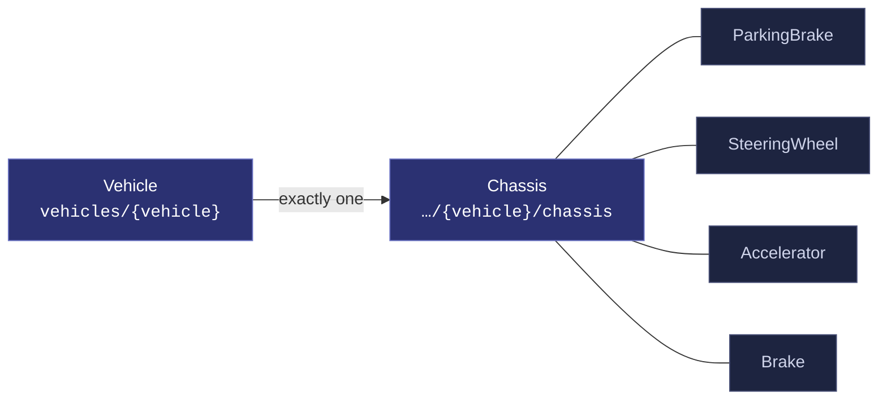
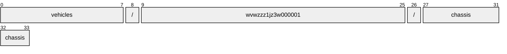
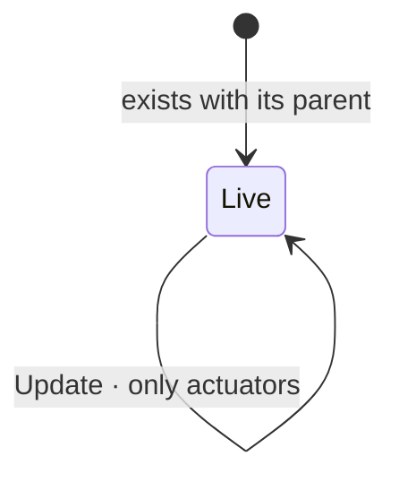

# Chassis

[](https://github.com/COVESA/vehicle_signal_specification)
[](https://covesa.github.io/vehicle_signal_specification/)
[](https://aip.dev/156)
[](#methods)
[](#signals)
[](v1/)

All data concerning steering, suspension, wheels, and brakes.

```
vehicles/{vehicle}/chassis
```

## Where it sits



The 4 blue-grey boxes are **embedded messages**, not resources. They have no
name of their own and travel with the chassis.

## Example

A chassis as this API returns it:

```json
{
  "name": "vehicles/wvwzzz1jz3w000001/chassis",
  "uid": "b3f1c2de-4a5b-4c6d-8e9f-0a1b2c3d4e5f",
  "axleCount": 42,
  "wheelbase": 42
}
```

The same data in the **VSS shape**, for a peer that speaks the specification
rather than this schema. `codec.ToVSS` produces it from
[`codec/manifest.json`](../../../../../codec/manifest.json):

```json
{
  "Vehicle.Chassis.AxleCount": 42,
  "Vehicle.Chassis.Wheelbase": 42
}
```

Note what changed: signals are keyed by **fully qualified VSS name**, enum
constants drop to the spelling VSS writes, and the AIP fields — `name`,
`uid` — fall away, because VSS declares no signal for them. `codec.FromVSS`
reverses all three.

## Resource names

Every chassis is addressed by a name that alternates collection and
identifier, per [AIP-122](https://aip.dev/122):



34 characters, alternating, which is what [AIP-123](https://aip.dev/123)
requires. An identifier is 80 random bits in Crockford base32, prefixed with
the resource's singular so the name opens with a letter — the randomness
half of a ULID with the timestamp half removed, because a ULID's leading
characters *are* a timestamp and a resource name should not publish when the
record was created. The vehicle is the exception: its identifier is its VIN,
which is already unique and already meaningful, the case AIP-122 prefers.

Rather than splitting that string by hand, use
[`resourcename`](https://github.com/the-protobuf-project/resourcename), which
implements AIP-122 templates in Go, Python, Rust, TypeScript, Swift and C:

```go
t := resourcename.ResourceTemplate("vehicles/{vehicle}/chassis")
t.Parse("vehicles/wvwzzz1jz3w000001/chassis")
// map[vehicle:wvwzzz1jz3w000001]
```

```python
t = resourcename.ResourceTemplate("vehicles/{vehicle}/chassis")
t.parse("vehicles/wvwzzz1jz3w000001/chassis")
# {'vehicle': 'wvwzzz1jz3w000001'}
```

The template above is the `pattern` this resource declares in its
`google.api.resource` annotation, so the two cannot drift.

## Signals

9 fields: 7 AIP identity and lifecycle, 2 VSS signals. Field numbers 8–15
are reserved for identity fields a later revision may add, so adding one never
renumbers a signal.

### Read-only — sensors and attributes

The vehicle reports these. An `update_mask` naming one is **rejected**, not
silently ignored.

| Field | Type | Unit | VSS | Description |
| --- | --- | --- | --- | --- |
| `axle_count` | `int32` | — | `Vehicle.Chassis.AxleCount` | Number of axles on the vehicle |
| `wheelbase` | `int32` | `mm` | `Vehicle.Chassis.Wheelbase` | Overall wheelbase, in mm. |

<details>
<summary>Identity and lifecycle — 7 fields every resource carries</summary>

| Field | Type | Notes |
| --- | --- | --- |
| `name` | `string` | `vehicles/{vehicle}/chassis`, server-assigned |
| `uid` | `string` | server-assigned UUID4, per [AIP-148](https://aip.dev/148) |
| `etag` | `string` | pass back on update to make the write conditional, per [AIP-154](https://aip.dev/154) |
| `create_time` `update_time` | `Timestamp` | when it was stored here |
| `delete_time` `expire_time` | `Timestamp` | soft delete; recoverable until `expire_time` |

</details>

## Embedded messages

4 messages travel inside the chassis and have no name of their own. Address a
field on one through its owner — `parking_brake.<field>` — not directly.

<details>
<summary><code>ParkingBrake</code> — Parking brake signals</summary>

| Field | Type | Unit | VSS | Description |
| --- | --- | --- | --- | --- |
| `is_auto_apply_enabled` | `bool` | — | `Vehicle.Chassis.ParkingBrake.IsAutoApplyEnabled` | Indicates if parking brake will be automatically engaged when the vehicle engine is turned off. |
| `is_engaged` | `bool` | — | `Vehicle.Chassis.ParkingBrake.IsEngaged` | Parking brake status. True = Parking Brake is Engaged. False = Parking Brake is not Engaged. |

</details>

<details>
<summary><code>SteeringWheel</code> — Steering wheel signals</summary>

| Field | Type | Unit | VSS | Description |
| --- | --- | --- | --- | --- |
| `angle` | `int32` | `degrees` | `Vehicle.Chassis.SteeringWheel.Angle` | Steering wheel angle. Positive = degrees to the left. Negative = degrees to the right. |
| `extension` | `int32` | `percent` | `Vehicle.Chassis.SteeringWheel.Extension` | Steering wheel column extension from dashboard. 0 = Closest to dashboard. 100 = Furthest from dashboard. |
| `heating_cooling` | `int32` | `percent` | `Vehicle.Chassis.SteeringWheel.HeatingCooling` | Heating or Cooling requsted for the Item. -100 = Maximum cooling, 0 = Heating/cooling deactivated, 100 = Maximum heating. |
| `tilt` | `int32` | `percent` | `Vehicle.Chassis.SteeringWheel.Tilt` | Steering wheel column tilt. 0 = Lowest position. 100 = Highest position. |

</details>

<details>
<summary><code>Accelerator</code> — Accelerator signals</summary>

| Field | Type | Unit | VSS | Description |
| --- | --- | --- | --- | --- |
| `pedal_position` | `int32` | `percent` | `Vehicle.Chassis.Accelerator.PedalPosition` | Accelerator pedal position as percent. 0 = Not depressed. 100 = Fully depressed. |

</details>

<details>
<summary><code>Brake</code> — Brake system signals</summary>

| Field | Type | Unit | VSS | Description |
| --- | --- | --- | --- | --- |
| `is_driver_emergency_braking_detected` | `bool` | — | `Vehicle.Chassis.Brake.IsDriverEmergencyBrakingDetected` | Indicates if emergency braking initiated by driver is detected. True = Emergency braking detected. False = Emergency braking not detected. |
| `pedal_position` | `int32` | `percent` | `Vehicle.Chassis.Brake.PedalPosition` | Brake pedal position as percent. 0 = Not depressed. 100 = Fully depressed. |

</details>

## Methods

A singleton, so **`Get`** · **`Update`** only, per
[AIP-156](https://aip.dev/156). Nothing can create a second or delete the only
one — that is the complete method set for a singleton, not a reduced one.



```http
GET    /v1/{name=vehicles/*/chassis}
PATCH  /v1/{chassis.name=vehicles/*/chassis}
```

---

<sub>Generated by `just docs` from COVESA VSS `2026-09-02` (`cd4bc50`) and VDM `2026-07-24` (`36bc939`). Do not edit by hand.<br>
Source: [`chassis.proto`](v1/chassis.proto) · [`service.proto`](v1/service.proto) · [`messages.proto`](v1/messages.proto)</sub>
