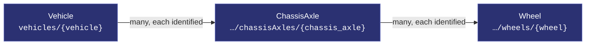
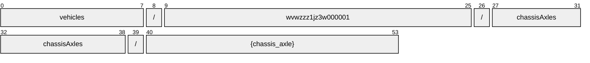
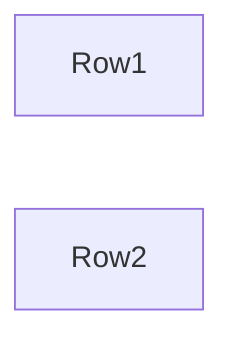
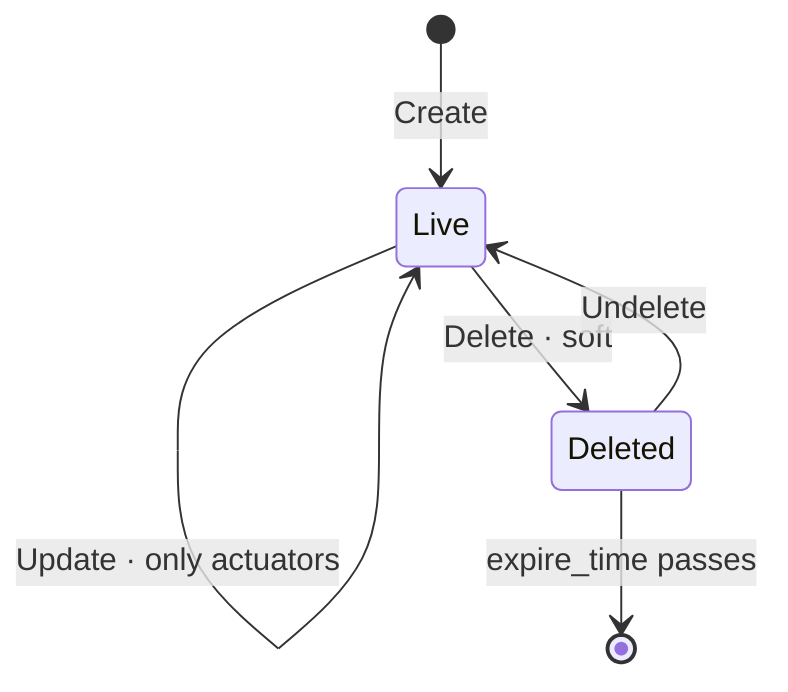

# ChassisAxle

[](https://github.com/COVESA/vehicle_signal_specification)
[](https://covesa.github.io/vehicle_signal_specification/)
[](https://aip.dev/121)
[](#methods)
[](#signals)
[](v1/)

Axle signals

```
vehicles/{vehicle}/chassisAxles/{chassis_axle}
```

## Where it sits



In the specification this hangs beneath **Chassis**, but its name hangs off
**Vehicle**. AIP-123 requires a name to alternate collection and identifier,
and `chassis` is a singleton whose name ends in a literal — two literals in
a row is not a legal name. Nothing is lost: chassis has one occurrence, so the
segment would identify nothing, and the full VSS path survives in the branch
annotation.

## Example

A chassisAxle as this API returns it:

```json
{
  "name": "vehicles/wvwzzz1jz3w000001/chassisAxles/{chassis_axle}",
  "uid": "b3f1c2de-4a5b-4c6d-8e9f-0a1b2c3d4e5f",
  "axleWidth": 42,
  "steeringAngle": 88.5,
  "tireAspectRatio": 42,
  "tireDiameter": 88.5,
  "tireWidth": 42
}
```

The same data in the **VSS shape**, for a peer that speaks the specification
rather than this schema. `codec.ToVSS` produces it from
[`codec/manifest.json`](../../../../../codec/manifest.json):

```json
{
  "Vehicle.Chassis.Axle.AxleWidth": 42,
  "Vehicle.Chassis.Axle.SteeringAngle": 88.5,
  "Vehicle.Chassis.Axle.TireAspectRatio": 42,
  "Vehicle.Chassis.Axle.TireDiameter": 88.5,
  "Vehicle.Chassis.Axle.TireWidth": 42
}
```

Note what changed: signals are keyed by **fully qualified VSS name**, enum
constants drop to the spelling VSS writes, and the AIP fields — `name`,
`uid` — fall away, because VSS declares no signal for them. `codec.FromVSS`
reverses all three.

## Resource names

Every chassisAxle is addressed by a name that alternates collection and
identifier, per [AIP-122](https://aip.dev/122):



54 characters, alternating, which is what [AIP-123](https://aip.dev/123)
requires. An identifier is 80 random bits in Crockford base32, prefixed with
the resource's singular so the name opens with a letter — the randomness
half of a ULID with the timestamp half removed, because a ULID's leading
characters *are* a timestamp and a resource name should not publish when the
record was created. The vehicle is the exception: its identifier is its VIN,
which is already unique and already meaningful, the case AIP-122 prefers.

Rather than splitting that string by hand, use
[`resourcename`](https://github.com/the-protobuf-project/resourcename), which
implements AIP-122 templates in Go, Python, Rust, TypeScript, Swift and C:

```go
t := resourcename.ResourceTemplate("vehicles/{vehicle}/chassisAxles/{chassis_axle}")
t.Parse("vehicles/wvwzzz1jz3w000001/chassisAxles/{chassis_axle}")
// map[vehicle:wvwzzz1jz3w000001 chassisAxle:chassisAxle-qktg089h0p2s4zq0]
```

```python
t = resourcename.ResourceTemplate("vehicles/{vehicle}/chassisAxles/{chassis_axle}")
t.parse("vehicles/wvwzzz1jz3w000001/chassisAxles/{chassis_axle}")
# {'vehicle': 'wvwzzz1jz3w000001', 'chassisAxle': 'chassisAxle-qktg089h0p2s4zq0'}
```

The template above is the `pattern` this resource declares in its
`google.api.resource` annotation, so the two cannot drift.

## Signals

18 fields: 7 AIP identity and lifecycle, 11 VSS signals. Field numbers 8–15
are reserved for identity fields a later revision may add, so adding one never
renumbers a signal.

### Read-only — sensors and attributes

The vehicle reports these. An `update_mask` naming one is **rejected**, not
silently ignored.

| Field | Type | Unit | VSS | Description |
| --- | --- | --- | --- | --- |
| `axle_width` | `int32` | `mm` | `Vehicle.Chassis.Axle.AxleWidth` | The lateral distance between the wheel mounting faces, measured along the spindle axis. |
| `steering_angle` | `double` | `degrees` | `Vehicle.Chassis.Axle.SteeringAngle` | Single track two-axle model steering angle. Angle according to ISO 8855. Positive = degrees to the left. Negative = degrees to the right. |
| `tire_aspect_ratio` | `int32` | `percent` | `Vehicle.Chassis.Axle.TireAspectRatio` | Aspect ratio between tire section height and tire section width, as per ETRTO / TRA standard. |
| `tire_diameter` | `double` | `inch` | `Vehicle.Chassis.Axle.TireDiameter` | Outer diameter of tires, in inches, as per ETRTO / TRA standard. |
| `tire_width` | `int32` | `mm` | `Vehicle.Chassis.Axle.TireWidth` | Nominal section width of tires, in mm, as per ETRTO / TRA standard. |
| `torque` | `int32` | `Nm` | `Vehicle.Chassis.Axle.Torque` | Incoming axle torque to differential. Negative values indicate regen mode. |
| `track_width` | `int32` | `mm` | `Vehicle.Chassis.Axle.TrackWidth` | The lateral distance between the centers of the wheels, measured along the spindle, or axle axis. If there are dual rear wheels, measure from the midway points between the inner and outer tires. |
| `tread_width` | `int32` | `mm` | `Vehicle.Chassis.Axle.TreadWidth` | The lateral distance between the centerlines of the base tires at ground, including camber angle. If there are dual rear wheels, measure from the midway points between the inner and outer tires. |
| `wheel_count` | `int32` | — | `Vehicle.Chassis.Axle.WheelCount` | Number of wheels on the axle |
| `wheel_diameter` | `double` | `inch` | `Vehicle.Chassis.Axle.WheelDiameter` | Diameter of wheels (rims without tires), in inches, as per ETRTO / TRA standard. |
| `wheel_width` | `double` | `inch` | `Vehicle.Chassis.Axle.WheelWidth` | Width of wheels (rims without tires), in inches, as per ETRTO / TRA standard. |

<details>
<summary>Identity and lifecycle — 7 fields every resource carries</summary>

| Field | Type | Notes |
| --- | --- | --- |
| `name` | `string` | `vehicles/{vehicle}/chassisAxles/{chassis_axle}`, server-assigned |
| `uid` | `string` | server-assigned UUID4, per [AIP-148](https://aip.dev/148) |
| `etag` | `string` | pass back on update to make the write conditional, per [AIP-154](https://aip.dev/154) |
| `create_time` `update_time` | `Timestamp` | when it was stored here |
| `delete_time` `expire_time` | `Timestamp` | soft delete; recoverable until `expire_time` |

</details>

## Which chassisAxle



VSS expands this branch across Row1, Row2, so the combination names one
chassisAxle — which is what makes it a resource rather than a repeated
field. The axes are recorded in
[`codec/manifest.json`](../../../../../codec/manifest.json), which is the only
thing that says how to map an id back to a VSS path.

## Methods

A collection, so the full set: **`Get`** · **`List`** · **`Create`** · **`Update`** · **`Delete`** · **`Undelete`**.



```http
GET    /v1/{name=vehicles/*/chassisAxles/*}
PATCH  /v1/{chassisAxle.name=vehicles/*/chassisAxles/*}
GET    /v1/{parent=vehicles/*}/chassisAxles
POST   /v1/{parent=vehicles/*}/chassisAxles
DELETE /v1/{name=vehicles/*/chassisAxles/*}
POST   /v1/{name=vehicles/*/chassisAxles/*}:undelete
```

A deleted chassisAxle is still returned by `Get` and hidden from `List` unless
`show_deleted` is set — which is what makes `Undelete` meaningful.

---

<sub>Generated by `just docs` from COVESA VSS `2026-09-02` (`cd4bc50`) and VDM `2026-07-24` (`36bc939`). Do not edit by hand.<br>
Source: [`chassis_axle.proto`](v1/chassis_axle.proto) · [`service.proto`](v1/service.proto) · [`messages.proto`](v1/messages.proto)</sub>
