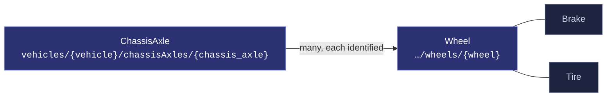
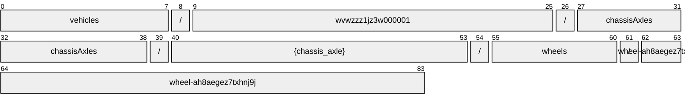
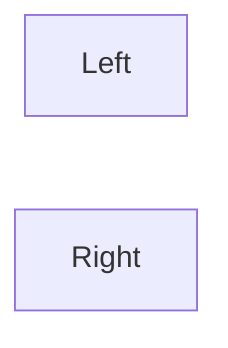
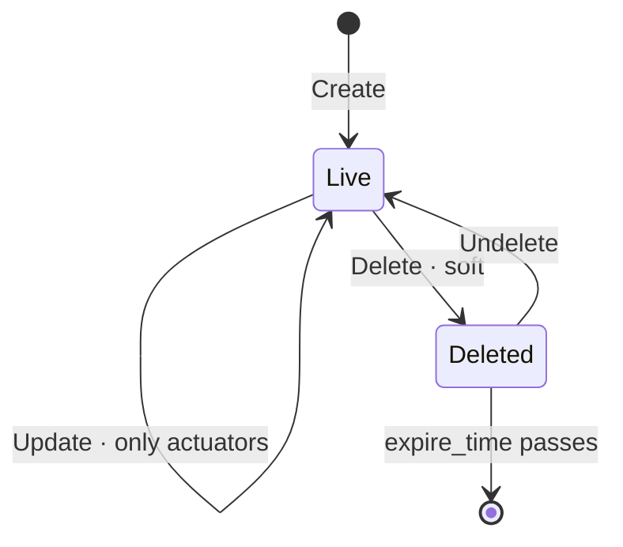

# Wheel

[](https://github.com/COVESA/vehicle_signal_specification)
[](https://covesa.github.io/vehicle_signal_specification/)
[](https://aip.dev/121)
[](#methods)
[](#signals)
[](v1/)

Wheel signals for axle

```
vehicles/{vehicle}/chassisAxles/{chassis_axle}/wheels/{wheel}
```

## Where it sits



The 2 blue-grey boxes are **embedded messages**, not resources. They have no
name of their own and travel with the wheel.

## Example

A wheel as this API returns it:

```json
{
  "name": "vehicles/wvwzzz1jz3w000001/chassisAxles/{chassis_axle}/wheels/wheel-ah8aegez7txhnj9j",
  "uid": "b3f1c2de-4a5b-4c6d-8e9f-0a1b2c3d4e5f",
  "angularSpeed": 88.5,
  "speed": 88.5,
  "torque": 42
}
```

The same data in the **VSS shape**, for a peer that speaks the specification
rather than this schema. `codec.ToVSS` produces it from
[`codec/manifest.json`](../../../../../codec/manifest.json):

```json
{
  "Vehicle.Chassis.Axle.Wheel.AngularSpeed": 88.5,
  "Vehicle.Chassis.Axle.Wheel.Speed": 88.5,
  "Vehicle.Chassis.Axle.Wheel.Torque": 42
}
```

Note what changed: signals are keyed by **fully qualified VSS name**, enum
constants drop to the spelling VSS writes, and the AIP fields — `name`,
`uid` — fall away, because VSS declares no signal for them. `codec.FromVSS`
reverses all three.

## Resource names

Every wheel is addressed by a name that alternates collection and identifier,
per [AIP-122](https://aip.dev/122):



84 characters, alternating, which is what [AIP-123](https://aip.dev/123)
requires. An identifier is 80 random bits in Crockford base32, prefixed with
the resource's singular so the name opens with a letter — the randomness
half of a ULID with the timestamp half removed, because a ULID's leading
characters *are* a timestamp and a resource name should not publish when the
record was created. The vehicle is the exception: its identifier is its VIN,
which is already unique and already meaningful, the case AIP-122 prefers.

Rather than splitting that string by hand, use
[`resourcename`](https://github.com/the-protobuf-project/resourcename), which
implements AIP-122 templates in Go, Python, Rust, TypeScript, Swift and C:

```go
t := resourcename.ResourceTemplate("vehicles/{vehicle}/chassisAxles/{chassis_axle}/wheels/{wheel}")
t.Parse("vehicles/wvwzzz1jz3w000001/chassisAxles/{chassis_axle}/wheels/wheel-ah8aegez7txhnj9j")
// map[vehicle:wvwzzz1jz3w000001 chassisAxle:chassisAxle-qktg089h0p2s4zq0 wheel:wheel-ah8aegez7txhnj9j]
```

```python
t = resourcename.ResourceTemplate("vehicles/{vehicle}/chassisAxles/{chassis_axle}/wheels/{wheel}")
t.parse("vehicles/wvwzzz1jz3w000001/chassisAxles/{chassis_axle}/wheels/wheel-ah8aegez7txhnj9j")
# {'vehicle': 'wvwzzz1jz3w000001', 'chassisAxle': 'chassisAxle-qktg089h0p2s4zq0', 'wheel': 'wheel-ah8aegez7txhnj9j'}
```

The template above is the `pattern` this resource declares in its
`google.api.resource` annotation, so the two cannot drift.

## Signals

12 fields: 7 AIP identity and lifecycle, 5 VSS signals. Field numbers 8–15 are reserved for identity fields a later revision may add, so adding one never renumbers a signal.

### Writable — actuators

The vehicle accepts these in an `update_mask`.

| Field | Type | Unit | VSS | Description |
| --- | --- | --- | --- | --- |
| `brake` | `Brake` | — | `Vehicle.Chassis.Axle.Wheel.Brake` | Brake signals for wheel |
| `tire` | `Tire` | — | `Vehicle.Chassis.Axle.Wheel.Tire` | Tire signals for wheel. |

### Read-only — sensors and attributes

The vehicle reports these. An `update_mask` naming one is **rejected**, not
silently ignored.

| Field | Type | Unit | VSS | Description |
| --- | --- | --- | --- | --- |
| `angular_speed` | `double` | `degrees/s` | `Vehicle.Chassis.Axle.Wheel.AngularSpeed` | Angular (Rotational) speed of a vehicle's wheel. |
| `speed` | `double` | `km/h` | `Vehicle.Chassis.Axle.Wheel.Speed` | Linear speed of a vehicle's wheel. |
| `torque` | `int32` | `Nm` | `Vehicle.Chassis.Axle.Wheel.Torque` | Torque provided by drivetrain, excluding torque provided by friction brakes. Negative values indicate regen mode. |

<details>
<summary>Identity and lifecycle — 7 fields every resource carries</summary>

| Field | Type | Notes |
| --- | --- | --- |
| `name` | `string` | `vehicles/{vehicle}/chassisAxles/{chassis_axle}/wheels/{wheel}`, server-assigned |
| `uid` | `string` | server-assigned UUID4, per [AIP-148](https://aip.dev/148) |
| `etag` | `string` | pass back on update to make the write conditional, per [AIP-154](https://aip.dev/154) |
| `create_time` `update_time` | `Timestamp` | when it was stored here |
| `delete_time` `expire_time` | `Timestamp` | soft delete; recoverable until `expire_time` |

</details>

## Which wheel



VSS expands this branch across Left, Right, so the combination names one wheel
— which is what makes it a resource rather than a repeated field. The axes
are recorded in [`codec/manifest.json`](../../../../../codec/manifest.json),
which is the only thing that says how to map an id back to a VSS path.

## Methods

A collection, so the full set: **`Get`** · **`List`** · **`Create`** · **`Update`** · **`Delete`** · **`Undelete`**.



```http
GET    /v1/{name=vehicles/*/chassisAxles/*/wheels/*}
PATCH  /v1/{wheel.name=vehicles/*/chassisAxles/*/wheels/*}
GET    /v1/{parent=vehicles/*/chassisAxles/*}/wheels
POST   /v1/{parent=vehicles/*/chassisAxles/*}/wheels
DELETE /v1/{name=vehicles/*/chassisAxles/*/wheels/*}
POST   /v1/{name=vehicles/*/chassisAxles/*/wheels/*}:undelete
```

A deleted wheel is still returned by `Get` and hidden from `List` unless
`show_deleted` is set — which is what makes `Undelete` meaningful.

## Enums

#### `WinterState`

Winter (cold-weather / snow) capability class of the tire currently fitted to
this wheel.

`UNSPECIFIED` · `UNKNOWN` · `NON_WINTER` · `WINTER`
<sub>emitted as `WINTER_STATE_UNKNOWN`, and so on</sub>

---

<sub>Generated by `just docs` from COVESA VSS `2026-09-02` (`cd4bc50`) and VDM `2026-07-24` (`36bc939`). Do not edit by hand.<br>
Source: [`wheel.proto`](v1/wheel.proto) · [`service.proto`](v1/service.proto) · [`messages.proto`](v1/messages.proto)</sub>
