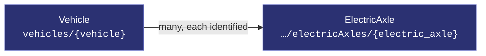
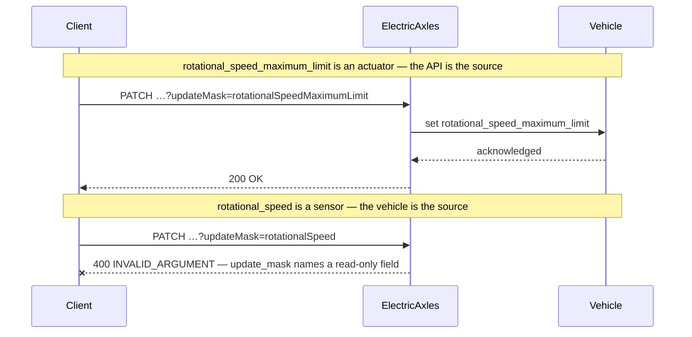
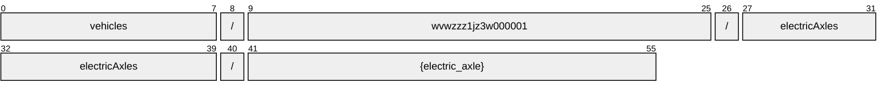
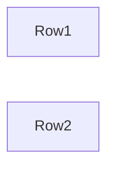
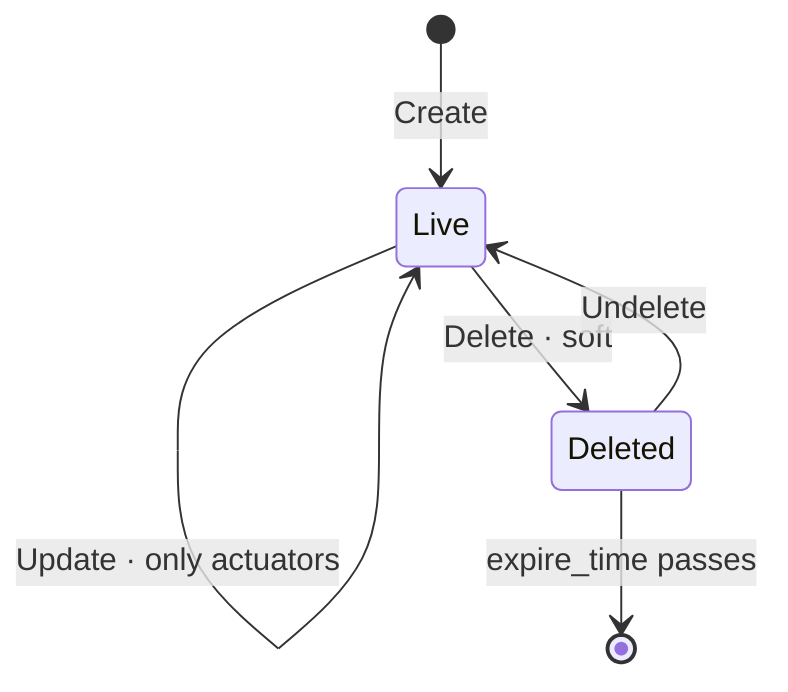

# ElectricAxle

[](https://github.com/COVESA/vehicle_signal_specification)
[](https://covesa.github.io/vehicle_signal_specification/)
[](https://aip.dev/121)
[](#methods)
[](#signals)
[](v1/)

MotionManagement for a specific electric axle.

```
vehicles/{vehicle}/electricAxles/{electric_axle}
```

## Where it sits



In the specification this hangs beneath **MotionManagement**, but its name
hangs off **Vehicle**. AIP-123 requires a name to alternate collection and
identifier, and `motionManagement` is a singleton whose name ends in a literal
— two literals in a row is not a legal name. Nothing is lost:
motionManagement has one occurrence, so the segment would identify nothing,
and the full VSS path survives in the branch annotation.

## Example

A electricAxle as this API returns it:

```json
{
  "name": "vehicles/wvwzzz1jz3w000001/electricAxles/{electric_axle}",
  "uid": "b3f1c2de-4a5b-4c6d-8e9f-0a1b2c3d4e5f",
  "rotationalSpeedMaximumLimit": 42,
  "rotationalSpeedMinimumLimit": 42,
  "rotationalSpeedTarget": 42,
  "torqueMaximumLimit": 42,
  "torqueMinimumLimit": 42
}
```

The same data in the **VSS shape**, for a peer that speaks the specification
rather than this schema. `codec.ToVSS` produces it from
[`codec/manifest.json`](../../../../../codec/manifest.json):

```json
{
  "Vehicle.MotionManagement.ElectricAxle.RotationalSpeedMaximumLimit": 42,
  "Vehicle.MotionManagement.ElectricAxle.RotationalSpeedMinimumLimit": 42,
  "Vehicle.MotionManagement.ElectricAxle.RotationalSpeedTarget": 42,
  "Vehicle.MotionManagement.ElectricAxle.TorqueMaximumLimit": 42,
  "Vehicle.MotionManagement.ElectricAxle.TorqueMinimumLimit": 42
}
```

Note what changed: signals are keyed by **fully qualified VSS name**, enum
constants drop to the spelling VSS writes, and the AIP fields — `name`,
`uid` — fall away, because VSS declares no signal for them. `codec.FromVSS`
reverses all three.

Writing to a electricAxle, and the one thing that will fail:



```http
PATCH /v1/vehicles/wvwzzz1jz3w000001/electricAxles/{electric_axle}?updateMask=rotationalSpeedMaximumLimit
{ "rotationalSpeedMaximumLimit": 42 }
```

The rejection is the schema working, not an inconvenience: VSS marks
`rotational_speed` a sensor, so the vehicle is the only thing that can set it.
A mask naming it fails rather than being silently dropped, so a caller that
believed it had written the value finds out immediately.

## Resource names

Every electricAxle is addressed by a name that alternates collection and
identifier, per [AIP-122](https://aip.dev/122):



56 characters, alternating, which is what [AIP-123](https://aip.dev/123)
requires. An identifier is 80 random bits in Crockford base32, prefixed with
the resource's singular so the name opens with a letter — the randomness
half of a ULID with the timestamp half removed, because a ULID's leading
characters *are* a timestamp and a resource name should not publish when the
record was created. The vehicle is the exception: its identifier is its VIN,
which is already unique and already meaningful, the case AIP-122 prefers.

Rather than splitting that string by hand, use
[`resourcename`](https://github.com/the-protobuf-project/resourcename), which
implements AIP-122 templates in Go, Python, Rust, TypeScript, Swift and C:

```go
t := resourcename.ResourceTemplate("vehicles/{vehicle}/electricAxles/{electric_axle}")
t.Parse("vehicles/wvwzzz1jz3w000001/electricAxles/{electric_axle}")
// map[vehicle:wvwzzz1jz3w000001 electricAxle:electricAxle-xbsqg3nby57dkwyf]
```

```python
t = resourcename.ResourceTemplate("vehicles/{vehicle}/electricAxles/{electric_axle}")
t.parse("vehicles/wvwzzz1jz3w000001/electricAxles/{electric_axle}")
# {'vehicle': 'wvwzzz1jz3w000001', 'electricAxle': 'electricAxle-xbsqg3nby57dkwyf'}
```

The template above is the `pattern` this resource declares in its
`google.api.resource` annotation, so the two cannot drift.

## Signals

17 fields: 7 AIP identity and lifecycle, 10 VSS signals. Field numbers 8–15 are reserved for identity fields a later revision may add, so adding one never renumbers a signal.

### Writable — actuators

The vehicle accepts these in an `update_mask`.

| Field | Type | Unit | VSS | Description |
| --- | --- | --- | --- | --- |
| `rotational_speed_maximum_limit` | `int32` | `rpm` | `Vehicle.MotionManagement.ElectricAxle.RotationalSpeedMaximumLimit` | Maximum allowed axle rotational speed in torque control mode, positive sign for rotation in forward direction, negative sign for rotation in backward direction. |
| `rotational_speed_minimum_limit` | `int32` | `rpm` | `Vehicle.MotionManagement.ElectricAxle.RotationalSpeedMinimumLimit` | Minimum allowed axle rotational speed in torque control mode, positive sign for rotation in forward direction, negative sign for rotation in backward direction. |
| `rotational_speed_target` | `int32` | `rpm` | `Vehicle.MotionManagement.ElectricAxle.RotationalSpeedTarget` | Target axle rotational speed in rotation speed control mode, positive sign for rotation in forward direction, negative sign for rotation in backward direction. |
| `torque_maximum_limit` | `int32` | `Nm` | `Vehicle.MotionManagement.ElectricAxle.TorqueMaximumLimit` | Maximum allowed eAxle torque in rotation speed control mode, positive sign for torque in forward direction, negative sign unused. |
| `torque_minimum_limit` | `int32` | `Nm` | `Vehicle.MotionManagement.ElectricAxle.TorqueMinimumLimit` | Minimum allowed axle torque in rotation speed control mode, positive sign unused, negative sign for torque in backward direction (ISO8855). |
| `torque_target` | `int32` | `Nm` | `Vehicle.MotionManagement.ElectricAxle.TorqueTarget` | Target axle torque in torque control mode, positive sign for torque in forward direction, negative sign for torque in backward direction (ISO8855). |

### Read-only — sensors and attributes

The vehicle reports these. An `update_mask` naming one is **rejected**, not
silently ignored.

| Field | Type | Unit | VSS | Description |
| --- | --- | --- | --- | --- |
| `rotational_speed` | `int32` | `rpm` | `Vehicle.MotionManagement.ElectricAxle.RotationalSpeed` | Rotational speed for the specified axle, positive sign for rotation in forward direction, negative sign for rotation in backward direction. |
| `torque` | `int32` | `Nm` | `Vehicle.MotionManagement.ElectricAxle.Torque` | Axle torque, positive sign for torque in forward direction, negative sign for torque in backward direction. |
| `torque_maximum` | `int32` | `Nm` | `Vehicle.MotionManagement.ElectricAxle.TorqueMaximum` | Maximum momentarily available eAxle torque, positive sign for torque in forward direction, negative sign for torque in backward direction. |
| `torque_minimum` | `int32` | `Nm` | `Vehicle.MotionManagement.ElectricAxle.TorqueMinimum` | Minimum momentarily available eAxle torque, positive sign for torque in forward direction, negative sign for torque in backward direction. |

<details>
<summary>Identity and lifecycle — 7 fields every resource carries</summary>

| Field | Type | Notes |
| --- | --- | --- |
| `name` | `string` | `vehicles/{vehicle}/electricAxles/{electric_axle}`, server-assigned |
| `uid` | `string` | server-assigned UUID4, per [AIP-148](https://aip.dev/148) |
| `etag` | `string` | pass back on update to make the write conditional, per [AIP-154](https://aip.dev/154) |
| `create_time` `update_time` | `Timestamp` | when it was stored here |
| `delete_time` `expire_time` | `Timestamp` | soft delete; recoverable until `expire_time` |

</details>

## Which electricAxle



VSS expands this branch across Row1, Row2, so the combination names one
electricAxle — which is what makes it a resource rather than a repeated
field. The axes are recorded in
[`codec/manifest.json`](../../../../../codec/manifest.json), which is the only
thing that says how to map an id back to a VSS path.

## Methods

A collection, so the full set: **`Get`** · **`List`** · **`Create`** · **`Update`** · **`Delete`** · **`Undelete`**.



```http
GET    /v1/{name=vehicles/*/electricAxles/*}
PATCH  /v1/{electricAxle.name=vehicles/*/electricAxles/*}
GET    /v1/{parent=vehicles/*}/electricAxles
POST   /v1/{parent=vehicles/*}/electricAxles
DELETE /v1/{name=vehicles/*/electricAxles/*}
POST   /v1/{name=vehicles/*/electricAxles/*}:undelete
```

A deleted electricAxle is still returned by `Get` and hidden from `List`
unless `show_deleted` is set — which is what makes `Undelete` meaningful.

---

<sub>Generated by `just docs` from COVESA VSS `2026-09-02` (`cd4bc50`) and VDM `2026-07-24` (`36bc939`). Do not edit by hand.<br>
Source: [`electric_axle.proto`](v1/electric_axle.proto) · [`service.proto`](v1/service.proto) · [`messages.proto`](v1/messages.proto)</sub>
