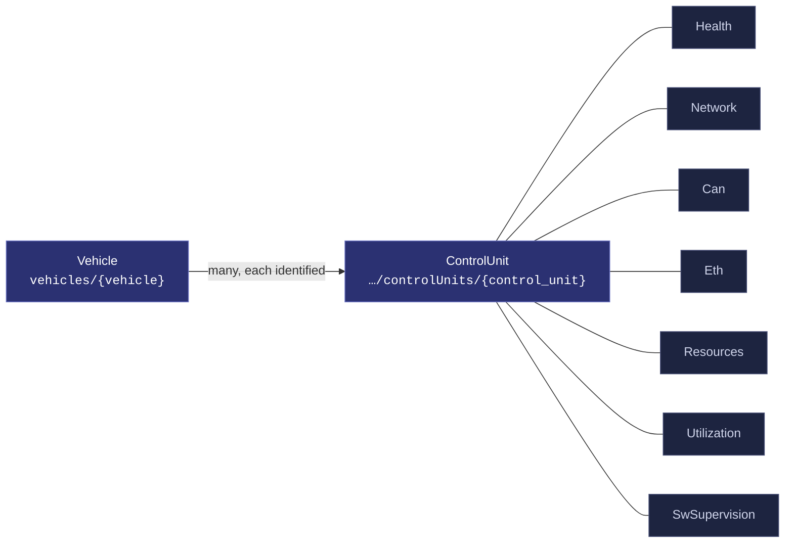
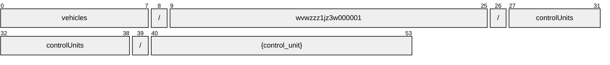
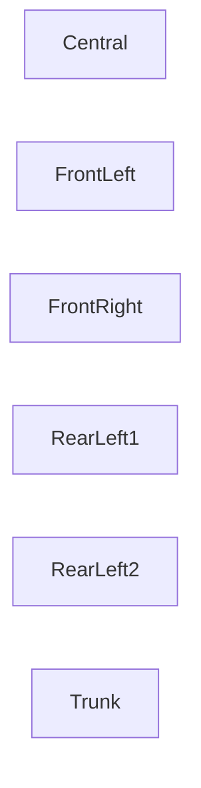
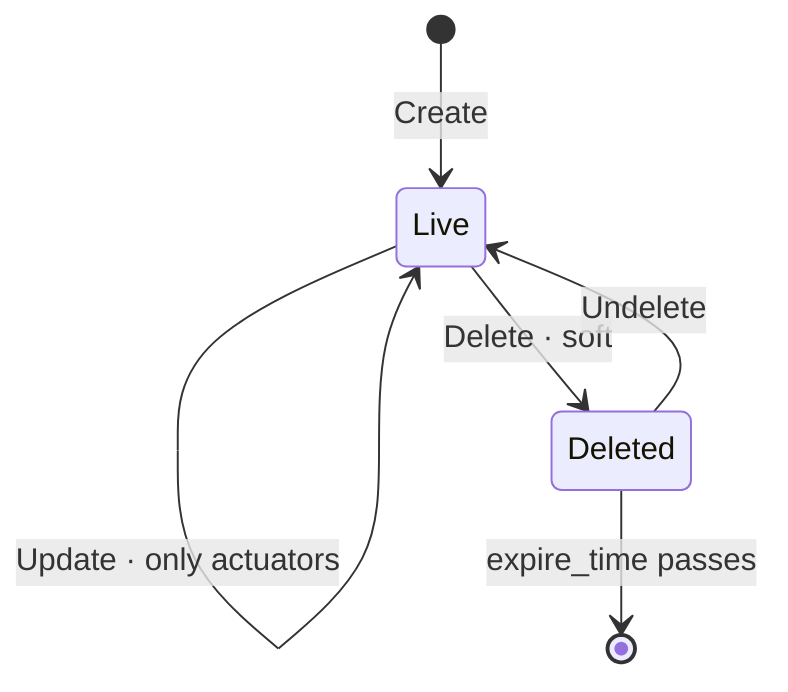

# ControlUnit

[](https://github.com/COVESA/vehicle_signal_specification)
[](https://covesa.github.io/vehicle_signal_specification/)
[](https://aip.dev/121)
[](#methods)
[](#signals)
[](v1/)

Root of the control unit branch

```
vehicles/{vehicle}/controlUnits/{control_unit}
```

## Where it sits



The 7 blue-grey boxes are **embedded messages**, not resources. They have no
name of their own and travel with the controlUnit.

## Example

A controlUnit as this API returns it:

```json
{
  "name": "vehicles/wvwzzz1jz3w000001/controlUnits/{control_unit}",
  "uid": "b3f1c2de-4a5b-4c6d-8e9f-0a1b2c3d4e5f",
  "controlUnitId": 42
}
```

The same data in the **VSS shape**, for a peer that speaks the specification
rather than this schema. `codec.ToVSS` produces it from
[`codec/manifest.json`](../../../../../codec/manifest.json):

```json
{
  "Vehicle.ControlUnit.ID": 42
}
```

Note what changed: signals are keyed by **fully qualified VSS name**, enum
constants drop to the spelling VSS writes, and the AIP fields — `name`,
`uid` — fall away, because VSS declares no signal for them. `codec.FromVSS`
reverses all three.

## Resource names

Every controlUnit is addressed by a name that alternates collection and
identifier, per [AIP-122](https://aip.dev/122):



54 characters, alternating, which is what [AIP-123](https://aip.dev/123)
requires. An identifier is 80 random bits in Crockford base32, prefixed with
the resource's singular so the name opens with a letter — the randomness
half of a ULID with the timestamp half removed, because a ULID's leading
characters *are* a timestamp and a resource name should not publish when the
record was created. The vehicle is the exception: its identifier is its VIN,
which is already unique and already meaningful, the case AIP-122 prefers.

Rather than splitting that string by hand, use
[`resourcename`](https://github.com/the-protobuf-project/resourcename), which
implements AIP-122 templates in Go, Python, Rust, TypeScript, Swift and C:

```go
t := resourcename.ResourceTemplate("vehicles/{vehicle}/controlUnits/{control_unit}")
t.Parse("vehicles/wvwzzz1jz3w000001/controlUnits/{control_unit}")
// map[vehicle:wvwzzz1jz3w000001 controlUnit:controlUnit-tvgx2ezcqypbqhcf]
```

```python
t = resourcename.ResourceTemplate("vehicles/{vehicle}/controlUnits/{control_unit}")
t.parse("vehicles/wvwzzz1jz3w000001/controlUnits/{control_unit}")
# {'vehicle': 'wvwzzz1jz3w000001', 'controlUnit': 'controlUnit-tvgx2ezcqypbqhcf'}
```

The template above is the `pattern` this resource declares in its
`google.api.resource` annotation, so the two cannot drift.

## Signals

8 fields: 7 AIP identity and lifecycle, 1 VSS signals. Field numbers 8–15
are reserved for identity fields a later revision may add, so adding one never
renumbers a signal.

### Read-only — sensors and attributes

The vehicle reports these. An `update_mask` naming one is **rejected**, not
silently ignored.

| Field | Type | Unit | VSS | Description |
| --- | --- | --- | --- | --- |
| `control_unit_id` | `int32` | — | `Vehicle.ControlUnit.ID` | Control unit ID |

<details>
<summary>Identity and lifecycle — 7 fields every resource carries</summary>

| Field | Type | Notes |
| --- | --- | --- |
| `name` | `string` | `vehicles/{vehicle}/controlUnits/{control_unit}`, server-assigned |
| `uid` | `string` | server-assigned UUID4, per [AIP-148](https://aip.dev/148) |
| `etag` | `string` | pass back on update to make the write conditional, per [AIP-154](https://aip.dev/154) |
| `create_time` `update_time` | `Timestamp` | when it was stored here |
| `delete_time` `expire_time` | `Timestamp` | soft delete; recoverable until `expire_time` |

</details>

## Embedded messages

7 messages travel inside the controlUnit and have no name of their own.
Address a field on one through its owner — `health.<field>` — not
directly.

<details>
<summary><code>Health</code> — Health attributes and signals</summary>

| Field | Type | Unit | VSS | Description |
| --- | --- | --- | --- | --- |
| `network` | `Network` | — | `Vehicle.ControlUnit.Health.Network` | Network attributes and signals |
| `resources` | `Resources` | — | `Vehicle.ControlUnit.Health.Resources` | Resources attributes and signals |
| `sw_supervision` | `SwSupervision` | — | `Vehicle.ControlUnit.Health.SWSupervision` | SW supervision attributes and signals |

</details>

<details>
<summary><code>Network</code> — Network attributes and signals</summary>

| Field | Type | Unit | VSS | Description |
| --- | --- | --- | --- | --- |
| `can` | `Can` | — | `Vehicle.ControlUnit.Health.Network.CAN` | CAN network attributes and signals |
| `eth` | `Eth` | — | `Vehicle.ControlUnit.Health.Network.ETH` | Ethernet network attributes and signals |

</details>

<details>
<summary><code>Can</code> — CAN network attributes and signals</summary>

| Field | Type | Unit | VSS | Description |
| --- | --- | --- | --- | --- |
| `is_network_ok` | `bool` | — | `Vehicle.ControlUnit.Health.Network.CAN.IsNetworkOK` | Network status. True = No network problems detected. False = Network problems detected. |

</details>

<details>
<summary><code>Eth</code> — Ethernet network attributes and signals</summary>

| Field | Type | Unit | VSS | Description |
| --- | --- | --- | --- | --- |
| `is_network_ok` | `bool` | — | `Vehicle.ControlUnit.Health.Network.ETH.IsNetworkOK` | Network status. True = No network problems detected. False = Network problems detected. |

</details>

<details>
<summary><code>Resources</code> — Resources attributes and signals</summary>

| Field | Type | Unit | VSS | Description |
| --- | --- | --- | --- | --- |
| `power` | `double` | `W` | `Vehicle.ControlUnit.Health.Resources.Power` | Power consumption |
| `temperature` | `double` | `Celsius` | `Vehicle.ControlUnit.Health.Resources.Temperature` | Instance temperature |
| `utilization` | `Utilization` | — | `Vehicle.ControlUnit.Health.Resources.Utilization` | Resources utilization branch |

</details>

<details>
<summary><code>Utilization</code> — Resources utilization branch</summary>

| Field | Type | Unit | VSS | Description |
| --- | --- | --- | --- | --- |
| `cpu` | `double` | `percent` | `Vehicle.ControlUnit.Health.Resources.Utilization.CPU` | CPU utilization |
| `memory` | `double` | `percent` | `Vehicle.ControlUnit.Health.Resources.Utilization.Memory` | Memory utilization |

</details>

<details>
<summary><code>SwSupervision</code> — SW supervision attributes and signals</summary>

| Field | Type | Unit | VSS | Description |
| --- | --- | --- | --- | --- |
| `is_alive_triggered` | `bool` | — | `Vehicle.ControlUnit.Health.SWSupervision.IsAliveTriggered` | Whether the alive supervision was triggered |
| `is_deadline_triggered` | `bool` | — | `Vehicle.ControlUnit.Health.SWSupervision.IsDeadlineTriggered` | Whether the deadline supervision was triggered |
| `is_logical_triggered` | `bool` | — | `Vehicle.ControlUnit.Health.SWSupervision.IsLogicalTriggered` | Whether the logical supervision was triggered |
| `is_watchdog_triggered` | `bool` | — | `Vehicle.ControlUnit.Health.SWSupervision.IsWatchdogTriggered` | Whether the watchdog deadline was triggered |

</details>

## Which controlUnit



VSS expands this branch across Central, FrontLeft, FrontRight, RearLeft1,
RearLeft2, Trunk, so the combination names one controlUnit — which is what
makes it a resource rather than a repeated field. The axes are recorded in
[`codec/manifest.json`](../../../../../codec/manifest.json), which is the only
thing that says how to map an id back to a VSS path.

## Methods

A collection, so the full set: **`Get`** · **`List`** · **`Create`** · **`Update`** · **`Delete`** · **`Undelete`**.



```http
GET    /v1/{name=vehicles/*/controlUnits/*}
PATCH  /v1/{controlUnit.name=vehicles/*/controlUnits/*}
GET    /v1/{parent=vehicles/*}/controlUnits
POST   /v1/{parent=vehicles/*}/controlUnits
DELETE /v1/{name=vehicles/*/controlUnits/*}
POST   /v1/{name=vehicles/*/controlUnits/*}:undelete
```

A deleted controlUnit is still returned by `Get` and hidden from `List` unless
`show_deleted` is set — which is what makes `Undelete` meaningful.

---

<sub>Generated by `just docs` from COVESA VSS `2026-09-02` (`cd4bc50`) and VDM `2026-07-24` (`36bc939`). Do not edit by hand.<br>
Source: [`control_unit.proto`](v1/control_unit.proto) · [`service.proto`](v1/service.proto) · [`messages.proto`](v1/messages.proto)</sub>
