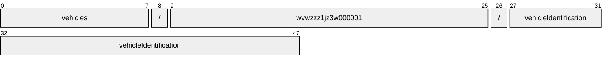
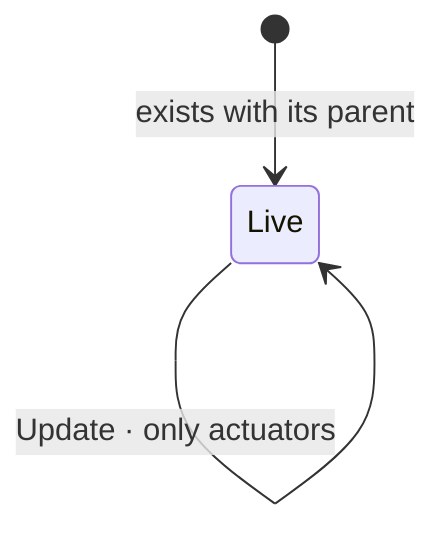

# VehicleIdentification

[](https://github.com/COVESA/vehicle_signal_specification)
[](https://covesa.github.io/vehicle_signal_specification/)
[](https://aip.dev/156)
[](#methods)
[](#signals)
[](v1/)

Attributes that identify a vehicle.

```
vehicles/{vehicle}/vehicleIdentification
```

## Where it sits


The 1 blue-grey box is **embedded messages**, not resources. They have no name
of their own and travel with the vehicleIdentification.

## Example

A vehicleIdentification as this API returns it:

```json
{
  "name": "vehicles/wvwzzz1jz3w000001/vehicleIdentification",
  "uid": "b3f1c2de-4a5b-4c6d-8e9f-0a1b2c3d4e5f",
  "acrissCode": "<acriss code>",
  "bodyType": "<body type>",
  "brand": "<brand>",
  "firstRegistration": { "year": 2026, "month": 3, "day": 14 },
  "knownVehicleDamages": "<known vehicle damages>"
}
```

The same data in the **VSS shape**, for a peer that speaks the specification
rather than this schema. `codec.ToVSS` produces it from
[`codec/manifest.json`](../../../../../codec/manifest.json):

```json
{
  "Vehicle.VehicleIdentification.AcrissCode": "<acriss code>",
  "Vehicle.VehicleIdentification.BodyType": "<body type>",
  "Vehicle.VehicleIdentification.Brand": "<brand>",
  "Vehicle.VehicleIdentification.DateVehicleFirstRegistered": { "year": 2026, "month": 3, "day": 14 },
  "Vehicle.VehicleIdentification.KnownVehicleDamages": "<known vehicle damages>"
}
```

Note what changed: signals are keyed by **fully qualified VSS name**, enum
constants drop to the spelling VSS writes, and the AIP fields — `name`,
`uid` — fall away, because VSS declares no signal for them. `codec.FromVSS`
reverses all three.

## Resource names

Every vehicleIdentification is addressed by a name that alternates collection
and identifier, per [AIP-122](https://aip.dev/122):



48 characters, alternating, which is what [AIP-123](https://aip.dev/123)
requires. An identifier is 80 random bits in Crockford base32, prefixed with
the resource's singular so the name opens with a letter — the randomness
half of a ULID with the timestamp half removed, because a ULID's leading
characters *are* a timestamp and a resource name should not publish when the
record was created. The vehicle is the exception: its identifier is its VIN,
which is already unique and already meaningful, the case AIP-122 prefers.

Rather than splitting that string by hand, use
[`resourcename`](https://github.com/the-protobuf-project/resourcename), which
implements AIP-122 templates in Go, Python, Rust, TypeScript, Swift and C:

```go
t := resourcename.ResourceTemplate("vehicles/{vehicle}/vehicleIdentification")
t.Parse("vehicles/wvwzzz1jz3w000001/vehicleIdentification")
// map[vehicle:wvwzzz1jz3w000001]
```

```python
t = resourcename.ResourceTemplate("vehicles/{vehicle}/vehicleIdentification")
t.parse("vehicles/wvwzzz1jz3w000001/vehicleIdentification")
# {'vehicle': 'wvwzzz1jz3w000001'}
```

The template above is the `pattern` this resource declares in its
`google.api.resource` annotation, so the two cannot drift.

## Signals

28 fields: 7 AIP identity and lifecycle, 21 VSS signals. Field numbers 8–15
are reserved for identity fields a later revision may add, so adding one never
renumbers a signal.

### Read-only — sensors and attributes

The vehicle reports these. An `update_mask` naming one is **rejected**, not
silently ignored.

| Field | Type | Unit | VSS | Description |
| --- | --- | --- | --- | --- |
| `acriss_code` | `string` | — | `Vehicle.VehicleIdentification.AcrissCode` | The ACRISS Car Classification Code is a code used by many car rental companies. |
| `body_type` | `string` | — | `Vehicle.VehicleIdentification.BodyType` | Indicates the design and body style of the vehicle (e.g. station wagon, hatchback, etc.). |
| `brand` | `string` | — | `Vehicle.VehicleIdentification.Brand` | Vehicle brand or manufacturer. |
| `first_registration` | `Date` | `iso8601` | `Vehicle.VehicleIdentification.DateVehicleFirstRegistered` | The date in ISO 8601 format of the first registration of the vehicle with the respective public authorities. |
| `known_vehicle_damages` | `string` | — | `Vehicle.VehicleIdentification.KnownVehicleDamages` | A textual description of known damages, both repaired and unrepaired. |
| `license_plate` | `string` | — | `Vehicle.VehicleIdentification.LicensePlate` | The license plate of the vehicle. |
| `meets_emission_standard` | `string` | — | `Vehicle.VehicleIdentification.MeetsEmissionStandard` | Indicates that the vehicle meets the respective emission standard. |
| `model` | `string` | — | `Vehicle.VehicleIdentification.Model` | Vehicle model. |
| `model_release` | `Date` | `iso8601` | `Vehicle.VehicleIdentification.VehicleModelDate` | The release date in ISO 8601 format of a vehicle model (often used to differentiate versions of the same make and model). |
| `optional_extras` | `repeated string` | — | `Vehicle.VehicleIdentification.OptionalExtras` | Optional extras refers to all car equipment options that are not installed as standard by the manufacturer. |
| `production` | `Date` | `iso8601` | `Vehicle.VehicleIdentification.ProductionDate` | The date in ISO 8601 format of production of the item, e.g. vehicle. |
| `purchase` | `Date` | `iso8601` | `Vehicle.VehicleIdentification.PurchaseDate` | The date in ISO 8601 format of the item e.g. vehicle was purchased by the current owner. |
| `vehicle_config` | `string` | — | `Vehicle.VehicleIdentification.VehicleConfiguration` | A short text indicating the configuration of the vehicle, e.g. '5dr hatchback ST 2.5 MT 225 hp' or 'limited edition'. |
| `vehicle_exterior_color` | `string` | — | `Vehicle.VehicleIdentification.VehicleExteriorColor` | The main color of the exterior within the basic color palette (eg. red, blue, black, white, ...). |
| `vehicle_interior_color` | `string` | — | `Vehicle.VehicleIdentification.VehicleInteriorColor` | The color or color combination of the interior of the vehicle. |
| `vehicle_interior_type` | `string` | — | `Vehicle.VehicleIdentification.VehicleInteriorType` | The type or material of the interior of the vehicle (e.g. synthetic fabric, leather, wood, etc.). |
| `vehicle_seating_capacity` | `int32` | — | `Vehicle.VehicleIdentification.VehicleSeatingCapacity` | The number of passengers that can be seated in the vehicle, both in terms of the physical space available, and in terms of limitations set by law. |
| `vehicle_special_usage` | `string` | — | `Vehicle.VehicleIdentification.VehicleSpecialUsage` | Indicates whether the vehicle has been used for special purposes, like commercial rental, driving school. |
| `vin` | `string` | — | `Vehicle.VehicleIdentification.VIN` | 17-character Vehicle Identification Number (VIN) as defined by ISO 3779. |
| `wmi` | `string` | — | `Vehicle.VehicleIdentification.WMI` | 3-character World Manufacturer Identification (WMI) as defined by ISO 3780. |
| `year` | `int32` | — | `Vehicle.VehicleIdentification.Year` | Model year of the vehicle. |

<details>
<summary>Identity and lifecycle — 7 fields every resource carries</summary>

| Field | Type | Notes |
| --- | --- | --- |
| `name` | `string` | `vehicles/{vehicle}/vehicleIdentification`, server-assigned |
| `uid` | `string` | server-assigned UUID4, per [AIP-148](https://aip.dev/148) |
| `etag` | `string` | pass back on update to make the write conditional, per [AIP-154](https://aip.dev/154) |
| `create_time` `update_time` | `Timestamp` | when it was stored here |
| `delete_time` `expire_time` | `Timestamp` | soft delete; recoverable until `expire_time` |

</details>

## Embedded messages

1 message travels inside the vehicleIdentification and has no name of their
own. Address a field on one through its owner — `date.<field>` — not
directly.

<details>
<summary><code>Date</code> — Date is a calendar date: a year, a month and a day.</summary>

| Field | Type | Unit | VSS | Description |
| --- | --- | --- | --- | --- |
| `day` | `int32` | — | `Vehicle.VehicleIdentification.Date.Day` | Day of the month, valid for the year and month. |
| `month` | `int32` | — | `Vehicle.VehicleIdentification.Date.Month` | Month of the year. |
| `year` | `int32` | — | `Vehicle.VehicleIdentification.Date.Year` | Year of the date. |

</details>

## Methods

A singleton, so **`Get`** · **`Update`** only, per
[AIP-156](https://aip.dev/156). Nothing can create a second or delete the only
one — that is the complete method set for a singleton, not a reduced one.



```http
GET    /v1/{name=vehicles/*/vehicleIdentification}
PATCH  /v1/{vehicleIdentification.name=vehicles/*/vehicleIdentification}
```

---

<sub>Generated by `just docs` from COVESA VSS `2026-09-02` (`cd4bc50`) and VDM `2026-07-24` (`36bc939`). Do not edit by hand.<br>
Source: [`vehicle_identification.proto`](v1/vehicle_identification.proto) · [`service.proto`](v1/service.proto) · [`messages.proto`](v1/messages.proto)</sub>
