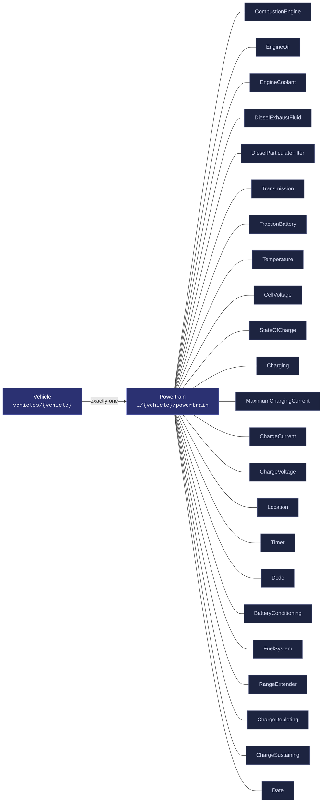
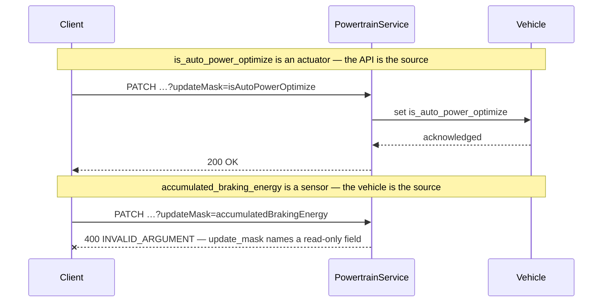
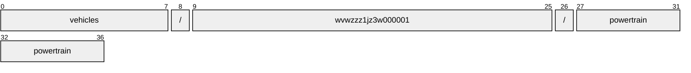
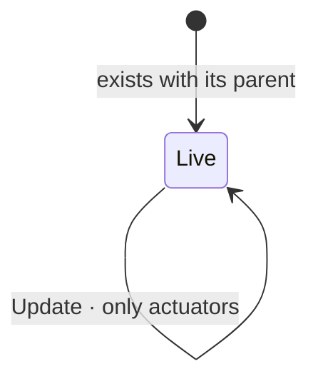

# Powertrain

[](https://github.com/COVESA/vehicle_signal_specification)
[](https://covesa.github.io/vehicle_signal_specification/)
[](https://aip.dev/156)
[](#methods)
[](#signals)
[](v1/)

Powertrain data for battery management, etc.

```
vehicles/{vehicle}/powertrain
```

## Where it sits



The 23 blue-grey boxes are **embedded messages**, not resources. They have no
name of their own and travel with the powertrain.

## Example

A powertrain as this API returns it:

```json
{
  "name": "vehicles/wvwzzz1jz3w000001/powertrain",
  "uid": "b3f1c2de-4a5b-4c6d-8e9f-0a1b2c3d4e5f",
  "isAutoPowerOptimize": true,
  "powerOptimizeLevel": 3,
  "accumulatedBrakingEnergy": 88.5,
  "rangeControl": 42,
  "timeRemaining": 42
}
```

The same data in the **VSS shape**, for a peer that speaks the specification
rather than this schema. `codec.ToVSS` produces it from
[`codec/manifest.json`](../../../../../codec/manifest.json):

```json
{
  "Vehicle.Powertrain.IsAutoPowerOptimize": true,
  "Vehicle.Powertrain.PowerOptimizeLevel": 3,
  "Vehicle.Powertrain.AccumulatedBrakingEnergy": 88.5,
  "Vehicle.Powertrain.Range": 42,
  "Vehicle.Powertrain.TimeRemaining": 42
}
```

Note what changed: signals are keyed by **fully qualified VSS name**, enum
constants drop to the spelling VSS writes, and the AIP fields — `name`,
`uid` — fall away, because VSS declares no signal for them. `codec.FromVSS`
reverses all three.

Writing to a powertrain, and the one thing that will fail:



```http
PATCH /v1/vehicles/wvwzzz1jz3w000001/powertrain?updateMask=isAutoPowerOptimize
{ "isAutoPowerOptimize": true }
```

The rejection is the schema working, not an inconvenience: VSS marks
`accumulated_braking_energy` a sensor, so the vehicle is the only thing that
can set it. A mask naming it fails rather than being silently dropped, so a
caller that believed it had written the value finds out immediately.

## Resource names

Every powertrain is addressed by a name that alternates collection and
identifier, per [AIP-122](https://aip.dev/122):



37 characters, alternating, which is what [AIP-123](https://aip.dev/123)
requires. An identifier is 80 random bits in Crockford base32, prefixed with
the resource's singular so the name opens with a letter — the randomness
half of a ULID with the timestamp half removed, because a ULID's leading
characters *are* a timestamp and a resource name should not publish when the
record was created. The vehicle is the exception: its identifier is its VIN,
which is already unique and already meaningful, the case AIP-122 prefers.

Rather than splitting that string by hand, use
[`resourcename`](https://github.com/the-protobuf-project/resourcename), which
implements AIP-122 templates in Go, Python, Rust, TypeScript, Swift and C:

```go
t := resourcename.ResourceTemplate("vehicles/{vehicle}/powertrain")
t.Parse("vehicles/wvwzzz1jz3w000001/powertrain")
// map[vehicle:wvwzzz1jz3w000001]
```

```python
t = resourcename.ResourceTemplate("vehicles/{vehicle}/powertrain")
t.parse("vehicles/wvwzzz1jz3w000001/powertrain")
# {'vehicle': 'wvwzzz1jz3w000001'}
```

The template above is the `pattern` this resource declares in its
`google.api.resource` annotation, so the two cannot drift.

## Signals

13 fields: 7 AIP identity and lifecycle, 6 VSS signals. Field numbers 8–15
are reserved for identity fields a later revision may add, so adding one never
renumbers a signal.

### Writable — actuators

The vehicle accepts these in an `update_mask`.

| Field | Type | Unit | VSS | Description |
| --- | --- | --- | --- | --- |
| `is_auto_power_optimize` | `bool` | — | `Vehicle.Powertrain.IsAutoPowerOptimize` | Auto Power Optimization Flag When set to 'true', the system enables automatic power optimization, dynamically adjusting the power optimization level based on runtime conditions or features managed by the OEM. When set to 'false', manual control of the power optimization level is allowed. |
| `power_optimize_level` | `int32` | — | `Vehicle.Powertrain.PowerOptimizeLevel` | Power optimization level for this branch/subsystem. A higher number indicates more aggressive power optimization. Level 0 indicates that all functionality is enabled, no power optimization enabled. Level 10 indicates most aggressive power optimization mode, only essential functionality enabled. |

### Read-only — sensors and attributes

The vehicle reports these. An `update_mask` naming one is **rejected**, not
silently ignored.

| Field | Type | Unit | VSS | Description |
| --- | --- | --- | --- | --- |
| `accumulated_braking_energy` | `double` | `kWh` | `Vehicle.Powertrain.AccumulatedBrakingEnergy` | The accumulated energy from regenerative braking over lifetime. |
| `range_control` | `int64` | `m` | `Vehicle.Powertrain.Range` | Remaining range in meters using all energy sources available in the vehicle. |
| `time_remaining` | `int64` | `s` | `Vehicle.Powertrain.TimeRemaining` | Time remaining in seconds before all energy sources available in the vehicle are empty. |
| `type_control` | [`PowertrainType`](#powertraintype) | — | `Vehicle.Powertrain.Type` | Defines the powertrain type of the vehicle. |

<details>
<summary>Identity and lifecycle — 7 fields every resource carries</summary>

| Field | Type | Notes |
| --- | --- | --- |
| `name` | `string` | `vehicles/{vehicle}/powertrain`, server-assigned |
| `uid` | `string` | server-assigned UUID4, per [AIP-148](https://aip.dev/148) |
| `etag` | `string` | pass back on update to make the write conditional, per [AIP-154](https://aip.dev/154) |
| `create_time` `update_time` | `Timestamp` | when it was stored here |
| `delete_time` `expire_time` | `Timestamp` | soft delete; recoverable until `expire_time` |

</details>

## Embedded messages

23 messages travel inside the powertrain and have no name of their own.
Address a field on one through its owner — `combustion_engine.<field>` —
not directly.

<details>
<summary><code>CombustionEngine</code> — Engine-specific data, stopping at the bell housing.</summary>

| Field | Type | Unit | VSS | Description |
| --- | --- | --- | --- | --- |
| `aspiration_type` | [`CombustionEngineAspirationType`](#combustionengineaspirationtype) | — | `Vehicle.Powertrain.CombustionEngine.AspirationType` | Type of aspiration (natural, turbocharger, supercharger etc). |
| `bore` | `double` | `mm` | `Vehicle.Powertrain.CombustionEngine.Bore` | Bore in millimetres. |
| `compression_ratio` | `string` | — | `Vehicle.Powertrain.CombustionEngine.CompressionRatio` | Engine compression ratio, specified in the format 'X:1', e.g. '9.2:1'. |
| `config` | [`CombustionEngineConfig`](#combustionengineconfig) | — | `Vehicle.Powertrain.CombustionEngine.Configuration` | Engine configuration. |
| `cylinder_count` | `int32` | — | `Vehicle.Powertrain.CombustionEngine.NumberOfCylinders` | Number of cylinders. |
| `cylinder_valve_count` | `int32` | — | `Vehicle.Powertrain.CombustionEngine.NumberOfValvesPerCylinder` | Number of valves per cylinder. |
| `diesel_exhaust_fluid` | `DieselExhaustFluid` | — | `Vehicle.Powertrain.CombustionEngine.DieselExhaustFluid` | Signals related to Diesel Exhaust Fluid (DEF). DEF is called AUS32 in ISO 22241. |
| `diesel_particulate_filter` | `DieselParticulateFilter` | — | `Vehicle.Powertrain.CombustionEngine.DieselParticulateFilter` | Diesel Particulate Filter signals. |
| `displacement` | `int32` | `cm^3` | `Vehicle.Powertrain.CombustionEngine.Displacement` | Displacement in cubic centimetres. |
| `engine_code` | `string` | — | `Vehicle.Powertrain.CombustionEngine.EngineCode` | Engine code designation, as specified by vehicle manufacturer. |
| `engine_coolant` | `EngineCoolant` | — | `Vehicle.Powertrain.CombustionEngine.EngineCoolant` | Signals related to the engine coolant |
| `engine_hours` | `double` | `h` | `Vehicle.Powertrain.CombustionEngine.EngineHours` | Accumulated time during engine lifetime with 'engine speed (rpm) > 0'. |
| `engine_oil` | `EngineOil` | — | `Vehicle.Powertrain.CombustionEngine.EngineOil` | Signals related to the engine oil |
| `eop` | `int32` | `kPa` | `Vehicle.Powertrain.CombustionEngine.EOP` | Engine oil pressure. |
| `idle_hours` | `double` | `h` | `Vehicle.Powertrain.CombustionEngine.IdleHours` | Accumulated idling time during engine lifetime. Definition of idling is not standardized. |
| `is_running` | `bool` | — | `Vehicle.Powertrain.CombustionEngine.IsRunning` | Engine Running. True if engine is rotating (Speed > 0). |
| `maf` | `int32` | `g/s` | `Vehicle.Powertrain.CombustionEngine.MAF` | Grams of air drawn into engine per second. |
| `map_control` | `int32` | `kPa` | `Vehicle.Powertrain.CombustionEngine.MAP` | Manifold absolute pressure possibly boosted using forced induction. |
| `max_power` | `int32` | `kW` | `Vehicle.Powertrain.CombustionEngine.MaxPower` | Peak power, in kilowatts, that engine can generate. |
| `max_torque` | `int32` | `Nm` | `Vehicle.Powertrain.CombustionEngine.MaxTorque` | Peak torque, in newton meter, that the engine can generate. |
| `power` | `int32` | `kW` | `Vehicle.Powertrain.CombustionEngine.Power` | Current engine power output. Shall be reported as 0 during engine breaking. |
| `speed` | `double` | `rpm` | `Vehicle.Powertrain.CombustionEngine.Speed` | Engine speed measured as rotations per minute. |
| `stroke_length` | `double` | `mm` | `Vehicle.Powertrain.CombustionEngine.StrokeLength` | Stroke length in millimetres. |
| `torque` | `int32` | `Nm` | `Vehicle.Powertrain.CombustionEngine.Torque` | Current engine torque. Shall be reported as a negative number during engine breaking. |
| `tps` | `int32` | `percent` | `Vehicle.Powertrain.CombustionEngine.TPS` | Current throttle position. |

</details>

<details>
<summary><code>EngineOil</code> — Signals related to the engine oil</summary>

| Field | Type | Unit | VSS | Description |
| --- | --- | --- | --- | --- |
| `capacity` | `double` | `l` | `Vehicle.Powertrain.CombustionEngine.EngineOil.Capacity` | Engine oil capacity in liters. |
| `level` | [`EngineOilLevel`](#engineoillevel) | — | `Vehicle.Powertrain.CombustionEngine.EngineOil.Level` | Engine oil level. |
| `life_remaining` | `int32` | `s` | `Vehicle.Powertrain.CombustionEngine.EngineOil.LifeRemaining` | Remaining engine oil life in seconds. Negative values can be used to indicate that lifetime has been exceeded. |
| `pressure_status` | [`EngineOilPressureState`](#engineoilpressurestate) | — | `Vehicle.Powertrain.CombustionEngine.EngineOil.PressureStatus` | Engine oil pressure status. |
| `temperature` | `double` | `Celsius` | `Vehicle.Powertrain.CombustionEngine.EngineOil.Temperature` | EOT, Engine oil temperature. |

</details>

<details>
<summary><code>EngineCoolant</code> — Signals related to the engine coolant</summary>

| Field | Type | Unit | VSS | Description |
| --- | --- | --- | --- | --- |
| `capacity` | `double` | `l` | `Vehicle.Powertrain.CombustionEngine.EngineCoolant.Capacity` | Engine coolant capacity in liters. |
| `level` | [`EngineCoolantLevel`](#enginecoolantlevel) | — | `Vehicle.Powertrain.CombustionEngine.EngineCoolant.Level` | Engine coolant level. |
| `life_remaining` | `int32` | `s` | `Vehicle.Powertrain.CombustionEngine.EngineCoolant.LifeRemaining` | Remaining engine coolant life in seconds. Negative values can be used to indicate that lifetime has been exceeded. |
| `temperature` | `double` | `Celsius` | `Vehicle.Powertrain.CombustionEngine.EngineCoolant.Temperature` | Engine coolant temperature. |

</details>

<details>
<summary><code>DieselExhaustFluid</code> — Signals related to Diesel Exhaust Fluid (DEF). DEF is called AUS32 in ISO 22241.</summary>

| Field | Type | Unit | VSS | Description |
| --- | --- | --- | --- | --- |
| `capacity` | `double` | `l` | `Vehicle.Powertrain.CombustionEngine.DieselExhaustFluid.Capacity` | Capacity in liters of the Diesel Exhaust Fluid Tank. |
| `is_level_low` | `bool` | — | `Vehicle.Powertrain.CombustionEngine.DieselExhaustFluid.IsLevelLow` | Indicates if the Diesel Exhaust Fluid level is low. True if level is low. Definition of low is vehicle dependent. |
| `level` | `int32` | `percent` | `Vehicle.Powertrain.CombustionEngine.DieselExhaustFluid.Level` | Level of the Diesel Exhaust Fluid tank as percent of capacity. 0 = empty. 100 = full. |
| `range_control` | `int64` | `m` | `Vehicle.Powertrain.CombustionEngine.DieselExhaustFluid.Range` | Remaining range in meters of the Diesel Exhaust Fluid present in the vehicle. |

</details>

<details>
<summary><code>DieselParticulateFilter</code> — Diesel Particulate Filter signals.</summary>

| Field | Type | Unit | VSS | Description |
| --- | --- | --- | --- | --- |
| `delta_pressure` | `double` | `Pa` | `Vehicle.Powertrain.CombustionEngine.DieselParticulateFilter.DeltaPressure` | Delta Pressure of Diesel Particulate Filter. |
| `inlet_temperature` | `double` | `Celsius` | `Vehicle.Powertrain.CombustionEngine.DieselParticulateFilter.InletTemperature` | Inlet temperature of Diesel Particulate Filter. |
| `outlet_temperature` | `double` | `Celsius` | `Vehicle.Powertrain.CombustionEngine.DieselParticulateFilter.OutletTemperature` | Outlet temperature of Diesel Particulate Filter. |

</details>

<details>
<summary><code>Transmission</code> — Transmission-specific data, stopping at the drive shafts.</summary>

| Field | Type | Unit | VSS | Description |
| --- | --- | --- | --- | --- |
| `clutch_engagement` | `double` | `percent` | `Vehicle.Powertrain.Transmission.ClutchEngagement` | Clutch engagement. 0% = Clutch fully disengaged. 100% = Clutch fully engaged. |
| `clutch_wear` | `int32` | `percent` | `Vehicle.Powertrain.Transmission.ClutchWear` | Clutch wear as a percent. 0 = no wear. 100 = worn. |
| `current_gear` | `int32` | — | `Vehicle.Powertrain.Transmission.CurrentGear` | The current gear. 0=Neutral, 1/2/..=Forward, -1/-2/..=Reverse. |
| `diff_lock_front_engagement` | `double` | `percent` | `Vehicle.Powertrain.Transmission.DiffLockFrontEngagement` | Front Diff Lock engagement. 0% = Diff lock fully disengaged. 100% = Diff lock fully engaged. |
| `diff_lock_rear_engagement` | `double` | `percent` | `Vehicle.Powertrain.Transmission.DiffLockRearEngagement` | Rear Diff Lock engagement. 0% = Diff lock fully disengaged. 100% = Diff lock fully engaged. |
| `drive_type` | [`TransmissionDriveType`](#transmissiondrivetype) | — | `Vehicle.Powertrain.Transmission.DriveType` | Drive type. |
| `gear_change_mode` | [`TransmissionGearChangeMode`](#transmissiongearchangemode) | — | `Vehicle.Powertrain.Transmission.GearChangeMode` | Is the gearbox in automatic or manual (paddle) mode. |
| `gear_count` | `int32` | — | `Vehicle.Powertrain.Transmission.GearCount` | Number of forward gears in the transmission. -1 = CVT. |
| `is_electrical_powertrain_engaged` | `bool` | — | `Vehicle.Powertrain.Transmission.IsElectricalPowertrainEngaged` | Is electrical powertrain mechanically connected/engaged to the drivetrain or not. False = Disconnected/Disengaged. True = Connected/Engaged. |
| `is_low_range_engaged` | `bool` | — | `Vehicle.Powertrain.Transmission.IsLowRangeEngaged` | Is gearbox in low range mode or not. False = Normal/High range engaged. True = Low range engaged. |
| `is_park_lock_engaged` | `bool` | — | `Vehicle.Powertrain.Transmission.IsParkLockEngaged` | Is the transmission park lock engaged or not. False = Disengaged. True = Engaged. |
| `performance_mode` | [`TransmissionPerformanceMode`](#transmissionperformancemode) | — | `Vehicle.Powertrain.Transmission.PerformanceMode` | Current gearbox performance mode. |
| `selected_gear` | `int32` | — | `Vehicle.Powertrain.Transmission.SelectedGear` | The selected gear. 0=Neutral, 1/2/..=Forward, -1/-2/..=Reverse, 126=Park, 127=Drive. |
| `temperature` | `double` | `Celsius` | `Vehicle.Powertrain.Transmission.Temperature` | The current gearbox temperature. |
| `torque_distribution` | `double` | `percent` | `Vehicle.Powertrain.Transmission.TorqueDistribution` | Torque distribution between front and rear axle in percent. -100% = Full torque to front axle, 0% = 50:50 Front/Rear, 100% = Full torque to rear axle. |
| `travelled_distance` | `double` | `km` | `Vehicle.Powertrain.Transmission.TravelledDistance` | Odometer reading, total distance travelled during the lifetime of the transmission. |
| `type_control` | [`TransmissionType`](#transmissiontype) | — | `Vehicle.Powertrain.Transmission.Type` | Transmission type. |

</details>

<details>
<summary><code>TractionBattery</code> — Battery Management data.</summary>

| Field | Type | Unit | VSS | Description |
| --- | --- | --- | --- | --- |
| `accumulated_charged_energy` | `double` | `kWh` | `Vehicle.Powertrain.TractionBattery.AccumulatedChargedEnergy` | The accumulated energy delivered to the battery during charging over lifetime of the battery. |
| `accumulated_charged_throughput` | `double` | `Ah` | `Vehicle.Powertrain.TractionBattery.AccumulatedChargedThroughput` | The accumulated charge throughput delivered to the battery during charging over lifetime of the battery. |
| `accumulated_consumed_energy` | `double` | `kWh` | `Vehicle.Powertrain.TractionBattery.AccumulatedConsumedEnergy` | The accumulated energy leaving HV battery for propulsion and auxiliary loads over lifetime of the battery. |
| `accumulated_consumed_throughput` | `double` | `Ah` | `Vehicle.Powertrain.TractionBattery.AccumulatedConsumedThroughput` | The accumulated charge throughput leaving HV battery for propulsion and auxiliary loads over lifetime of the battery. |
| `battery_conditioning` | `BatteryConditioning` | — | `Vehicle.Powertrain.TractionBattery.BatteryConditioning` | Properties related to preparing the vehicle battery for charging or driving. |
| `cell_voltage` | `CellVoltage` | — | `Vehicle.Powertrain.TractionBattery.CellVoltage` | Voltage information for cells in the battery pack. |
| `charge_state` | `StateOfCharge` | — | `Vehicle.Powertrain.TractionBattery.StateOfCharge` | Information on the state of charge of the vehicle's high voltage battery. |
| `charging` | `Charging` | — | `Vehicle.Powertrain.TractionBattery.Charging` | Properties related to battery charging. |
| `current_current` | `double` | `A` | `Vehicle.Powertrain.TractionBattery.CurrentCurrent` | Current current flowing in/out of battery. Positive = Current flowing in to battery, e.g. during charging. Negative = Current flowing out of battery, e.g. during driving. |
| `current_power` | `double` | `W` | `Vehicle.Powertrain.TractionBattery.CurrentPower` | Current electrical energy flowing in/out of battery. Positive = Energy flowing in to battery, e.g. during charging. Negative = Energy flowing out of battery, e.g. during driving. |
| `current_voltage` | `double` | `V` | `Vehicle.Powertrain.TractionBattery.CurrentVoltage` | Current Voltage of the battery. |
| `dcdc` | `Dcdc` | — | `Vehicle.Powertrain.TractionBattery.DCDC` | Properties related to DC/DC converter converting high voltage (from high voltage battery) to vehicle low voltage (supply voltage, typically 12 Volts). |
| `error_codes` | `repeated string` | — | `Vehicle.Powertrain.TractionBattery.ErrorCodes` | Current error codes related to the battery, if any. |
| `gross_capacity` | `int32` | `kWh` | `Vehicle.Powertrain.TractionBattery.GrossCapacity` | Gross capacity of the battery. |
| `health_state` | `double` | `percent` | `Vehicle.Powertrain.TractionBattery.StateOfHealth` | Calculated battery state of health at standard conditions. |
| `id` | `string` | — | `Vehicle.Powertrain.TractionBattery.Id` | Battery Identification Number as assigned by OEM. |
| `is_ground_connected` | `bool` | — | `Vehicle.Powertrain.TractionBattery.IsGroundConnected` | Indicating if the ground (negative terminator) of the traction battery is connected to the powertrain. |
| `is_power_connected` | `bool` | — | `Vehicle.Powertrain.TractionBattery.IsPowerConnected` | Indicating if the power (positive terminator) of the traction battery is connected to the powertrain. |
| `max_voltage` | `int32` | `V` | `Vehicle.Powertrain.TractionBattery.MaxVoltage` | Max allowed voltage of the battery, e.g. during charging. |
| `net_capacity` | `int32` | `kWh` | `Vehicle.Powertrain.TractionBattery.NetCapacity` | Total net capacity of the battery considering aging. |
| `nominal_voltage` | `int32` | `V` | `Vehicle.Powertrain.TractionBattery.NominalVoltage` | Nominal Voltage of the battery. |
| `power_loss` | `double` | `W` | `Vehicle.Powertrain.TractionBattery.PowerLoss` | Electrical energy lost by power dissipation to heat inside the battery. |
| `production` | `Date` | `iso8601` | `Vehicle.Powertrain.TractionBattery.ProductionDate` | Production date of battery in ISO8601 format, e.g. YYYY-MM-DD. |
| `range_control` | `int64` | `m` | `Vehicle.Powertrain.TractionBattery.Range` | Remaining range in meters using only battery. |
| `temperature` | `Temperature` | — | `Vehicle.Powertrain.TractionBattery.Temperature` | Temperature Information for the battery pack. |
| `time_remaining` | `int64` | `s` | `Vehicle.Powertrain.TractionBattery.TimeRemaining` | Time remaining in seconds before the battery is empty. |

</details>

<details>
<summary><code>Temperature</code> — Temperature Information for the battery pack.</summary>

| Field | Type | Unit | VSS | Description |
| --- | --- | --- | --- | --- |
| `average` | `double` | `Celsius` | `Vehicle.Powertrain.TractionBattery.Temperature.Average` | Current average temperature of the battery cells. |
| `cell_temperature` | `repeated double` | — | `Vehicle.Powertrain.TractionBattery.Temperature.CellTemperature` | Array of cell temperatures. Length or array shall correspond to number of cells in vehicle. |
| `max` | `double` | `Celsius` | `Vehicle.Powertrain.TractionBattery.Temperature.Max` | Current maximum temperature of the battery cells, i.e. temperature of the hottest cell. |
| `min` | `double` | `Celsius` | `Vehicle.Powertrain.TractionBattery.Temperature.Min` | Current minimum temperature of the battery cells, i.e. temperature of the coldest cell. |

</details>

<details>
<summary><code>CellVoltage</code> — Voltage information for cells in the battery pack.</summary>

| Field | Type | Unit | VSS | Description |
| --- | --- | --- | --- | --- |
| `cell_voltages` | `repeated double` | — | `Vehicle.Powertrain.TractionBattery.CellVoltage.CellVoltages` | Array of cell voltages. Length or array shall correspond to number of cells in vehicle. |
| `id_max` | `int32` | — | `Vehicle.Powertrain.TractionBattery.CellVoltage.IdMax` | Identifier of the battery cell with highest voltage. |
| `id_min` | `int32` | — | `Vehicle.Powertrain.TractionBattery.CellVoltage.IdMin` | Identifier of the battery cell with lowest voltage. |
| `max` | `double` | `V` | `Vehicle.Powertrain.TractionBattery.CellVoltage.Max` | Current voltage of the battery cell with highest voltage. |
| `min` | `double` | `V` | `Vehicle.Powertrain.TractionBattery.CellVoltage.Min` | Current voltage of the battery cell with lowest voltage. |

</details>

<details>
<summary><code>StateOfCharge</code> — Information on the state of charge of the vehicle's high voltage battery.</summary>

| Field | Type | Unit | VSS | Description |
| --- | --- | --- | --- | --- |
| `current` | `double` | `percent` | `Vehicle.Powertrain.TractionBattery.StateOfCharge.Current` | Physical state of charge of the high voltage battery, relative to net capacity. This is not necessarily the state of charge being displayed to the customer. |
| `current_energy` | `double` | `kWh` | `Vehicle.Powertrain.TractionBattery.StateOfCharge.CurrentEnergy` | Physical state of charge of high voltage battery expressed in kWh. |
| `displayed` | `double` | `percent` | `Vehicle.Powertrain.TractionBattery.StateOfCharge.Displayed` | State of charge displayed to the customer. |

</details>

<details>
<summary><code>Charging</code> — Properties related to battery charging.</summary>

| Field | Type | Unit | VSS | Description |
| --- | --- | --- | --- | --- |
| `average_power` | `double` | `kW` | `Vehicle.Powertrain.TractionBattery.Charging.AveragePower` | Average charging power of last or current charging event. |
| `charge_current` | `ChargeCurrent` | — | `Vehicle.Powertrain.TractionBattery.Charging.ChargeCurrent` | Current charging current. |
| `charge_limit` | `int32` | `percent` | `Vehicle.Powertrain.TractionBattery.Charging.ChargeLimit` | Target charge limit (state of charge) for battery. |
| `charge_rate` | `double` | `km/h` | `Vehicle.Powertrain.TractionBattery.Charging.ChargeRate` | Current charging rate, as in kilometers of range added per hour. |
| `charge_voltage` | `ChargeVoltage` | — | `Vehicle.Powertrain.TractionBattery.Charging.ChargeVoltage` | Current charging voltage, as measured at the charging inlet. |
| `completion_duration` | `google.protobuf.Duration` | `s` | `Vehicle.Powertrain.TractionBattery.Charging.TimeToComplete` | The time needed for the current charging process to reach Charging.ChargeLimit. 0 if charging is complete or no charging process is active or planned. |
| `evse_id` | `string` | — | `Vehicle.Powertrain.TractionBattery.Charging.EvseId` | EVSE charging point ID (without separators) of last or current charging event according to ISO 15118-2 Annex H. |
| `is_charging` | `bool` | — | `Vehicle.Powertrain.TractionBattery.Charging.IsCharging` | True if charging is ongoing. Charging is considered to be ongoing if energy is flowing from charger to vehicle. |
| `is_discharging` | `bool` | — | `Vehicle.Powertrain.TractionBattery.Charging.IsDischarging` | True if discharging (vehicle to grid) is ongoing. Discharging is considered to be ongoing if energy is flowing from vehicle to charger/grid. |
| `location` | `Location` | — | `Vehicle.Powertrain.TractionBattery.Charging.Location` | Location of last or current charging event. |
| `max_power` | `double` | `kW` | `Vehicle.Powertrain.TractionBattery.Charging.MaxPower` | Maximum charging power of last or current charging event. |
| `maximum_charging_current` | `MaximumChargingCurrent` | — | `Vehicle.Powertrain.TractionBattery.Charging.MaximumChargingCurrent` | Maximum charging current that can be accepted by the system, as measured at the charging inlet. |
| `power_loss` | `double` | `W` | `Vehicle.Powertrain.TractionBattery.Charging.PowerLoss` | Electrical energy lost by power dissipation to heat inside the AC/DC converter. |
| `start_stop_charging` | [`ChargingStartStopCharging`](#chargingstartstopcharging) | — | `Vehicle.Powertrain.TractionBattery.Charging.StartStopCharging` | Start or stop the charging process. |
| `temperature` | `double` | `Celsius` | `Vehicle.Powertrain.TractionBattery.Charging.Temperature` | Current temperature of AC/DC converter converting grid voltage to battery voltage. |
| `timer` | `Timer` | — | `Vehicle.Powertrain.TractionBattery.Charging.Timer` | Properties related to timing of battery charging sessions. |

</details>

<details>
<summary><code>MaximumChargingCurrent</code> — Maximum charging current that can be accepted by the system, as measured at the charging inlet.</summary>

| Field | Type | Unit | VSS | Description |
| --- | --- | --- | --- | --- |
| `dc` | `double` | `A` | `Vehicle.Powertrain.TractionBattery.Charging.MaximumChargingCurrent.DC` | Maximum DC charging current at inlet that can be accepted by the system. |
| `phase1` | `double` | `A` | `Vehicle.Powertrain.TractionBattery.Charging.MaximumChargingCurrent.Phase1` | Maximum AC charging current (rms) at inlet for Phase 1 that can be accepted by the system. |
| `phase2` | `double` | `A` | `Vehicle.Powertrain.TractionBattery.Charging.MaximumChargingCurrent.Phase2` | Maximum AC charging current (rms) at inlet for Phase 2 that can be accepted by the system. |
| `phase3` | `double` | `A` | `Vehicle.Powertrain.TractionBattery.Charging.MaximumChargingCurrent.Phase3` | Maximum AC charging current (rms) at inlet for Phase 3 that can be accepted by the system. |

</details>

<details>
<summary><code>ChargeCurrent</code> — Current charging current.</summary>

| Field | Type | Unit | VSS | Description |
| --- | --- | --- | --- | --- |
| `dc` | `double` | `A` | `Vehicle.Powertrain.TractionBattery.Charging.ChargeCurrent.DC` | Current DC charging current at inlet. Negative if returning energy to grid. |
| `phase1` | `double` | `A` | `Vehicle.Powertrain.TractionBattery.Charging.ChargeCurrent.Phase1` | Current AC charging current (rms) at inlet for Phase 1. Negative if returning energy to grid. |
| `phase2` | `double` | `A` | `Vehicle.Powertrain.TractionBattery.Charging.ChargeCurrent.Phase2` | Current AC charging current (rms) at inlet for Phase 2. Negative if returning energy to grid. |
| `phase3` | `double` | `A` | `Vehicle.Powertrain.TractionBattery.Charging.ChargeCurrent.Phase3` | Current AC charging current (rms) at inlet for Phase 3. Negative if returning energy to grid. |

</details>

<details>
<summary><code>ChargeVoltage</code> — Current charging voltage, as measured at the charging inlet.</summary>

| Field | Type | Unit | VSS | Description |
| --- | --- | --- | --- | --- |
| `dc` | `double` | `V` | `Vehicle.Powertrain.TractionBattery.Charging.ChargeVoltage.DC` | Current DC charging voltage at charging inlet. |
| `phase1` | `double` | `V` | `Vehicle.Powertrain.TractionBattery.Charging.ChargeVoltage.Phase1` | Current AC charging voltage (rms) at inlet for Phase 1. |
| `phase2` | `double` | `V` | `Vehicle.Powertrain.TractionBattery.Charging.ChargeVoltage.Phase2` | Current AC charging voltage (rms) at inlet for Phase 2. |
| `phase3` | `double` | `V` | `Vehicle.Powertrain.TractionBattery.Charging.ChargeVoltage.Phase3` | Current AC charging voltage (rms) at inlet for Phase 3. |

</details>

<details>
<summary><code>Location</code> — Location of last or current charging event.</summary>

| Field | Type | Unit | VSS | Description |
| --- | --- | --- | --- | --- |
| `altitude` | `double` | `m` | `Vehicle.Powertrain.TractionBattery.Charging.Location.Altitude` | Altitude relative to WGS 84 reference ellipsoid of last or current charging event. |
| `latitude` | `double` | `degrees` | `Vehicle.Powertrain.TractionBattery.Charging.Location.Latitude` | Latitude of last or current charging event in WGS 84 geodetic coordinates. |
| `longitude` | `double` | `degrees` | `Vehicle.Powertrain.TractionBattery.Charging.Location.Longitude` | Longitude of last or current charging event in WGS 84 geodetic coordinates. |

</details>

<details>
<summary><code>Timer</code> — Properties related to timing of battery charging sessions.</summary>

| Field | Type | Unit | VSS | Description |
| --- | --- | --- | --- | --- |
| `action_time` | `google.protobuf.Timestamp` | `iso8601` | `Vehicle.Powertrain.TractionBattery.Charging.Timer.Time` | Time for next charging-related action, formatted according to ISO 8601 with UTC time zone. Value has no significance if Charging.Timer.Mode is 'inactive'. |
| `mode` | [`TimerMode`](#timermode) | — | `Vehicle.Powertrain.TractionBattery.Charging.Timer.Mode` | Defines timer mode for charging: INACTIVE - no timer set, charging may start as soon as battery is connected to a charger. START_TIME - charging shall start at Charging.Timer.Time. END_TIME - charging shall be finished (reach Charging.ChargeLimit) at Charging.Timer.Time. When charging is completed the vehicle shall change mode to 'inactive' or set a new Charging.Timer.Time. Charging shall start immediately if mode is 'starttime' or 'endtime' and Charging.Timer.Time is a time in the past. |

</details>

<details>
<summary><code>Dcdc</code> — Properties related to DC/DC converter converting high voltage (from high voltage battery) to vehicle low voltage (supply voltage, typically 12 Volts).</summary>

| Field | Type | Unit | VSS | Description |
| --- | --- | --- | --- | --- |
| `power_loss` | `double` | `W` | `Vehicle.Powertrain.TractionBattery.DCDC.PowerLoss` | Electrical energy lost by power dissipation to heat inside DC/DC converter. |
| `temperature` | `double` | `Celsius` | `Vehicle.Powertrain.TractionBattery.DCDC.Temperature` | Current temperature of DC/DC converter converting battery high voltage to vehicle low voltage (typically 12 Volts). |

</details>

<details>
<summary><code>BatteryConditioning</code> — Properties related to preparing the vehicle battery for charging or driving.</summary>

| Field | Type | Unit | VSS | Description |
| --- | --- | --- | --- | --- |
| `is_active` | `bool` | — | `Vehicle.Powertrain.TractionBattery.BatteryConditioning.IsActive` | Indicates if battery conditioning is active (i.e. actively monitors battery temperature). True = Active. False = Inactive. |
| `is_ongoing` | `bool` | — | `Vehicle.Powertrain.TractionBattery.BatteryConditioning.IsOngoing` | Indicating if battery conditioning is currently ongoing. Battery conditioning is considered ongoing when the battery conditioning system is actively heating or cooling the battery, or requesting heating or cooling. |
| `requested_mode` | [`BatteryConditioningRequestedMode`](#batteryconditioningrequestedmode) | — | `Vehicle.Powertrain.TractionBattery.BatteryConditioning.RequestedMode` | Defines requested mode for battery conditioning. INACTIVE - Battery conditioning inactive. FAST_CHARGING_PREPARATION - Battery conditioning for fast charging. DRIVING_PREPARATION - Battery conditioning for driving. |
| `start_time` | `google.protobuf.Timestamp` | `iso8601` | `Vehicle.Powertrain.TractionBattery.BatteryConditioning.StartTime` | Start time for battery conditioning, formatted according to ISO 8601 with UTC time zone. |
| `target_temperature` | `double` | `Celsius` | `Vehicle.Powertrain.TractionBattery.BatteryConditioning.TargetTemperature` | Target temperature for battery conditioning. |
| `target_time` | `google.protobuf.Timestamp` | `iso8601` | `Vehicle.Powertrain.TractionBattery.BatteryConditioning.TargetTime` | Target time when conditioning shall be finished, formatted according to ISO 8601 with UTC time zone. |

</details>

<details>
<summary><code>FuelSystem</code> — Fuel system data.</summary>

| Field | Type | Unit | VSS | Description |
| --- | --- | --- | --- | --- |
| `absolute_level` | `double` | `l` | `Vehicle.Powertrain.FuelSystem.AbsoluteLevel` | Current available fuel in the fuel tank expressed in liters. |
| `average_consumption` | `double` | `l/100km` | `Vehicle.Powertrain.FuelSystem.AverageConsumption` | Average consumption in liters per 100 km. |
| `cumulative_fuel_economy` | `double` | `km/l` | `Vehicle.Powertrain.FuelSystem.CumulativeFuelEconomy` | Cumulative average fuel economy calculated from vehicle start or last user reset. |
| `current_tank_consumption` | `double` | `l` | `Vehicle.Powertrain.FuelSystem.ConsumptionSinceLastRefuel` | Fuel consumption since last refueling. |
| `current_tank_fuel_economy` | `double` | `km/l` | `Vehicle.Powertrain.FuelSystem.AfterRefuelingFuelEconomy` | Average fuel economy calculated from the most recent refueling event to the current time. |
| `drive_fuel_economy` | `double` | `km/l` | `Vehicle.Powertrain.FuelSystem.DriveFuelEconomy` | Average fuel economy for the current drive cycle, calculated from engine start to current time. |
| `hybrid_type` | [`FuelSystemHybridType`](#fuelsystemhybridtype) | — | `Vehicle.Powertrain.FuelSystem.HybridType` | Defines the hybrid type of the vehicle. |
| `instant_consumption` | `double` | `l/100km` | `Vehicle.Powertrain.FuelSystem.InstantConsumption` | Current consumption in liters per 100 km. |
| `instant_fuel_economy` | `double` | `km/l` | `Vehicle.Powertrain.FuelSystem.InstantFuelEconomy` | Real-time instantaneous fuel economy calculated over a short time window. |
| `instantant_fuel_economy` | `double` | `km/l` | `Vehicle.Powertrain.FuelSystem.InstantantFuelEconomy` | Real-time instantaneous fuel economy calculated over a short time window. |
| `is_engine_stop_start_enabled` | `bool` | — | `Vehicle.Powertrain.FuelSystem.IsEngineStopStartEnabled` | Indicates whether eco start stop is currently enabled. |
| `is_fuel_level_empty` | `bool` | — | `Vehicle.Powertrain.FuelSystem.IsFuelLevelEmpty` | Indicates that the fuel gauge on the instrument cluster displays empty (0). |
| `is_fuel_level_low` | `bool` | — | `Vehicle.Powertrain.FuelSystem.IsFuelLevelLow` | Indicates that the fuel level is low (e.g. <50km range). |
| `is_fuel_port_flap_open` | `bool` | — | `Vehicle.Powertrain.FuelSystem.IsFuelPortFlapOpen` | Status of the fuel port flap(s). True if at least one is open. |
| `range_control` | `int64` | `m` | `Vehicle.Powertrain.FuelSystem.Range` | Remaining range in meters using only liquid fuel. |
| `refuel_port_position` | [`repeated FuelSystemRefuelPortPosition`](#repeated fuelsystemrefuelportposition) | — | `Vehicle.Powertrain.FuelSystem.RefuelPortPosition` | Position of refuel port(s). First part indicates side of vehicle, second part relative position on that side. |
| `relative_level` | `int32` | `percent` | `Vehicle.Powertrain.FuelSystem.RelativeLevel` | Level in fuel tank as percent of capacity. 0 = empty. 100 = full. |
| `supported_fuel` | [`repeated FuelSystemSupportedFuel`](#repeated fuelsystemsupportedfuel) | — | `Vehicle.Powertrain.FuelSystem.SupportedFuel` | Detailed information on fuels supported by the vehicle. Identifiers originating from DIN EN 16942:2021-08, appendix B, with additional suffix for octane (RON) where relevant. |
| `supported_fuel_types` | [`repeated FuelSystemSupportedFuelTypes`](#repeated fuelsystemsupportedfueltypes) | — | `Vehicle.Powertrain.FuelSystem.SupportedFuelTypes` | High level information of fuel types supported |
| `tank_capacity` | `double` | `l` | `Vehicle.Powertrain.FuelSystem.TankCapacity` | Capacity of the fuel tank in liters. |
| `time_remaining` | `int64` | `s` | `Vehicle.Powertrain.FuelSystem.TimeRemaining` | Time remaining in seconds before the fuel tank is empty. |
| `trip_consumption` | `double` | `l` | `Vehicle.Powertrain.FuelSystem.ConsumptionSinceStart` | Fuel amount in liters consumed since start of current trip. |

</details>

<details>
<summary><code>RangeExtender</code> — Extended Range Electric Vehicle (EREV) specific data.</summary>

| Field | Type | Unit | VSS | Description |
| --- | --- | --- | --- | --- |
| `charge_depleting` | `ChargeDepleting` | — | `Vehicle.Powertrain.RangeExtender.ChargeDepleting` | Signals related to Charge Depleting (CD) mode operation. |
| `charge_sustaining` | `ChargeSustaining` | — | `Vehicle.Powertrain.RangeExtender.ChargeSustaining` | Signals related to Charge Sustaining (CS) mode operation. |
| `combined_fuel_economy` | `double` | `km/l` | `Vehicle.Powertrain.RangeExtender.CombinedFuelEconomy` | Combined fuel economy equivalent that accounts for both electric energy and fuel consumption. |
| `operating_mode` | [`RangeExtenderOperatingMode`](#rangeextenderoperatingmode) | — | `Vehicle.Powertrain.RangeExtender.OperatingMode` | Current operating mode of the Extended Range Electric Vehicle. |

</details>

<details>
<summary><code>ChargeDepleting</code> — Signals related to Charge Depleting (CD) mode operation.</summary>

| Field | Type | Unit | VSS | Description |
| --- | --- | --- | --- | --- |
| `energy_consumption` | `double` | `kWh/100km` | `Vehicle.Powertrain.RangeExtender.ChargeDepleting.EnergyConsumption` | Current electric energy consumption rate during Charge Depleting mode operation. |
| `range_control` | `int64` | `m` | `Vehicle.Powertrain.RangeExtender.ChargeDepleting.Range` | Estimated remaining distance that can be traveled in Charge Depleting mode using available battery energy. |

</details>

<details>
<summary><code>ChargeSustaining</code> — Signals related to Charge Sustaining (CS) mode operation.</summary>

| Field | Type | Unit | VSS | Description |
| --- | --- | --- | --- | --- |
| `fuel_economy` | `double` | `km/l` | `Vehicle.Powertrain.RangeExtender.ChargeSustaining.FuelEconomy` | Current fuel economy during Charge Sustaining mode operation. |
| `range_control` | `int64` | `m` | `Vehicle.Powertrain.RangeExtender.ChargeSustaining.Range` | Estimated remaining distance that can be traveled in Charge Sustaining mode using available fuel. |

</details>

<details>
<summary><code>Date</code> — Date is a calendar date: a year, a month and a day.</summary>

| Field | Type | Unit | VSS | Description |
| --- | --- | --- | --- | --- |
| `day` | `int32` | — | `Vehicle.Powertrain.Date.Day` | Day of the month, valid for the year and month. |
| `month` | `int32` | — | `Vehicle.Powertrain.Date.Month` | Month of the year. |
| `year` | `int32` | — | `Vehicle.Powertrain.Date.Year` | Year of the date. |

</details>

## Methods

A singleton, so **`Get`** · **`Update`** only, per
[AIP-156](https://aip.dev/156). Nothing can create a second or delete the only
one — that is the complete method set for a singleton, not a reduced one.



```http
GET    /v1/{name=vehicles/*/powertrain}
PATCH  /v1/{powertrain.name=vehicles/*/powertrain}
```

## Enums

#### `PowertrainType`

Defines the powertrain type of the vehicle.

`UNSPECIFIED` · `COMBUSTION` · `HYBRID` · `ELECTRIC`
<sub>emitted as `POWERTRAIN_TYPE_COMBUSTION`, and so on</sub>

#### `CombustionEngineConfig`

Engine configuration.

`UNSPECIFIED` · `UNKNOWN` · `STRAIGHT` · `V` · `BOXER` · `W` · `ROTARY`
· `RADIAL` · `SQUARE` · `H` · `U` · `OPPOSED` · `X`
<sub>emitted as `COMBUSTION_ENGINE_CONFIG_UNKNOWN`, and so on</sub>

#### `CombustionEngineAspirationType`

Type of aspiration (natural, turbocharger, supercharger etc).

`UNSPECIFIED` · `UNKNOWN` · `NATURAL` · `SUPERCHARGER` · `TURBOCHARGER`
<sub>emitted as `COMBUSTION_ENGINE_ASPIRATION_TYPE_UNKNOWN`, and so on</sub>

#### `EngineOilLevel`

Engine oil level.

`UNSPECIFIED` · `CRITICALLY_LOW` · `LOW` · `NORMAL` · `HIGH` ·
`CRITICALLY_HIGH`
<sub>emitted as `ENGINE_OIL_LEVEL_CRITICALLY_LOW`, and so on</sub>

#### `EngineOilPressureState`

Engine oil pressure status.

`UNSPECIFIED` · `NORMAL` · `WARNING` · `ALERT` · `ERROR`
<sub>emitted as `ENGINE_OIL_PRESSURE_STATE_NORMAL`, and so on</sub>

#### `EngineCoolantLevel`

Engine coolant level.

`UNSPECIFIED` · `CRITICALLY_LOW` · `LOW` · `NORMAL`
<sub>emitted as `ENGINE_COOLANT_LEVEL_CRITICALLY_LOW`, and so on</sub>

#### `TransmissionType`

Transmission type.

`UNSPECIFIED` · `UNKNOWN` · `SEQUENTIAL` · `H` · `AUTOMATIC` · `DSG` ·
`CVT`
<sub>emitted as `TRANSMISSION_TYPE_UNKNOWN`, and so on</sub>

#### `TransmissionDriveType`

Drive type.

`UNSPECIFIED` · `UNKNOWN` · `FORWARD_WHEEL_DRIVE` · `REAR_WHEEL_DRIVE` ·
`ALL_WHEEL_DRIVE`
<sub>emitted as `TRANSMISSION_DRIVE_TYPE_UNKNOWN`, and so on</sub>

#### `TransmissionPerformanceMode`

Current gearbox performance mode.

`UNSPECIFIED` · `NORMAL` · `SPORT` · `ECONOMY` · `SNOW` · `RAIN`
<sub>emitted as `TRANSMISSION_PERFORMANCE_MODE_NORMAL`, and so on</sub>

#### `TransmissionGearChangeMode`

Is the gearbox in automatic or manual (paddle) mode.

`UNSPECIFIED` · `MANUAL` · `AUTOMATIC`
<sub>emitted as `TRANSMISSION_GEAR_CHANGE_MODE_MANUAL`, and so on</sub>

#### `ChargingStartStopCharging`

Start or stop the charging process.

`UNSPECIFIED` · `START` · `STOP`
<sub>emitted as `CHARGING_START_STOP_CHARGING_START`, and so on</sub>

#### `TimerMode`

Defines timer mode for charging: INACTIVE - no timer set, charging may start
as soon as battery is connected to a charger. START_TIME - charging shall
start at Charging.Timer.Time. END_TIME - charging shall be finished (reach
Charging.ChargeLimit) at Charging.Timer.Time. When charging is completed the
vehicle shall change mode to 'inactive' or set a new Charging.Timer.Time.
Charging shall start immediately if mode is 'starttime' or 'endtime' and
Charging.Timer.Time is a time in the past.

`UNSPECIFIED` · `INACTIVE` · `START_TIME` · `END_TIME`
<sub>emitted as `TIMER_MODE_INACTIVE`, and so on</sub>

#### `BatteryConditioningRequestedMode`

Defines requested mode for battery conditioning. INACTIVE - Battery
conditioning inactive. FAST_CHARGING_PREPARATION - Battery conditioning for
fast charging. DRIVING_PREPARATION - Battery conditioning for driving.

`UNSPECIFIED` · `INACTIVE` · `FAST_CHARGING_PREPARATION` ·
`DRIVING_PREPARATION`
<sub>emitted as `BATTERY_CONDITIONING_REQUESTED_MODE_INACTIVE`, and so on</sub>

#### `FuelSystemSupportedFuelTypes`

High level information of fuel types supported

`UNSPECIFIED` · `GASOLINE` · `DIESEL` · `E85` · `LPG` · `CNG` · `LNG` ·
`H2` · `OTHER`
<sub>emitted as `FUEL_SYSTEM_SUPPORTED_FUEL_TYPES_GASOLINE`, and so on</sub>

#### `FuelSystemSupportedFuel`

Detailed information on fuels supported by the vehicle. Identifiers
originating from DIN EN 16942:2021-08, appendix B, with additional suffix for
octane (RON) where relevant.

`UNSPECIFIED` · `E5_95` · `E5_98` · `E10_95` · `E10_98` · `E85` · `B7`
· `B10` · `B20` · `B30` · `B100` · `XTL` · `LPG` · `CNG` · `LNG` ·
`H2` · `OTHER`
<sub>emitted as `FUEL_SYSTEM_SUPPORTED_FUEL_E5_95`, and so on</sub>

#### `FuelSystemHybridType`

Defines the hybrid type of the vehicle.

`UNSPECIFIED` · `UNKNOWN` · `NOT_APPLICABLE` · `STOP_START` · `BELT_ISG`
· `CIMG` · `PHEV`
<sub>emitted as `FUEL_SYSTEM_HYBRID_TYPE_UNKNOWN`, and so on</sub>

#### `FuelSystemRefuelPortPosition`

Position of refuel port(s). First part indicates side of vehicle, second part
relative position on that side.

`UNSPECIFIED` · `FRONT_LEFT` · `FRONT_MIDDLE` · `FRONT_RIGHT` ·
`REAR_LEFT` · `REAR_MIDDLE` · `REAR_RIGHT` · `LEFT_FRONT` · `LEFT_MIDDLE`
· `LEFT_REAR` · `RIGHT_FRONT` · `RIGHT_MIDDLE` · `RIGHT_REAR`
<sub>emitted as `FUEL_SYSTEM_REFUEL_PORT_POSITION_FRONT_LEFT`, and so on</sub>

#### `RangeExtenderOperatingMode`

Current operating mode of the Extended Range Electric Vehicle.

`UNSPECIFIED` · `CHARGE_DEPLETING` · `CHARGE_SUSTAINING` · `BLENDED`
<sub>emitted as `RANGE_EXTENDER_OPERATING_MODE_CHARGE_DEPLETING`, and so on</sub>

---

<sub>Generated by `just docs` from COVESA VSS `2026-09-02` (`cd4bc50`) and VDM `2026-07-24` (`36bc939`). Do not edit by hand.<br>
Source: [`powertrain.proto`](v1/powertrain.proto) · [`service.proto`](v1/service.proto) · [`messages.proto`](v1/messages.proto)</sub>
