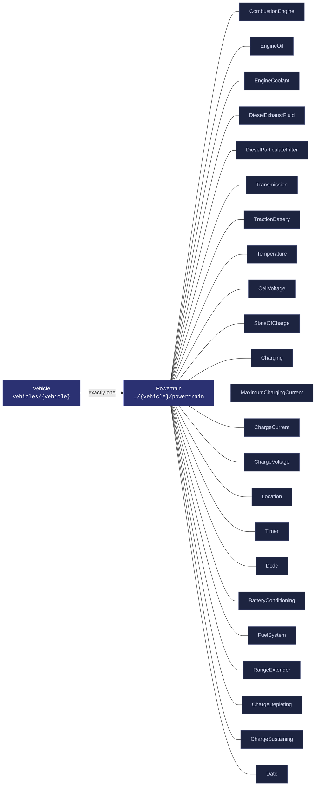
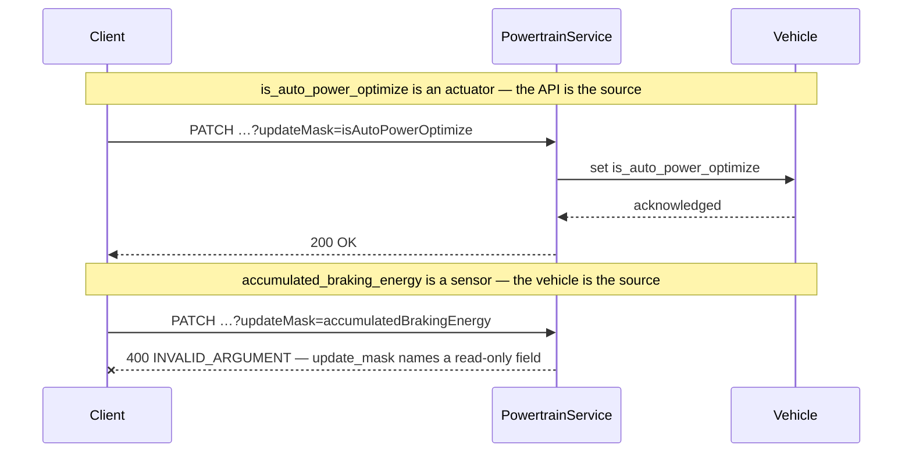
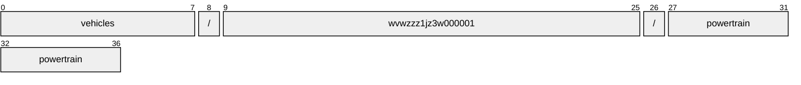
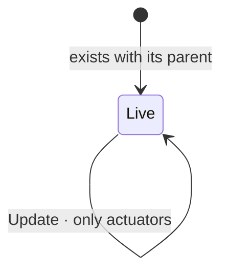

# Powertrain

[](https://github.com/COVESA/vehicle_signal_specification)
[](https://covesa.github.io/vehicle_signal_specification/)
[](https://aip.dev/156)
[](#methods)
[](#signals)
[](v1/)

Powertrain data for battery management, etc.

```
vehicles/{vehicle}/powertrain
```

## Where it sits



The 23 blue-grey boxes are **embedded messages**, not resources. They have no
name of their own and travel with the powertrain.

## Example

A powertrain as this API returns it:

```json
{
  "name": "vehicles/wvwzzz1jz3w000001/powertrain",
  "uid": "b3f1c2de-4a5b-4c6d-8e9f-0a1b2c3d4e5f",
  "isAutoPowerOptimize": true,
  "powerOptimizeLevel": 3,
  "accumulatedBrakingEnergy": 88.5,
  "rangeControl": 42,
  "timeRemaining": 42
}
```

The same data in the **VSS shape**, for a peer that speaks the specification
rather than this schema. `codec.ToVSS` produces it from
[`codec/manifest.json`](../../../../../codec/manifest.json):

```json
{
  "Vehicle.Powertrain.IsAutoPowerOptimize": true,
  "Vehicle.Powertrain.PowerOptimizeLevel": 3,
  "Vehicle.Powertrain.AccumulatedBrakingEnergy": 88.5,
  "Vehicle.Powertrain.Range": 42,
  "Vehicle.Powertrain.TimeRemaining": 42
}
```

Note what changed: signals are keyed by **fully qualified VSS name**, enum
constants drop to the spelling VSS writes, and the AIP fields — `name`,
`uid` — fall away, because VSS declares no signal for them. `codec.FromVSS`
reverses all three.

Writing to a powertrain, and the one thing that will fail:



```http
PATCH /v1/vehicles/wvwzzz1jz3w000001/powertrain?updateMask=isAutoPowerOptimize
{ "isAutoPowerOptimize": true }
```

The rejection is the schema working, not an inconvenience: VSS marks
`accumulated_braking_energy` a sensor, so the vehicle is the only thing that
can set it. A mask naming it fails rather than being silently dropped, so a
caller that believed it had written the value finds out immediately.

## Resource names

Every powertrain is addressed by a name that alternates collection and
identifier, per [AIP-122](https://aip.dev/122):



37 characters, alternating, which is what [AIP-123](https://aip.dev/123)
requires. An identifier is 80 random bits in Crockford base32, prefixed with
the resource's singular so the name opens with a letter — the randomness
half of a ULID with the timestamp half removed, because a ULID's leading
characters *are* a timestamp and a resource name should not publish when the
record was created. The vehicle is the exception: its identifier is its VIN,
which is already unique and already meaningful, the case AIP-122 prefers.

Rather than splitting that string by hand, use
[`resourcename`](https://github.com/the-protobuf-project/resourcename), which
implements AIP-122 templates in Go, Python, Rust, TypeScript, Swift and C:

```go
t := resourcename.ResourceTemplate("vehicles/{vehicle}/powertrain")
t.Parse("vehicles/wvwzzz1jz3w000001/powertrain")
// map[vehicle:wvwzzz1jz3w000001]
```

```python
t = resourcename.ResourceTemplate("vehicles/{vehicle}/powertrain")
t.parse("vehicles/wvwzzz1jz3w000001/powertrain")
# {'vehicle': 'wvwzzz1jz3w000001'}
```

The template above is the `pattern` this resource declares in its
`google.api.resource` annotation, so the two cannot drift.

## Signals

18 fields: 7 AIP identity and lifecycle, 11 VSS signals. Field numbers 8–15 are reserved for identity fields a later revision may add, so adding one never renumbers a signal.

### Writable — actuators

The vehicle accepts these in an `update_mask`.

| Field | Type | Unit | VSS | Description |
| --- | --- | --- | --- | --- |
| `combustion_engine` | `CombustionEngine` | — | `Vehicle.Powertrain.CombustionEngine` | Engine-specific data, stopping at the bell housing. |
| `fuel_system` | `FuelSystem` | — | `Vehicle.Powertrain.FuelSystem` | Fuel system data. |
| `is_auto_power_optimize` | `bool` | — | `Vehicle.Powertrain.IsAutoPowerOptimize` | Auto Power Optimization Flag When set to 'true', the system enables automatic power optimization, dynamically adjusting the power optimization level based on runtime conditions or features managed by the OEM. When set to 'false', manual control of the power optimization level is allowed. |
| `power_optimize_level` | `int32` | — | `Vehicle.Powertrain.PowerOptimizeLevel` | Power optimization level for this branch/subsystem. A higher number indicates more aggressive power optimization. Level 0 indicates that all functionality is enabled, no power optimization enabled. Level 10 indicates most aggressive power optimization mode, only essential functionality enabled. |
| `range_extender` | `RangeExtender` | — | `Vehicle.Powertrain.RangeExtender` | Extended Range Electric Vehicle (EREV) specific data. |
| `traction_battery` | `TractionBattery` | — | `Vehicle.Powertrain.TractionBattery` | Battery Management data. |
| `transmission` | `Transmission` | — | `Vehicle.Powertrain.Transmission` | Transmission-specific data, stopping at the drive shafts. |

### Read-only — sensors and attributes

The vehicle reports these. An `update_mask` naming one is **rejected**, not
silently ignored.

| Field | Type | Unit | VSS | Description |
| --- | --- | --- | --- | --- |
| `accumulated_braking_energy` | `double` | `kWh` | `Vehicle.Powertrain.AccumulatedBrakingEnergy` | The accumulated energy from regenerative braking over lifetime. |
| `range_control` | `int64` | `m` | `Vehicle.Powertrain.Range` | Remaining range in meters using all energy sources available in the vehicle. |
| `time_remaining` | `int64` | `s` | `Vehicle.Powertrain.TimeRemaining` | Time remaining in seconds before all energy sources available in the vehicle are empty. |
| `type_control` | [`PowertrainType`](#powertraintype) | — | `Vehicle.Powertrain.Type` | Defines the powertrain type of the vehicle. |

<details>
<summary>Identity and lifecycle — 7 fields every resource carries</summary>

| Field | Type | Notes |
| --- | --- | --- |
| `name` | `string` | `vehicles/{vehicle}/powertrain`, server-assigned |
| `uid` | `string` | server-assigned UUID4, per [AIP-148](https://aip.dev/148) |
| `etag` | `string` | pass back on update to make the write conditional, per [AIP-154](https://aip.dev/154) |
| `create_time` `update_time` | `Timestamp` | when it was stored here |
| `delete_time` `expire_time` | `Timestamp` | soft delete; recoverable until `expire_time` |

</details>

## Methods

A singleton, so **`Get`** · **`Update`** only, per
[AIP-156](https://aip.dev/156). Nothing can create a second or delete the only
one — that is the complete method set for a singleton, not a reduced one.



```http
GET    /v1/{name=vehicles/*/powertrain}
PATCH  /v1/{powertrain.name=vehicles/*/powertrain}
```

## Enums

#### `PowertrainType`

Defines the powertrain type of the vehicle.

`UNSPECIFIED` · `COMBUSTION` · `HYBRID` · `ELECTRIC`
<sub>emitted as `POWERTRAIN_TYPE_COMBUSTION`, and so on</sub>

#### `CombustionEngineConfig`

Engine configuration.

`UNSPECIFIED` · `UNKNOWN` · `STRAIGHT` · `V` · `BOXER` · `W` · `ROTARY`
· `RADIAL` · `SQUARE` · `H` · `U` · `OPPOSED` · `X`
<sub>emitted as `COMBUSTION_ENGINE_CONFIG_UNKNOWN`, and so on</sub>

#### `CombustionEngineAspirationType`

Type of aspiration (natural, turbocharger, supercharger etc).

`UNSPECIFIED` · `UNKNOWN` · `NATURAL` · `SUPERCHARGER` · `TURBOCHARGER`
<sub>emitted as `COMBUSTION_ENGINE_ASPIRATION_TYPE_UNKNOWN`, and so on</sub>

#### `EngineOilLevel`

Engine oil level.

`UNSPECIFIED` · `CRITICALLY_LOW` · `LOW` · `NORMAL` · `HIGH` ·
`CRITICALLY_HIGH`
<sub>emitted as `ENGINE_OIL_LEVEL_CRITICALLY_LOW`, and so on</sub>

#### `EngineOilPressureState`

Engine oil pressure status.

`UNSPECIFIED` · `NORMAL` · `WARNING` · `ALERT` · `ERROR`
<sub>emitted as `ENGINE_OIL_PRESSURE_STATE_NORMAL`, and so on</sub>

#### `EngineCoolantLevel`

Engine coolant level.

`UNSPECIFIED` · `CRITICALLY_LOW` · `LOW` · `NORMAL`
<sub>emitted as `ENGINE_COOLANT_LEVEL_CRITICALLY_LOW`, and so on</sub>

#### `TransmissionType`

Transmission type.

`UNSPECIFIED` · `UNKNOWN` · `SEQUENTIAL` · `H` · `AUTOMATIC` · `DSG` ·
`CVT`
<sub>emitted as `TRANSMISSION_TYPE_UNKNOWN`, and so on</sub>

#### `TransmissionDriveType`

Drive type.

`UNSPECIFIED` · `UNKNOWN` · `FORWARD_WHEEL_DRIVE` · `REAR_WHEEL_DRIVE` ·
`ALL_WHEEL_DRIVE`
<sub>emitted as `TRANSMISSION_DRIVE_TYPE_UNKNOWN`, and so on</sub>

#### `TransmissionPerformanceMode`

Current gearbox performance mode.

`UNSPECIFIED` · `NORMAL` · `SPORT` · `ECONOMY` · `SNOW` · `RAIN`
<sub>emitted as `TRANSMISSION_PERFORMANCE_MODE_NORMAL`, and so on</sub>

#### `TransmissionGearChangeMode`

Is the gearbox in automatic or manual (paddle) mode.

`UNSPECIFIED` · `MANUAL` · `AUTOMATIC`
<sub>emitted as `TRANSMISSION_GEAR_CHANGE_MODE_MANUAL`, and so on</sub>

#### `ChargingStartStopCharging`

Start or stop the charging process.

`UNSPECIFIED` · `START` · `STOP`
<sub>emitted as `CHARGING_START_STOP_CHARGING_START`, and so on</sub>

#### `TimerMode`

Defines timer mode for charging: INACTIVE - no timer set, charging may start
as soon as battery is connected to a charger. START_TIME - charging shall
start at Charging.Timer.Time. END_TIME - charging shall be finished (reach
Charging.ChargeLimit) at Charging.Timer.Time. When charging is completed the
vehicle shall change mode to 'inactive' or set a new Charging.Timer.Time.
Charging shall start immediately if mode is 'starttime' or 'endtime' and
Charging.Timer.Time is a time in the past.

`UNSPECIFIED` · `INACTIVE` · `START_TIME` · `END_TIME`
<sub>emitted as `TIMER_MODE_INACTIVE`, and so on</sub>

#### `BatteryConditioningRequestedMode`

Defines requested mode for battery conditioning. INACTIVE - Battery
conditioning inactive. FAST_CHARGING_PREPARATION - Battery conditioning for
fast charging. DRIVING_PREPARATION - Battery conditioning for driving.

`UNSPECIFIED` · `INACTIVE` · `FAST_CHARGING_PREPARATION` ·
`DRIVING_PREPARATION`
<sub>emitted as `BATTERY_CONDITIONING_REQUESTED_MODE_INACTIVE`, and so on</sub>

#### `FuelSystemSupportedFuelTypes`

High level information of fuel types supported

`UNSPECIFIED` · `GASOLINE` · `DIESEL` · `E85` · `LPG` · `CNG` · `LNG` ·
`H2` · `OTHER`
<sub>emitted as `FUEL_SYSTEM_SUPPORTED_FUEL_TYPES_GASOLINE`, and so on</sub>

#### `FuelSystemSupportedFuel`

Detailed information on fuels supported by the vehicle. Identifiers
originating from DIN EN 16942:2021-08, appendix B, with additional suffix for
octane (RON) where relevant.

`UNSPECIFIED` · `E5_95` · `E5_98` · `E10_95` · `E10_98` · `E85` · `B7`
· `B10` · `B20` · `B30` · `B100` · `XTL` · `LPG` · `CNG` · `LNG` ·
`H2` · `OTHER`
<sub>emitted as `FUEL_SYSTEM_SUPPORTED_FUEL_E5_95`, and so on</sub>

#### `FuelSystemHybridType`

Defines the hybrid type of the vehicle.

`UNSPECIFIED` · `UNKNOWN` · `NOT_APPLICABLE` · `STOP_START` · `BELT_ISG`
· `CIMG` · `PHEV`
<sub>emitted as `FUEL_SYSTEM_HYBRID_TYPE_UNKNOWN`, and so on</sub>

#### `FuelSystemRefuelPortPosition`

Position of refuel port(s). First part indicates side of vehicle, second part
relative position on that side.

`UNSPECIFIED` · `FRONT_LEFT` · `FRONT_MIDDLE` · `FRONT_RIGHT` ·
`REAR_LEFT` · `REAR_MIDDLE` · `REAR_RIGHT` · `LEFT_FRONT` · `LEFT_MIDDLE`
· `LEFT_REAR` · `RIGHT_FRONT` · `RIGHT_MIDDLE` · `RIGHT_REAR`
<sub>emitted as `FUEL_SYSTEM_REFUEL_PORT_POSITION_FRONT_LEFT`, and so on</sub>

#### `RangeExtenderOperatingMode`

Current operating mode of the Extended Range Electric Vehicle.

`UNSPECIFIED` · `CHARGE_DEPLETING` · `CHARGE_SUSTAINING` · `BLENDED`
<sub>emitted as `RANGE_EXTENDER_OPERATING_MODE_CHARGE_DEPLETING`, and so on</sub>

---

<sub>Generated by `just docs` from COVESA VSS `2026-09-02` (`cd4bc50`) and VDM `2026-07-24` (`36bc939`). Do not edit by hand.<br>
Source: [`powertrain.proto`](v1/powertrain.proto) · [`service.proto`](v1/service.proto) · [`messages.proto`](v1/messages.proto)</sub>
