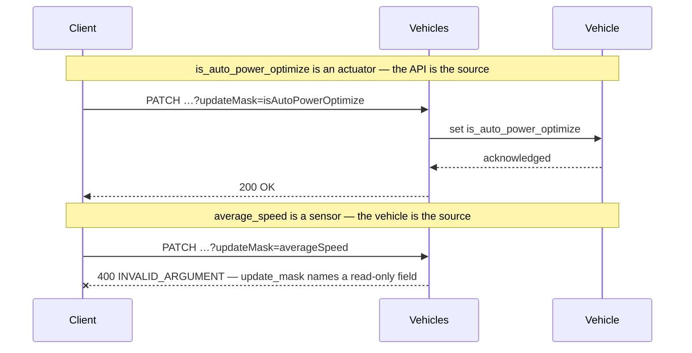
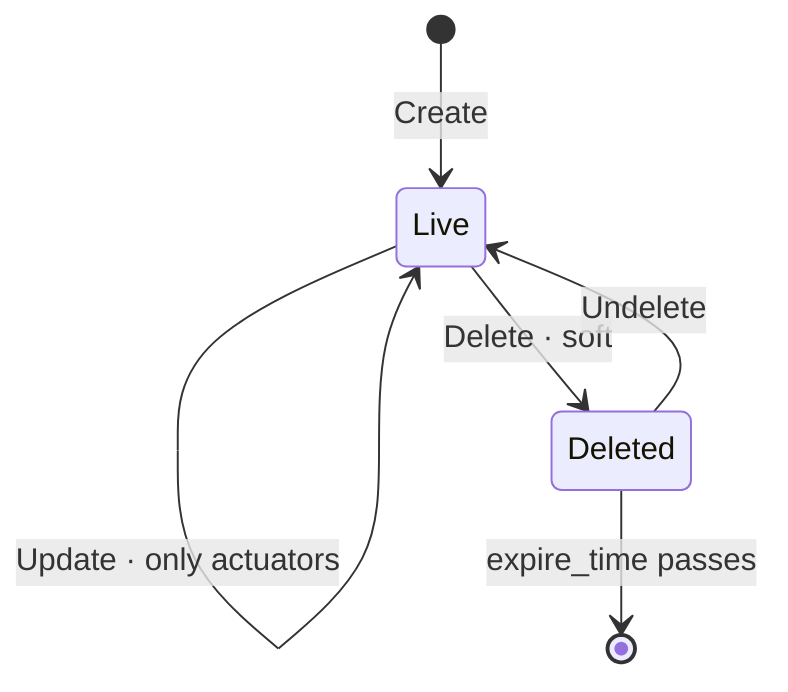

# Vehicle

[](https://github.com/COVESA/vehicle_signal_specification)
[](https://covesa.github.io/vehicle_signal_specification/)
[](https://aip.dev/121)
[](#methods)
[](#signals)
[](v1/)

High-level vehicle data.

```
vehicles/{vehicle}
```

## Where it sits

```mermaid
flowchart LR
  R["Vehicle<br/><code>vehicles/{vehicle}</code>"]
  C0["Acceleration<br/><code>…/{vehicle}/acceleration</code>"]
  C1["Adas<br/><code>…/{vehicle}/adas</code>"]
  C2["AmbientLight<br/><code>…/ambientLights/{ambient_light}</code>"]
  C3["AngularVelocity<br/><code>…/{vehicle}/angularVelocity</code>"]
  C4["Beam<br/><code>…/beams/{beam}</code>"]
  C5["Body<br/><code>…/{vehicle}/body</code>"]
  C6["BrakeAxle<br/><code>…/brakeAxles/{brake_axle}</code>"]
  C7["Cabin<br/><code>…/{vehicle}/cabin</code>"]
  C8["ChargingPort<br/><code>…/chargingPorts/{charging_port}</code>"]
  C9["Chassis<br/><code>…/{vehicle}/chassis</code>"]
  C10["ChassisAxle<br/><code>…/chassisAxles/{chassis_axle}</code>"]
  C11["Connectivity<br/><code>…/{vehicle}/connectivity</code>"]
  C12["ControlUnit<br/><code>…/controlUnits/{control_unit}</code>"]
  C13["CurrentLocation<br/><code>…/{vehicle}/currentLocation</code>"]
  C14["Diagnostics<br/><code>…/{vehicle}/diagnostics</code>"]
  C15["DirectionIndicator<br/><code>…/directionIndicators/{direction_indicator}</code>"]
  C16["Door<br/><code>…/doors/{door}</code>"]
  C17["Driver<br/><code>…/{vehicle}/driver</code>"]
  C18["ElectricAxle<br/><code>…/electricAxles/{electric_axle}</code>"]
  C19["ElectricMotor<br/><code>…/electricMotors/{electric_motor}</code>"]
  C20["Exterior<br/><code>…/{vehicle}/exterior</code>"]
  C21["Fog<br/><code>…/fogs/{fog}</code>"]
  C22["LowVoltageBattery<br/><code>…/{vehicle}/lowVoltageBattery</code>"]
  C23["Mirrors<br/><code>…/mirrors/{mirrors}</code>"]
  C24["MotionManagement<br/><code>…/{vehicle}/motionManagement</code>"]
  C25["ObstacleDetection<br/><code>…/obstacleDetections/{obstacle_detection}</code>"]
  C26["Occupant<br/><code>…/occupants/{occupant}</code>"]
  C27["Orientation<br/><code>…/{vehicle}/orientation</code>"]
  C28["Powertrain<br/><code>…/{vehicle}/powertrain</code>"]
  C29["Safety<br/><code>…/{vehicle}/safety</code>"]
  C30["Seat<br/><code>…/seats/{seat}</code>"]
  C31["Service<br/><code>…/{vehicle}/service</code>"]
  C32["Spotlight<br/><code>…/spotlights/{spotlight}</code>"]
  C33["Station<br/><code>…/stations/{station}</code>"]
  C34["SuspensionAxle<br/><code>…/suspensionAxles/{suspension_axle}</code>"]
  C35["Trailer<br/><code>…/{vehicle}/trailer</code>"]
  C36["Trunk<br/><code>…/trunks/{trunk}</code>"]
  C37["VehicleIdentification<br/><code>…/{vehicle}/vehicleIdentification</code>"]
  C38["VersionVss<br/><code>…/{vehicle}/versionVss</code>"]
  C39["Windshield<br/><code>…/windshields/{windshield}</code>"]

  R -->|"exactly one"| C0
  R -->|"exactly one"| C1
  R -->|"many, each identified"| C2
  R -->|"exactly one"| C3
  R -->|"many, each identified"| C4
  R -->|"exactly one"| C5
  R -->|"many, each identified"| C6
  R -->|"exactly one"| C7
  R -->|"many, each identified"| C8
  R -->|"exactly one"| C9
  R -->|"many, each identified"| C10
  R -->|"exactly one"| C11
  R -->|"many, each identified"| C12
  R -->|"exactly one"| C13
  R -->|"exactly one"| C14
  R -->|"many, each identified"| C15
  R -->|"many, each identified"| C16
  R -->|"exactly one"| C17
  R -->|"many, each identified"| C18
  R -->|"many, each identified"| C19
  R -->|"exactly one"| C20
  R -->|"many, each identified"| C21
  R -->|"exactly one"| C22
  R -->|"many, each identified"| C23
  R -->|"exactly one"| C24
  R -->|"many, each identified"| C25
  R -->|"many, each identified"| C26
  R -->|"exactly one"| C27
  R -->|"exactly one"| C28
  R -->|"exactly one"| C29
  R -->|"many, each identified"| C30
  R -->|"exactly one"| C31
  R -->|"many, each identified"| C32
  R -->|"many, each identified"| C33
  R -->|"many, each identified"| C34
  R -->|"exactly one"| C35
  R -->|"many, each identified"| C36
  R -->|"exactly one"| C37
  R -->|"exactly one"| C38
  R -->|"many, each identified"| C39

  classDef res fill:#2B3172,stroke:#6C74C4,color:#fff;
  classDef emb fill:#1d2440,stroke:#4a5178,color:#cfd4ea;
  class R,C0,C1,C2,C3,C4,C5,C6,C7,C8,C9,C10,C11,C12,C13,C14,C15,C16,C17,C18,C19,C20,C21,C22,C23,C24,C25,C26,C27,C28,C29,C30,C31,C32,C33,C34,C35,C36,C37,C38,C39 res;
```



## Example

A vehicle as this API returns it:

```json
{
  "name": "vehicles/wvwzzz1jz3w000001",
  "uid": "b3f1c2de-4a5b-4c6d-8e9f-0a1b2c3d4e5f",
  "isAutoPowerOptimize": true,
  "powerOptimizeLevel": 3,
  "tripMeterReading": 42,
  "averageSpeed": 88.5,
  "cargoVolume": 88.5
}
```

The same data in the **VSS shape**, for a peer that speaks the specification
rather than this schema. `codec.ToVSS` produces it from
[`codec/manifest.json`](../../../../../codec/manifest.json):

```json
{
  "Vehicle.IsAutoPowerOptimize": true,
  "Vehicle.PowerOptimizeLevel": 3,
  "Vehicle.TripMeterReading": 42,
  "Vehicle.AverageSpeed": 88.5,
  "Vehicle.CargoVolume": 88.5
}
```

Note what changed: signals are keyed by **fully qualified VSS name**, enum
constants drop to the spelling VSS writes, and the AIP fields — `name`,
`uid` — fall away, because VSS declares no signal for them. `codec.FromVSS`
reverses all three.

Writing to a vehicle, and the one thing that will fail:



```http
PATCH /v1/vehicles/wvwzzz1jz3w000001?updateMask=isAutoPowerOptimize
{ "isAutoPowerOptimize": true }
```

The rejection is the schema working, not an inconvenience: VSS marks
`average_speed` a sensor, so the vehicle is the only thing that can set it. A
mask naming it fails rather than being silently dropped, so a caller that
believed it had written the value finds out immediately.

## Resource names

Every vehicle is addressed by a name that alternates collection and
identifier, per [AIP-122](https://aip.dev/122):


26 characters, alternating, which is what [AIP-123](https://aip.dev/123)
requires. An identifier is 80 random bits in Crockford base32, prefixed with
the resource's singular so the name opens with a letter — the randomness
half of a ULID with the timestamp half removed, because a ULID's leading
characters *are* a timestamp and a resource name should not publish when the
record was created. The vehicle is the exception: its identifier is its VIN,
which is already unique and already meaningful, the case AIP-122 prefers.

Rather than splitting that string by hand, use
[`resourcename`](https://github.com/the-protobuf-project/resourcename), which
implements AIP-122 templates in Go, Python, Rust, TypeScript, Swift and C:

```go
t := resourcename.ResourceTemplate("vehicles/{vehicle}")
t.Parse("vehicles/wvwzzz1jz3w000001")
// map[vehicle:wvwzzz1jz3w000001]
```

```python
t = resourcename.ResourceTemplate("vehicles/{vehicle}")
t.parse("vehicles/wvwzzz1jz3w000001")
# {'vehicle': 'wvwzzz1jz3w000001'}
```

The template above is the `pattern` this resource declares in its
`google.api.resource` annotation, so the two cannot drift.

## Signals

33 fields: 7 AIP identity and lifecycle, 26 VSS signals. Field numbers 8–15 are reserved for identity fields a later revision may add, so adding one never renumbers a signal.

### Writable — actuators

The vehicle accepts these in an `update_mask`.

| Field | Type | Unit | VSS | Description |
| --- | --- | --- | --- | --- |
| `is_auto_power_optimize` | `bool` | — | `Vehicle.IsAutoPowerOptimize` | Auto Power Optimization Flag When set to 'true', the system enables automatic power optimization, dynamically adjusting the power optimization level based on runtime conditions or features managed by the OEM. When set to 'false', manual control of the power optimization level is allowed. |
| `power_optimize_level` | `int32` | — | `Vehicle.PowerOptimizeLevel` | Power optimization level for this branch/subsystem. A higher number indicates more aggressive power optimization. Level 0 indicates that all functionality is enabled, no power optimization enabled. Level 10 indicates most aggressive power optimization mode, only essential functionality enabled. |
| `trip_meter_reading` | `int64` | `m` | `Vehicle.TripMeterReading` | Trip meter reading. |

### Read-only — sensors and attributes

The vehicle reports these. An `update_mask` naming one is **rejected**, not
silently ignored.

| Field | Type | Unit | VSS | Description |
| --- | --- | --- | --- | --- |
| `average_speed` | `double` | `km/h` | `Vehicle.AverageSpeed` | Average speed for the current trip. |
| `cargo_volume` | `double` | `l` | `Vehicle.CargoVolume` | The available volume for cargo or luggage. For automobiles, this is usually the trunk volume. |
| `curb_weight` | `int32` | `kg` | `Vehicle.CurbWeight` | Vehicle curb weight, including all liquids and full tank of fuel, but no cargo or passengers. |
| `current_overall_weight` | `int32` | `kg` | `Vehicle.CurrentOverallWeight` | Current overall Vehicle weight. Including passengers, cargo and other load inside the car. |
| `emissions_co2` | `int32` | `g/km` | `Vehicle.EmissionsCO2` | The CO2 emissions. |
| `gross_weight` | `int32` | `kg` | `Vehicle.GrossWeight` | Curb weight of vehicle, including all liquids and full tank of fuel and full load of cargo and passengers. |
| `height` | `int32` | `mm` | `Vehicle.Height` | Overall vehicle height. |
| `is_broken_down` | `bool` | — | `Vehicle.IsBrokenDown` | Vehicle breakdown or any similar event causing vehicle to stop on the road, that might pose a risk to other road users. True = Vehicle broken down on the road, due to e.g. engine problems, flat tire, out of gas, brake problems. False = Vehicle not broken down. |
| `is_moving` | `bool` | — | `Vehicle.IsMoving` | Indicates whether the vehicle is stationary or moving. |
| `length` | `int32` | `mm` | `Vehicle.Length` | Overall vehicle length. |
| `low_voltage_system_state` | [`LowVoltageSystemState`](#lowvoltagesystemstate) | — | `Vehicle.LowVoltageSystemState` | State of the supply voltage of the control units (usually 12V). |
| `max_tow_ball_weight` | `int32` | `kg` | `Vehicle.MaxTowBallWeight` | Maximum vertical weight on the tow ball of a trailer. |
| `max_tow_weight` | `int32` | `kg` | `Vehicle.MaxTowWeight` | Maximum weight of trailer. |
| `roof_load` | `int32` | `kg` | `Vehicle.RoofLoad` | The permitted total weight of cargo and installations (e.g. a roof rack) on top of the vehicle. |
| `speed` | `double` | `km/h` | `Vehicle.Speed` | Vehicle speed. |
| `start_time` | `google.protobuf.Timestamp` | `iso8601` | `Vehicle.StartTime` | Start time of current or latest trip, formatted according to ISO 8601 with UTC time zone. |
| `traveled_distance` | `int64` | `m` | `Vehicle.TraveledDistance` | Odometer reading, total distance traveled during the lifetime of the vehicle. |
| `trip_duration` | `double` | `s` | `Vehicle.TripDuration` | Duration of latest trip. |
| `trip_traveled_distance` | `int64` | `m` | `Vehicle.TraveledDistanceSinceStart` | Distance traveled since start of current trip. |
| `turning_diameter` | `int32` | `mm` | `Vehicle.TurningDiameter` | Minimum turning diameter, Wall-to-Wall, as defined by SAE J1100-2009 D102. |
| `width_excluding_mirrors` | `int32` | `mm` | `Vehicle.WidthExcludingMirrors` | Overall vehicle width excluding mirrors, as defined by SAE J1100-2009 W103. |
| `width_folded_mirrors` | `int32` | `mm` | `Vehicle.WidthFoldedMirrors` | Overall vehicle width with mirrors folded, as defined by SAE J1100-2009 W145. |
| `width_mirrors_included` | `int32` | `mm` | `Vehicle.WidthIncludingMirrors` | Overall vehicle width including mirrors, as defined by SAE J1100-2009 W144. |

<details>
<summary>Identity and lifecycle — 7 fields every resource carries</summary>

| Field | Type | Notes |
| --- | --- | --- |
| `name` | `string` | `vehicles/{vehicle}`, server-assigned |
| `uid` | `string` | server-assigned UUID4, per [AIP-148](https://aip.dev/148) |
| `etag` | `string` | pass back on update to make the write conditional, per [AIP-154](https://aip.dev/154) |
| `create_time` `update_time` | `Timestamp` | when it was stored here |
| `delete_time` `expire_time` | `Timestamp` | soft delete; recoverable until `expire_time` |

</details>

## Methods

A collection, so the full set: **`Get`** · **`List`** · **`Create`** · **`Update`** · **`Delete`** · **`Undelete`**.



```http
GET    /v1/{name=vehicles/*}
PATCH  /v1/{vehicle.name=vehicles/*}
GET    /v1/vehicles
POST   /v1/vehicles
DELETE /v1/{name=vehicles/*}
POST   /v1/{name=vehicles/*}:undelete
```

A deleted vehicle is still returned by `Get` and hidden from `List` unless
`show_deleted` is set — which is what makes `Undelete` meaningful.

## Enums

#### `LowVoltageSystemState`

State of the supply voltage of the control units (usually 12V).

`UNSPECIFIED` · `UNDEFINED` · `LOCK` · `OFF` · `ACC` · `ON` · `START`
<sub>emitted as `LOW_VOLTAGE_SYSTEM_STATE_UNDEFINED`, and so on</sub>

---

<sub>Generated by `just docs` from COVESA VSS `2026-09-02` (`cd4bc50`) and VDM `2026-07-24` (`36bc939`). Do not edit by hand.<br>
Source: [`vehicle.proto`](v1/vehicle.proto) · [`service.proto`](v1/service.proto) · [`messages.proto`](v1/messages.proto)</sub>
